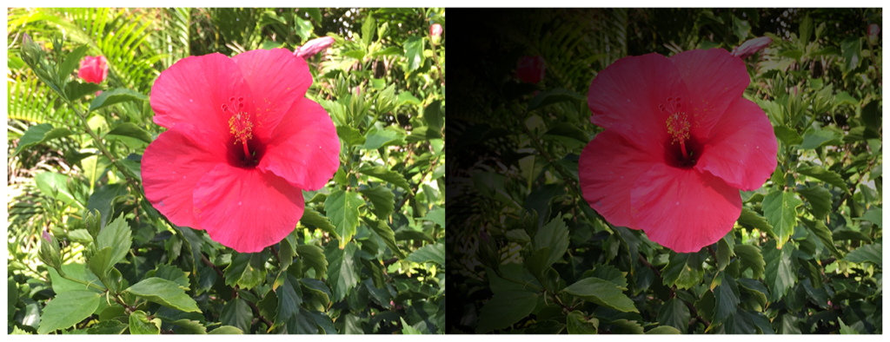

> Navigation: [Technologies](../../technologies.md) · [Core Image](../../coreimage.md) · [CIFilter](../cifilter-swift.class.md)

# vignetteEffect()

<sub>Type Method</sub>

Gradually darkens a specified area of an image.

<sub>iOS, iPadOS, Mac Catalyst, macOS, tvOS, visionOS</sub>

```swift
class func vignetteEffect() -> any CIFilter & CIVignetteEffect
```

## Return Value

The modified image.

## Discussion

This method applies the vignette effect filter to an image. This effect reduces brightness of the image at the periphery of a specified region.

The vignette effect filter uses the following properties:

- **`inputImage`** — An image with the type [CIImage](../ciimage.md).
- **`intensity`** — A `float` representing the intensity of the vignette effect as an [NSNumber](../../foundation/nsnumber.md).
- **`radius`** — A `float` representing the radius of the effect as an [NSNumber](../../foundation/nsnumber.md).
- **`falloff`** — A `float` representing the fall off of brightness toward the edge of the image as an [NSNumber](../../foundation/nsnumber.md).
- **`center`** — A [CGPoint](../../corefoundation/cgpoint.md) representing the center of the image.

The following code creates a filter that darkens the edges of an area on the input image:

```swift
func vignetteEffect(inputImage: CIImage ) -> CIImage {
    let vignetteFilter = CIFilter.vignetteEffect()
    vignetteFilter.inputImage = inputImage
    vignetteFilter.intensity = 1
    vignetteFilter.radius = 650
    vignetteFilter.falloff = 0.5
    vignetteFilter.center = CGPoint(x: 1024, y: 768)
    return vignetteFilter.outputImage!
}
```



<sub>Two pictures of a pink flower surrounded by foliage. The photo on the left shows a single flower photographed close-up, in focus, with good light and no effects. In the photo on the right, a vignette effect filter is applied, resulting in a gradual reduction of an image brightness and reduction of saturation in the periphery. </sub>

## See Also

### Color Effect Filters

- [+ colorCrossPolynomialFilter](<colorcrosspolynomial().md>) — Adjusts an image’s color by applying polynomial cross-products.
- [+ colorCubeFilter](<colorcube().md>) — Adjusts an image’s pixels using a three-dimensional color table.
- [+ colorCubeWithColorSpaceFilter](<colorcubewithcolorspace().md>) — Adjusts an image’s pixels using a three-dimensional color table in specified color space.
- [+ colorCubesMixedWithMaskFilter](<colorcubesmixedwithmask().md>) — Alters an image’s pixels using a three-dimensional color tables and a mask image.
- [+ colorCurvesFilter](<colorcurves().md>) — Adjusts an image’s color curves.
- [+ colorInvertFilter](<colorinvert().md>) — Inverts an image’s colors.
- [+ colorMapFilter](<colormap().md>) — Performs a transformation of the input image colors to colors from a gradient image.
- [+ colorMonochromeFilter](<colormonochrome().md>) — Adjusts an image’s colors to shades of a single color.
- [+ colorPosterizeFilter](<colorposterize().md>) — Flattens an image’s colors.
- [+ convertLabToRGBFilter](<convertlabtorgb().md>) — Converts an image from CIELAB to RGB color space.
- [+ convertRGBtoLabFilter](<convertrgbtolab().md>) — Converts an image from RGB to CIELAB color space.
- [+ ditherFilter](<dither().md>) — Applies randomized noise to produce a processed look.
- [+ documentEnhancerFilter](<documentenhancer().md>) — Adjusts an image’s shadows and contrast.
- [+ falseColorFilter](<falsecolor().md>) — Replaces an image’s colors with specified colors.
- [+ LabDeltaE](<labdeltae().md>) — Compares an image’s color values.
