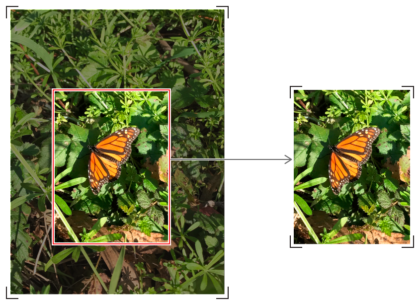

> Navigation: [Technologies](../../technologies.md) · [Core Image](../../coreimage.md) · [CIImage](../ciimage.md)

# cropped(to:)

<sub>Instance Method</sub>

Returns a new image with a cropped portion of the original image.

<sub>iOS, iPadOS, Mac Catalyst, macOS, tvOS, visionOS</sub>

```swift
func cropped(to rect: CGRect) -> CIImage
```

## Parameters

- `rect` — The rectangle, in image coordinates, to which to crop the image.

## Return Value

An image object cropped to the specified rectangle.

## Discussion



## Discussion

Due to Core Image’s coordinate system mismatch with [UIKit](https://developer.apple.com/library/archive/releasenotes/General/WhatsNewIniOS/Articles/iOS5.html#//apple_ref/doc/uid/TP30915195-SW41), this filtering approach may yield unexpected results when displayed in a [UIImageView](../../uikit/uiimageview.md) with [contentMode](../../uikit/uiview/contentmode-swift.property.md). Be sure to back it with a [CGImage](cgimage.md) so that it handles [contentMode](../../uikit/uiview/contentmode-swift.property.md) properly.

```swift
CIContext* context = [CIContext context];
CGImageRef cgCroppedImage = [context createCGImage:ciCroppedImage fromRect:ciCroppedImage.extent];
UIImage* croppedImage = [UIImage imageWithCGImage:cgCroppedImage];
CGImageRelease(cgCroppedImage);
```

If you are displaying or processing your image primarily as a [CGImage](../../coregraphics/cgimage.md) or [UIImage](../../uikit/uiimage.md), with no additional Core Image application, consider cropping in Core Graphics using the [cropping(to:)](<../../coregraphics/cgimage/cropping(to_).md>) function to save processing overhead from conversion of images to [CIImage](../ciimage.md).  It makes most sense to use [- imageByCroppingToRect:](<cropped(to_).md>) when you already have [CIImage](../ciimage.md) in your pipeline.

## See Also

### Creating an Image by Modifying an Existing Image

- [- imageByApplyingFilter:withInputParameters:](<applyingfilter(__parameters_).md>) — Returns a new image created by applying a filter to the original image with the specified name and parameters.
- [- imageByApplyingFilter:](<applyingfilter(__).md>) — Applies the filter to an image and returns the output.
- [- imageByApplyingTransform:](<transformed(by_).md>) — Returns a new image that represents the original image after applying an affine transform.
- [- imageByApplyingTransform:highQualityDownsample:](<transformed(by_highqualitydownsample_).md>)
- [- imageByApplyingOrientation:](<oriented(forexiforientation_).md>) — Returns a new image created by transforming the original image to the specified EXIF orientation.
- [- imageByClampingToExtent](<clampedtoextent().md>) — Returns a new image created by making the pixel colors along its edges extend infinitely in all directions.
- [- imageByClampingToRect:](<clamped(to_).md>) — Returns a new image created by cropping to a specified area, then making the pixel colors along the edges of the cropped image extend infinitely in all directions.
- [- imageByCompositingOverImage:](<composited(over_).md>) — Returns a new image created by compositing the original image over the specified destination image.
- [- imageByConvertingWorkingSpaceToLab](<convertingworkingspacetolab().md>)
- [- imageByConvertingLabToWorkingSpace](<convertinglabtoworkingspace().md>)
- [- imageByColorMatchingColorSpaceToWorkingSpace:](<matchedtoworkingspace(from_).md>) — Returns a new image created by color matching from the specified color space to the context’s working color space.
- [- imageByColorMatchingWorkingSpaceToColorSpace:](<matchedfromworkingspace(to_).md>) — Returns a new image created by color matching from the context’s working color space to the specified color space.
- [- imageByPremultiplyingAlpha](<premultiplyingalpha().md>) — Returns a new image created by multiplying the image’s RGB values by its alpha values.
- [- imageByUnpremultiplyingAlpha](<unpremultiplyingalpha().md>) — Returns a new image created by dividing the image’s RGB values by its alpha values.
- [- imageBySettingAlphaOneInExtent:](<settingalphaone(in_).md>) — Returns a new image created by setting all alpha values to 1.0 within the specified rectangle and to 0.0 outside of that area.
