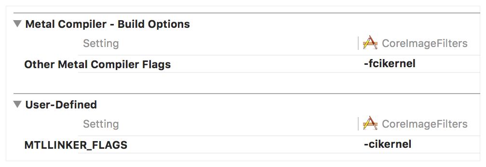

> Navigation: [Technologies](../../technologies.md) · [Core Image](../../coreimage.md) · [CIKernel](../cikernel.md)

# init(functionName:fromMetalLibraryData:)

<sub>Initializer</sub>

Creates a single kernel object using a Metal Shading Language (MSL) kernel function.

<sub>iOS, iPadOS, Mac Catalyst, macOS, tvOS, visionOS</sub>

```swift
convenience init(functionName name: String, fromMetalLibraryData data: Data) throws
```

## Discussion

- name: The name of the function in the Metal shading language.
- data: A metallib file compiled with the Core Image Standard Library.

## Discussion

This method allows you to use MSL as the shader language for a Core Image kernel. Since MSL based kernels are precompiled, initializing them is faster than their than Core Image Kernel Language (CIKL) counterparts and Xcode can provide error diagnostics during development rather than at runtime. MSL is a more modern language than CIKL, and you can write shader code that uses arrays, structs and matrices.

MSL based kernels still support concatenation and tiling and can work in the same filter graph as traditional CIKL kernels.

### Specifying Compiler and Linker Options

To use MSL as the shader language for a [CIKernel](../cikernel.md), you must specify some options in Xcode under the _Build Settings_ tab of your project’s target. The first option you need to specify is an `-fcikernel` flag in the Other Metal Compiler Flags option. The second is to add a user-defined setting with a key called `MTLLINKER_FLAGS` with a value of `-cikernel:`



### Creating a General Kernel in Swift

The following code shows how you can create a general kernel based on a Metal function named `myKernel`.

The first step is to create a `Data` object that represents the default Metal library. If you have built this in Xcode, it will be called `default.metallib` and can be loaded using the [Bundle](https://developer.apple.com/library/archive/documentation/General/Conceptual/DevPedia-CocoaCore/Bundle.html#//apple_ref/doc/uid/TP40008195-CH4) type’s `url` method.

Using the representation of the Metal library and the function name `myKernel`, you initialize a [CIKernel](../cikernel.md).

```swift
guard
    let url = Bundle.main.url(forResource: "default", withExtension: "metallib"),
    let data = try? Data(contentsOf: url) else {
    fatalError("Unable to get metallib")
}
 
guard let generalKernel = try? CIKernel(functionName: "myKernel", fromMetalLibraryData: data) else {
    fatalError("Unable to create CIKernel from myKernel")
}
```

The code to create general, color, warp and blend filters is identical.

### Metal Shading Language Extensions

Core Image provides a set of language extensions to MSL in `CIKernelMetalLib.h`. These extensions include three new data types for working with images: `sampler` (for accessing the input image), `sample_t` (represents a single color sample from the input image), and `destination` (for accessing the output image). The extensions also include convenience functions such as color conversion and premultiply / unpremultiply.

Whereas in CIKL, you typically called global functions when working with, for example, coordinates and samples, these functions are implemented as member functions on the new types.

The following table shows a summary of CIKL global functions and their equivalent MSL functions.

|  | Core Image Kernel Language | Metal Shading Language |
|---|---|---|
| Get destination coordinate | `destCoord()` | `dest.coord()` |
| Transform coordinate to sampler space | `samplerTransform(src, p)` | `src.transform(p)` |
| Get destination coordinate in sampler space | `samplerCoord(src)` | `src.coord()` |
| Sample from source image | `sample(src, p)` | `src.sample(p)` |
| Get extent of source image | `samplerExtent(src)` | `src.extent()` |

## See Also

### Creating a Kernel Using Metal Shading Language

- [+ kernelWithFunctionName:fromMetalLibraryData:outputPixelFormat:error:](<init(functionname_frommetallibrarydata_outputpixelformat_).md>) — Creates a single kernel object using a Metal Shading Language kernel function with optional pixel format.
- [+ kernelNamesFromMetalLibraryData:](<kernelnames(frommetallibrarydata_).md>) — Return an array of strings containing the names of all of the kernels contained in the Metal library.
- [+ kernelsWithMetalString:error:](<kernels(withmetalstring_).md>) — Load kernels from a Metal language string.
