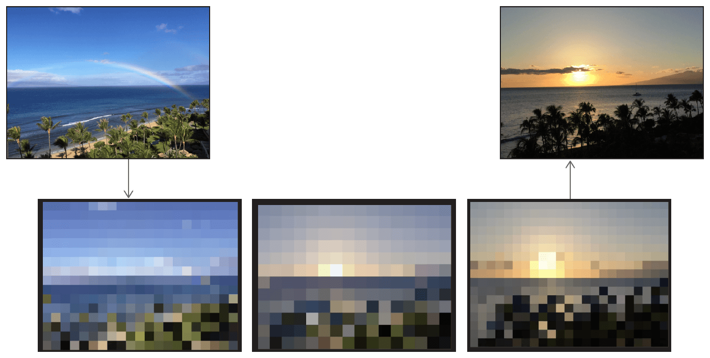
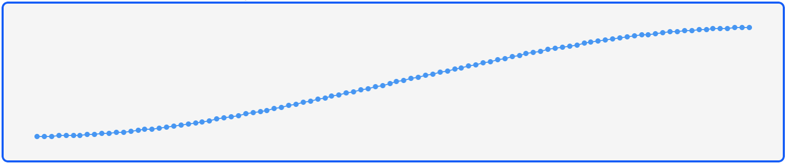
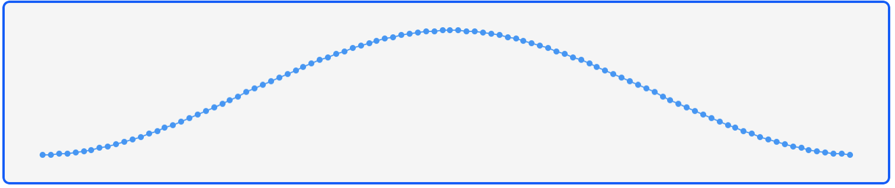
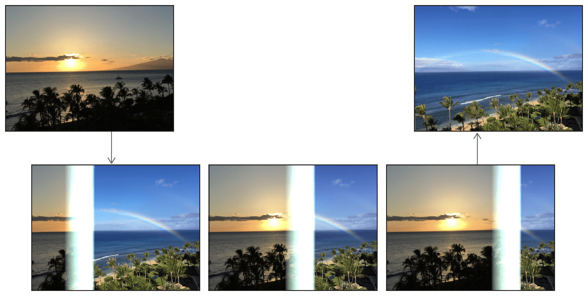
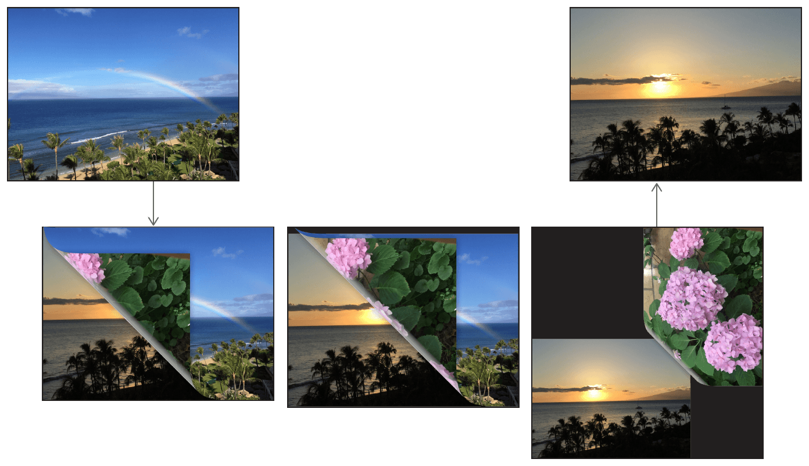
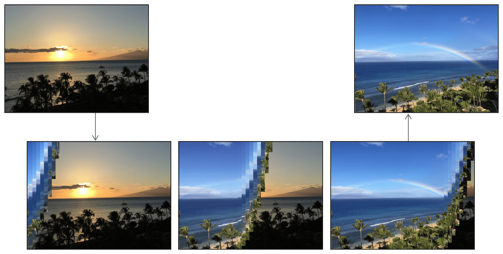

> Navigation: [Technologies](../technologies.md) · [Core Image](../coreimage.md)

# Customizing Image Transitions

<sub>Article</sub>

Transition between images in creative ways using Core Image filters.

## Overview

You can add visual effects to an image transition by chaining together Core Image [CIFilter](cifilter-swift.class.md) objects in the category [CICategoryTransition](https://developer.apple.com/library/archive/documentation/GraphicsImaging/Reference/CoreImageFilterReference/index.html#//apple_ref/doc/uid/TP30000136-SW239). Each filter from this category represents a single transition effect.

For example, you can combine an effect that dissolves an image and one that pixelates it as a transition to a second image. This particular transition chain comprises three steps:

1. Create a [+ dissolveTransitionFilter](<cifilter-swift.class/dissolvetransition().md>) transition filter with time as an input parameter.
2. Create a [+ pixellateFilter](<cifilter-swift.class/pixellate().md>) transition filter with time as an input parameter.
3. Initiate the transition by adding a time step to your run loop.



### Load Source and Target Images

Filters in the transition category require your program to load both source and target images in order to transform the source into the destination.

```swift
NSURL* sourceURL = [[NSBundle mainBundle] URLForResource:@"YourSourceImage" withExtension:@"JPG"];
_sourceCIImage = [CIImage imageWithContentsOfURL:sourceURL];

NSURL* destinationURL = [[NSBundle mainBundle] URLForResource:@"YourTargetImage" withExtension:@"JPG"];
_finalCIImage = [CIImage imageWithContentsOfURL:destinationURL];
```

### Create a Time-Dependent Dissolve Transition

The key difference of transition filters from their normal filter chain counterparts is the dependence on time.  After creating a [CIFilter](cifilter-swift.class.md) from the [Transition Filters](transition-filters.md) category, you set the value of the `time` parameter to a float between `0.0` and `1.0` to indicate how far along the transition has progressed.

Write each transition filter to accept time as an input parameter, and reapply the filter at a regular interval to transform the image from its source state to the target state.

```swift
#import <simd/simd.h>

- (CIImage*) dissolveFilterImage:(CIImage*)inputImage
                              to:(CIImage*)targetImage
                          atTime:(NSTimeInterval)time {
    NSTimeInterval t = simd_smoothstep(0, 1, time);
    CIFilter<CIDissolveTransition> *filter = CIFilter.dissolveTransitionFilter;
    filter.inputImage = inputImage;
    filter.targetImage = targetImage;
    filter.time = t;
    return filter.outputImage;
}
```

You don’t need to pass time linearly from `0.0` to `1.0`. In fact, you can advance the transition at a variable rate by modulating the time variable with a function, such as `simd_smoothstep`, which is a smooth ramp function clamped between two values, imbuing the dissolve effect with an ease-in ease-out feel.



### Create a Time-Dependent Pixelate Transition

Like the dissolve transition, you can write the pixelate transition filter as a time-dependent function as well.

```swift
#import <simd/simd.h>

- (CIImage*) pixelateFilterImage:(CIImage*)inputImage atTime:(NSTimeInterval)time {
    NSTimeInterval scale = simd_smoothstep(1, 0, fabs(time));
    CIFilter<CIPixellate> *filter = CIFilter.pixellateFilter;
    filter.inputImage = inputImage;
    filter.scale = 100 * scale;
    return filter.outputImage;
}
```

As with the dissolve filter, you can modify the speed and acceleration of the transition by changing the way time varies between `0.0` and `1.0`.  In this case, unlike the [+ dissolveTransitionFilter](<cifilter-swift.class/dissolvetransition().md>) filter, the [+ pixellateFilter](<cifilter-swift.class/pixellate().md>) filter accepts a s`cale`, which you can vary over a smoothened triangle function: `simd_smoothstep(1, 0, abs(time))`.



This function puts the peak of the pixelation at the middle of the transition: the pixels start and end small, closely approximating the source image, but as the transition reaches its halfway point, the pixels scale to their largest size, effectively blocking out the moment farthest from source and target.

### Step Time with a Display Link

In writing the filter functions to accept a time parameter, you parametrized the transition effect moving from source to target. Now, you must move time forward when you want to perform the transition.

Adding a [CADisplayLink](../quartzcore/cadisplaylink.md) to your run loop gives you a way to refresh an image every time a screen redraw occurs, so you can execute on a reliably regular time interval. In the case of a transition, you need only perform the following steps:

1. Create the display link to call an update function.
2. Add to your app’s main run loop to begin the transition. Start time at `0.0` and track time through the update function.
3. In the update function, update the transition filters’ `inputTime` value and refresh the filtered image. Since this example chains two filters for a simultaneous effect, update both filters.
4. In the update function, remove the link once time has expired.

> [!note] Note
> Adding a [Timer](../foundation/timer.md) may seem like a logical strategy for stepping time, but the display link fires with greater precision in sync with screen redraws.

#### Create the Display Link to Call an Update Function

```swift
_displayLink = [CADisplayLink displayLinkWithTarget:self 
                                           selector:@selector(stepTime)];
```

Keeping the display link around beyond function scope allows you to remove it when the transition completes.

#### Add the Display Link to Begin the Transition

To begin the transition effect, add the [CADisplayLink](../quartzcore/cadisplaylink.md) to your program’s main run loop, so it can execute each time step and redraw the transitioning [CIImage](ciimage.md).

```swift
- (void) beginTransition {
    _time = 0;
    _dt = 0.005;
    
    _displayLink = [CADisplayLink displayLinkWithTarget:self selector:@selector(stepTime)];
    [_displayLink addToRunLoop:[NSRunLoop mainRunLoop] forMode:NSDefaultRunLoopMode];
}
```

#### Write the Transition Update Function

The [CADisplayLink](../quartzcore/cadisplaylink.md) should call a time-stepping function on each pass through the run loop.  Inside this function, recompute the filtered image with that frame’s `time` variable.

```swift
- (void) stepTime {
    _time += _dt;

    // End transition after 1 second
    if (_time > 1) {
        [_displayLink removeFromRunLoop:[NSRunLoop mainRunLoop] forMode:NSDefaultRunLoopMode];
    }
    else {
        _dissolvedCIImage = [self dissolveFilterImage:_sourceCIImage
                                                  to:_finalCIImage
                                              atTime:_time];
        
        _pixellatedCIImage = [self pixellateFilterImage:_dissolvedCIImage
                                                 atTime:_time];
        
        // imageView and ciContext are ivars of the class, initialized elsewhere.
        [self showCIImage:_pixellatedCIImage in:_imageView usingContext:_ciContext];
    }
}
```

As a convenience, the following helper function shows a CIImage in a UIImageView.

```swift
- (void) showCIImage:(CIImage*)ciImage
         inImageView:(UIImageView*)imageView
        usingContext:(CIContext*)context {
    CGImageRef cgImage = [context createCGImage:ciImage
                                       fromRect:ciImage.extent];
    
    UIImage* uiImage = [UIImage imageWithCGImage:cgImage];
    
    imageView.image = uiImage;
}
```

### Explore Other Transition Visual Effects

The Core Image framework provides many distinct visual effects through its built-in catalog of filters. You can substitute a different transition effect for the dissolve and pixelation effects.

See filters under the [Transition Filters](transition-filters.md) collection for other effects to try.

For example, the [+ copyMachineTransitionFilter](<cifilter-swift.class/copymachinetransition().md>) filter passes a scanning light over the source image as it transforms into the target image.



The [+ pageCurlWithShadowTransitionFilter](<cifilter-swift.class/pagecurlwithshadowtransition().md>) filter simulates the turn of a page, peeling the source image toward the right to reveal the target image underneath. You can include a separate image on the back of the flipped page.



<sub>Page curl transition from a photo of a beach at daytime with rainbow in the sky to a photo of a beach at sunset, with a flower image on the back of the page</sub>

The [+ barsSwipeTransitionFilter](<cifilter-swift.class/barsswipetransition().md>) slices the source image into vertical bars that sequentially slide off the page, revealing the target image underneath.



You can apply transitions such as accordion folding, flash photography, disintegration, and watery rippling. Substitute the dissolve and pixellate filters with others from the same category, and tweak the t`ime` or s`cale` parameter to customize the effect to fit your app.

## See Also

### Filter Recipes

- [Applying a Chroma Key Effect](applying-a-chroma-key-effect.md) — Replace a color in one image with the background from another.
- [Selectively Focusing on an Image](selectively-focusing-on-an-image.md) — Focus on a part of an image by applying Gaussian blur and gradient masks.
- [Simulating Scratchy Analog Film](simulating-scratchy-analog-film.md) — Degrade the quality of an image to make it look like dated, analog film.
