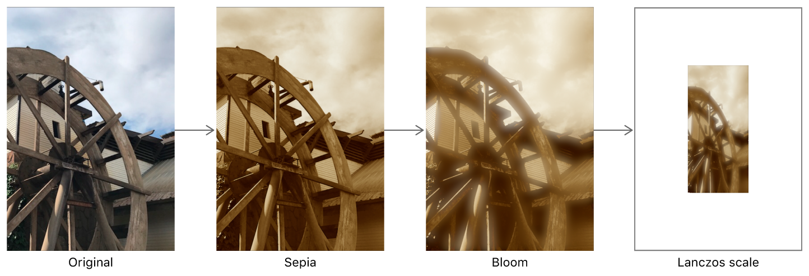

> Navigation: [Technologies](../technologies.md) · [Core Image](../coreimage.md)

# Processing an Image Using Built-in Filters

<sub>Article</sub>

Apply effects such as sepia tint, highlight strengthening, and scaling to images.

## Overview

You can add effects to images by applying Core Image filters to [CIImage](ciimage.md) objects. Figure 1 shows three filters chained together to achieve a cumulative effect:

1. Apply the sepia filter to tint an image with a reddish-brown hue.
2. Add the bloom filter to accentuate highlights.
3. Use the Lanczos scale filter to scale an image down.



### Create a Context

[CIImage](ciimage.md) processing occurs in a [CIContext](cicontext.md) object. Creating a [CIContext](cicontext.md) is expensive, so create one during your initial setup and reuse it throughout your app.

```swift
CIContext* context = [CIContext context];
```

### Load an Image to Process

The next step is to load an image to process. This example loads an image from the project bundle.

```swift
NSURL* imageURL = [[NSBundle mainBundle] URLForResource:@"YourImageName" withExtension:@"png"];
CIImage* originalCIImage = [CIImage imageWithContentsOfURL:imageURL];
self.imageView.image = [UIImage imageWithCIImage:originalCIImage];
```

The [CIImage](ciimage.md) object isn’t itself a displayable image, but rather image data. To display it, you must convert it to another type, such as [UIImage](../uikit/uiimage.md).

### Apply Built-In Core Image Filters

A [CIFilter](cifilter-swift.class.md) represents a single operation or recipe for a particular effect. To process a [CIImage](ciimage.md) object, pass it through [CIFilter](cifilter-swift.class.md) objects. You can subclass [CIFilter](cifilter-swift.class.md) or draw from the existing library of built-in filters.

#### Tint Reddish-Brown with the Sepia Filter

Although you can chain filters without separating them into functions, the following example shows how to configure a single [CIFilter](cifilter-swift.class.md), the [+ sepiaToneFilter](<cifilter-swift.class/sepiatone().md>) filter.

```swift
- (CIImage*) sepiaFilterImage: (CIImage*)inputImage withIntensity:(CGFloat)intensity {
    CIFilter<CISepiaTone>* sepiaFilter = CIFilter.sepiaToneFilter;
    sepiaFilter.inputImage = inputImage;
    sepiaFilter.intensity = intensity;
    return sepiaFilter.outputImage;
}
```

To pass the image through the filter, call the sepia filter function.

```swift
CIImage* sepiaCIImage = [self sepiaFilterImage:originalCIImage withIntensity:0.9];
```

You can check the intermediate result at any point in the filter chain by converting from [CIImage](ciimage.md) to a [UIImage](../uikit/uiimage.md). You can then assign this [UIImage](../uikit/uiimage.md) to a [UIImageView](../uikit/uiimageview.md) for display.

```swift
_imageView.image = [UIImage imageWithCIImage:sepiaCIImage];
```

#### Strengthen Highlights with the Bloom Filter

The bloom filter accentuates the highlights of an image. You can apply it as part of a chain without factoring it into a separate function, but this example encapsulates its functionality into a function.

```swift
- (CIImage*) bloomFilterImage: (CIImage*)inputImage withIntensity:(CGFloat)intensity radius:(CGFloat)radius {
    CIFilter<CIBloom>* bloomFilter = CIFilter.bloomFilter;
    bloomFilter.inputImage = inputImage;
    bloomFilter.intensity = intensity;
    bloomFilter.radius = radius;
    return bloomFilter.outputImage;
}
```

Like the sepia filter, the intensity of the bloom filter’s effect ranges between 0 and 1, with 1 being the most intense effect. The bloom filter has an additional r`adius` parameter to determine how much the glowing regions expand. Experiment with a range to values to fine tune the effect, or assign the input parameter to a control like a [UISlider](../uikit/uislider.md) to allow your users to tweak its values.

> [!note] Note
> The [+ gloomFilter](<cifilter-swift.class/gloom().md>) filter performs the opposite effect.

To display the output, convert the [CIImage](ciimage.md) to a [UIImage](../uikit/uiimage.md).

```swift
CIImage* bloomCIImage = [self bloomFilterImage:sepiaCIImage withIntensity:1 radius:10];
_filteredImageView.image = [UIImage imageWithCIImage:bloomCIImage];
```

#### Scale Image Size with the Lanczos Scale Filter

Apply the [+ lanczosScaleTransformFilter](<cifilter-swift.class/lanczosscaletransform().md>) to obtain a high-quality downsampling of the image, preserving the original image’s aspect ratio through the [+ lanczosScaleTransformFilter](<cifilter-swift.class/lanczosscaletransform().md>) filter’s parameter `aspectRatio`. For built-in Core Image filters, calculate the aspect ratio as the image’s width over height.

```swift
CGFloat imageWidth = originalUIImage.size.width;
CGFloat imageHeight = originalUIImage.size.height;
CGFloat aspectRatio = imageHeight / imageWidth;
CIImage* scaledCIImage = [self scaleFilterImage:bloomCIImage withAspectRatio:aspectRatio scale:0.05];
```

Like other built-in filters, the [+ lanczosScaleTransformFilter](<cifilter-swift.class/lanczosscaletransform().md>) filter also outputs its result as a [CIImage](ciimage.md).

```swift
- (CIImage*) scaleFilterImage: (CIImage*)inputImage withAspectRatio:(CGFloat)aspectRatio scale:(CGFloat)scale {
    CIFilter<CILanczosScaleTransform>* scaleFilter = CIFilter.lanczosScaleTransformFilter;
    scaleFilter.inputImage = inputImage;
    scaleFilter.scale = scale;
    scaleFilter.aspectRatio = aspectRatio;
    return scaleFilter.outputImage;
}
```

> [!important] Important
> To optimize computation, Core Image doesn’t actually render any intermediate [CIImage](ciimage.md) result until you force the [CIImage](ciimage.md) to display its content onscreen, as you might do using [UIImageView](../uikit/uiimageview.md).

```swift
_imageView.image = [UIImage imageWithCIImage:scaledCIImage];
```

> [!note] Note
> Core Image optimizes filtering by reordering the three chained filters and concatenating them into a single image processing kernel, saving computation and rendering cycles.

In addition to trying out the built-in filters for a fixed effect, you can combine filters in certain Filter Recipes to accomplish tasks such as [Applying a Chroma Key Effect](applying-a-chroma-key-effect.md), [Selectively Focusing on an Image](selectively-focusing-on-an-image.md), [Customizing Image Transitions](customizing-image-transitions.md), and [Simulating Scratchy Analog Film](simulating-scratchy-analog-film.md).

## See Also

### Essentials

- [CIContext](cicontext.md) — The Core Image context class provides an evaluation context for Core Image processing with Metal, OpenGL, or OpenCL.
- [CIImage](ciimage.md) — A representation of an image to be processed or produced by Core Image filters.
