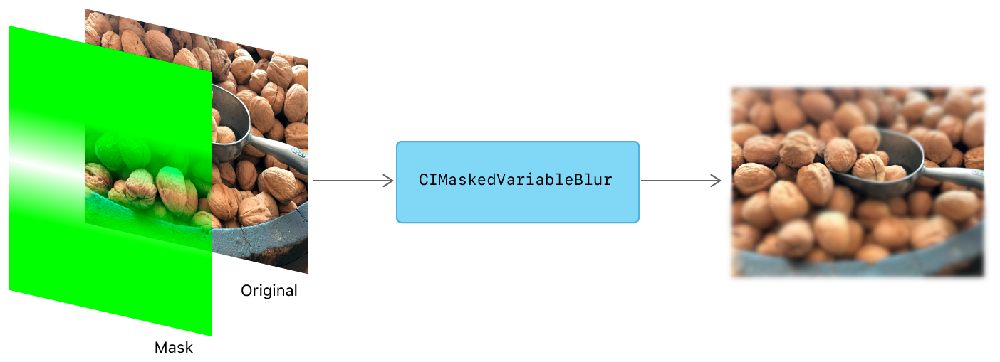
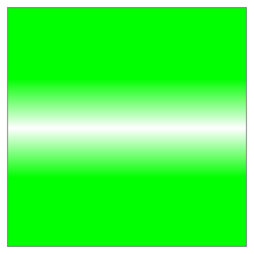
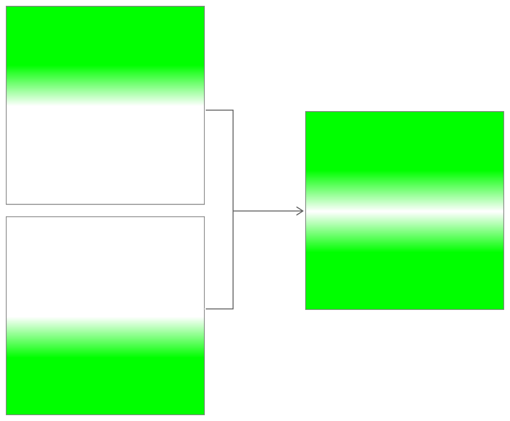
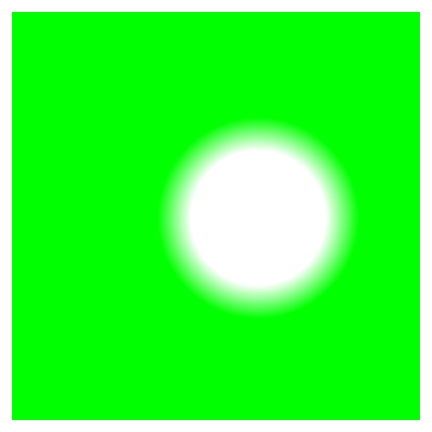
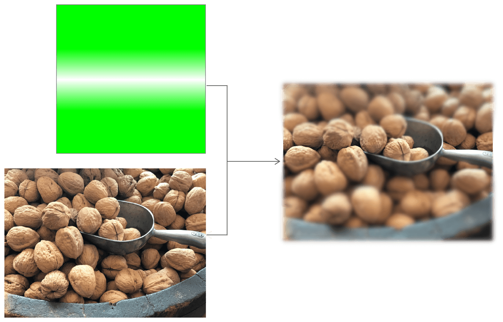
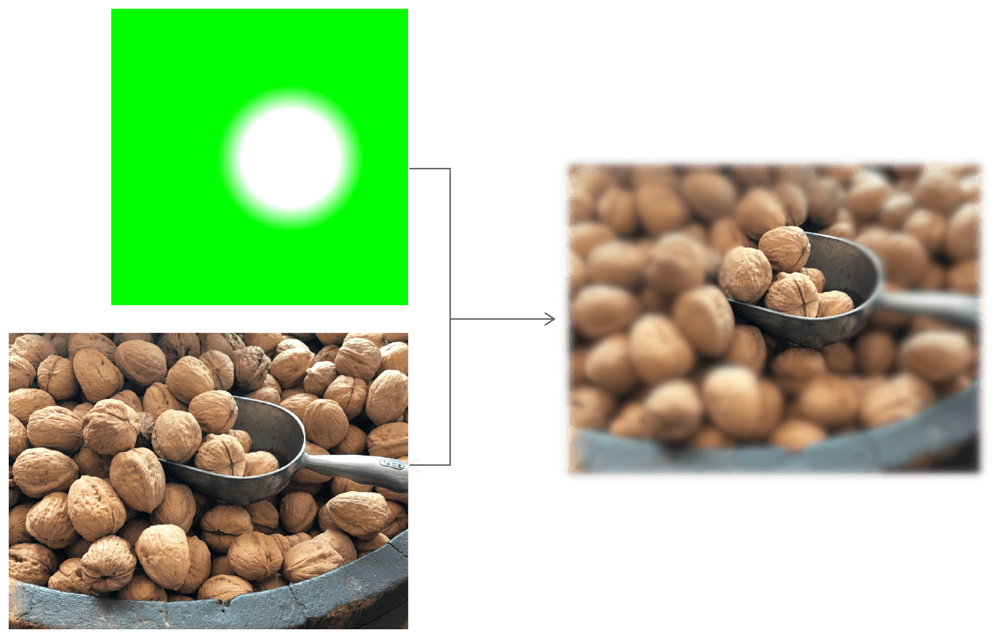

> Navigation: [Technologies](../technologies.md) · [Core Image](../coreimage.md)

# Selectively Focusing on an Image

<sub>Article</sub>

Focus on a part of an image by applying Gaussian blur and gradient masks.

## Overview

You can selectively blur areas of an image using [+ maskedVariableBlurFilter](<cifilter-swift.class/maskedvariableblur().md>) filter.



You specify the region to blur by applying a mask image; the shape and values of the mask image determine the location and strength of the blurring. Creating this effect involves the following steps:

1. To focus on a strip across the image, create two linear gradients representing the portions of the image to blur.
2. To focus on a circular region in the image, create a radial gradient centered on the region to keep sharp.
3. Composite the gradients into a mask.
4. Apply Core Image’s [+ maskedVariableBlurFilter](<cifilter-swift.class/maskedvariableblur().md>) filter to the original image, inputting the created mask.

### Focusing on a Strip of the Image

You can build your mask in any shape, but the general strategy remains the same: leave the mask transparent where you want the original image to stay sharp and focused. This section covers focusing on a horizontal strip.

To build a mask that leaves out a stripe, create linear gradients from a single color, such as green or gray. Our goal is to build the mask shown in Figure 2.



The linear gradients cause the blur to taper smoothly as it approaches the focused stripe of the image. The Core Image [CIFilter](cifilter-swift.class.md) named [+ linearGradientFilter](<cifilter-swift.class/lineargradient().md>) generates filters of the desired color. The linear gradient has four parameters:

- **`point0`** — A [CGPoint](../corefoundation/cgpoint.md) representing the starting position of the gradient.
- **`point1`** — A [CGPoint](../corefoundation/cgpoint.md) representing the ending position of the gradient.
- **`color0`** — A [CIColor](cicolor.md) representing the first color to use in the gradient.
- **`color1`** — A [CIColor](cicolor.md) representing the sexond color to use in the gradient.

Compute the start and stop points of the gradient as fractions of the image height, as obtained through [extent](ciimage/extent.md). For this particular mask and example image, focus on the area near the middle, in the second quarter of the image. Set the linear gradient’s `point0` and `point1` to reflect the region through which the gradient tapers.

```swift
const CGFloat h = inputImage.extent.size.height;
CIFilter<CILinearGradient>* topGradient = CIFilter.linearGradientFilter;
topGradient.point0 = CGPointMake(0, 0.85 * h);
topGradient.color0 = CIColor.greenColor;
topGradient.point1 = CGPointMake(0, 0.6 * h);
topGradient.color1 = [CIColor colorWithRed:0 green:1 blue:0];
```

The lower gradient should complement the upper gradient, so that their combined coverage delineates the entire area to blur. Express the starting `inputPoint0` y-value at `0.35` of the image height and taper to `0.6`, where the top gradient began. This leaves a gap in the combined mask through which the sharp image will show.

```swift
CIFilter<CILinearGradient>* bottomGradient = CIFilter.linearGradientFilter;
bottomGradient.point0 = CGPointMake(0, 0.35 * h);
bottomGradient.color0 = CIColor.greenColor;
bottomGradient.point1 = CGPointMake(0, 0.6 * h);
bottomGradient.color1 = [CIColor colorWithRed:0 green:1 blue:0 alpha:0];
```

### Creating a Mask by Compositing Linear Gradients

To create a mask that dilineates where and how strong a blur to apply, combine the two linear gradients.



Since the gradients themselves are [CIFilter](cifilter-swift.class.md) objects, compositing them is as simple as concatenating their filter outputs to a compositing filter.  Use the built-in [CIFilter](cifilter-swift.class.md) named [+ additionCompositingFilter](<cifilter-swift.class/additioncompositing().md>) to composite two images additively.

```swift
CIFilter<CICompositeOperation> *gradientMask = CIFilter.additionCompositingFilter
gradientMask.inputImage = topGradient.outputImage;
gradientMask.backgroundImage = bottomGradient.outputImage;
```

The resulting mask is now ready to be applied as part of the [+ maskedVariableBlurFilter](<cifilter-swift.class/maskedvariableblur().md>) filter.

### Focusing on a Circular Region

In order to focus on a circular region of an image, you can create a Core Image [+ radialGradientFilter](<cifilter-swift.class/radialgradient().md>) filter.

The filter takes four parameters:

- **center** — A CGPoint representing the center of the effect as x and y coordinates.
- **color0** — A [CIColor](cicolor.md) representing the first color to use in the gradient.
- **color1** — A [CIColor](cicolor.md) representing the second color to use in the gradient.
- **radius0** — A `float` representing the radius of the starting circle to use in the gradient.
- **radius1** — A `float` representing the radius of the ending circle to use in the gradient.

1. Set the `center` to a [CGPoint](../corefoundation/cgpoint.md) pointing to the center of the region you want to leave unblurred.
2. Set the `radius0` to a fraction of the image’s dimension, like `0.2*h` in this example. You can tweak this parameter to determine the size of the sharp region.
3. Set the `radius1` to a larger fraction of the image’s dimension, like `0.3*h` in this example. Tweaking this parameter changes the extent of the blur’s tapering effect; a larger value makes the blur more gradual, whereas a smaller value makes the image transition more abruptly from sharp (at `inputRadius0`) to blur (at `inputRadius1`).
4. As with the linear gradients, set `color0` to transparency, and `color1` to a solid opaque color, to indicate the blur’s gradation from nonexistent to full.

```swift
CIFilter<CIRadialGradient> *radialMask = CIFilter.radialGradientFilter;
radialMask.center = CGPointMake(0.55 * w, 0.6 * h);
radialMask.radius0 = 0.2 * h;
radialMask.radius1 = 0.3 * h;
radialMask.color0 = [CIColor colorWithRed:0 green:1 blue:0 alpha:0];
radialMask.color1 = [CIColor colorWithRed:0 green:1 blue:0 alpha:1];
```

This yields a circular mask to use with the [+ maskedVariableBlurFilter](<cifilter-swift.class/maskedvariableblur().md>) filter.



### Masking the Blurred Image to Apply Selective Focus

The final step is applying your choice of mask with the input image. The [+ maskedVariableBlurFilter](<cifilter-swift.class/maskedvariableblur().md>) built-in [CIFilter](cifilter-swift.class.md) accomplishes this task with the following input parameters:

- **`inputImage`** — Set to the original, unprocessed [CIImage](ciimage.md).
- **`radius`** — A float representing the area of effect.
- **`mask`** — An image that masks an area on the input image with the type [CIImage](ciimage.md)

```swift
CIFilter<CIMaskedVariableBlur> *maskedVariableBlur = CIFilter.maskedVariableBlurFilter;
maskedVariableBlur.inputImage = inputImage;
maskedVariableBlur.mask = radialMask.outputImage;
maskedVariableBlur.radius = 10;
CIImage *selectivelyFocusedCIImage = maskedVariableBlur.outputImage;
```

The resulting image shows the original image with portions blurred out according to the mask applied. The linear gradient mask results in an output image focused on a strip, and the radial gradient mask results in an output image focused on a circular region.





## See Also

### Filter Recipes

- [Applying a Chroma Key Effect](applying-a-chroma-key-effect.md) — Replace a color in one image with the background from another.
- [Customizing Image Transitions](customizing-image-transitions.md) — Transition between images in creative ways using Core Image filters.
- [Simulating Scratchy Analog Film](simulating-scratchy-analog-film.md) — Degrade the quality of an image to make it look like dated, analog film.
