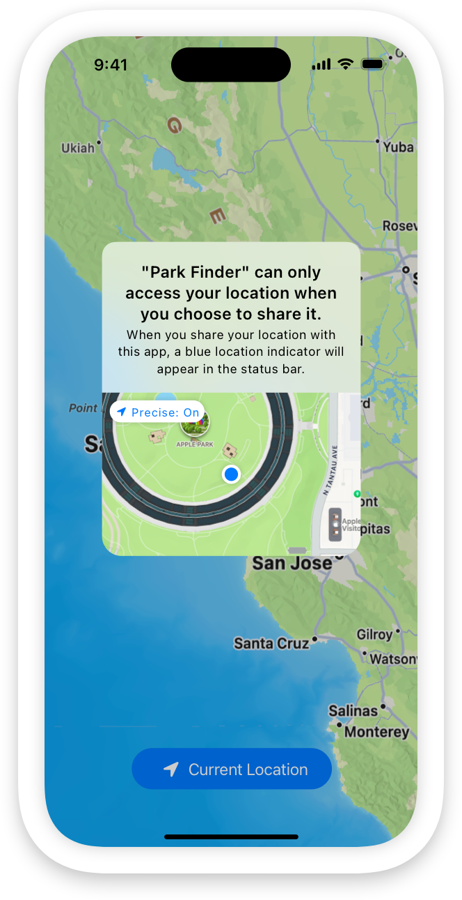

> Navigation: [Technologies](technologies.md)

# Core Location

Framework

Obtain the geographic location and orientation of a device.

## Overview

Core Location provides services that determine a device’s geographic location, altitude, and orientation, or its position relative to a nearby iBeacon device. The framework gathers data using all available components on the device, including the Wi-Fi, GPS, Bluetooth, magnetometer, barometer, and cellular hardware.

You use instances of the [CLLocationManager](corelocation/cllocationmanager.md) class to configure, start, and stop the Core Location services. A location manager object supports the following location-related activities:

- **Standard and significant location updates** — Track large or small changes in the user’s current location with a configurable degree of accuracy.
- **Region monitoring** — Monitor distinct regions of interest and generate location events when the user enters or leaves those regions.
- **Beacon ranging** — Detect and locate nearby beacons.
- **Compass headings** — Report heading changes from the onboard compass.

To use location services, call [liveUpdates(_:)](<corelocation/cllocationupdate/liveupdates(__).md>) to obtain an update stream, then asynchronously iterate over that stream to receive and process location updates, and receive diagnostic properties to understand if and why location updates don’t arrive.

If needed, the system prompts the user to grant or deny the request. An initial prompt is shown in the example below:

A screenshot of an iPhone showing a prompt asking the user if they allow the “Park Finder” app to have access to their location. The options are “OK” and “Not now”.

On iOS devices, users can change location service settings at any time in the Settings app, affecting individual apps or the device as a whole. Your app receives events, including authorization changes, by observing asynchronous sequences from [CLLocationUpdate](corelocation/cllocationupdate.md) and [CLMonitor](corelocation/clmonitor-6ynwz.md).

## Topics

### Essentials

- [Configuring your app to use location services](corelocation/configuring-your-app-to-use-location-services.md) — Prepare your app to start collecting location data.
- [Supporting live updates in SwiftUI and Mac Catalyst apps](corelocation/supporting-live-updates-in-swiftui-and-mac-catalyst-apps.md) — Enable background events by adding lifecycle event support.
- [CLLocationManager](corelocation/cllocationmanager.md) — The object you use to start and stop the delivery of location-related events to your app.
- [CLBackgroundActivitySession](corelocation/clbackgroundactivitysession-3mzv3.md) — An object that manages a visual indicator that keeps your app in use in the background, allowing it to receive updates or events.
- [CLLocationUpdate](corelocation/cllocationupdate.md) — A structure that contains the location information the framework delivers with each update.
- [Adopting live updates in Core Location](corelocation/adopting-live-updates-in-core-location.md) — Simplify location delivery using asynchronous events in Swift.
- [Monitoring location changes with Core Location](corelocation/monitoring-location-changes-with-core-location.md) — Define boundaries and act on user location updates.

### Authorization

- [Requesting authorization to use location services](corelocation/requesting-authorization-to-use-location-services.md) — Obtain authorization to use location services and manage changes to your app’s authorization status.
- [Suspending authorization requests](corelocation/suspending-authorization-requests.md) — Defer the system’s authorization request dialog until your app is ready.
- [CLAuthorizationStatus](corelocation/clauthorizationstatus.md) — Constants that indicate the app’s authorization to use location services.
- [CLAccuracyAuthorization](corelocation/claccuracyauthorization.md) — Constants that indicate the level of location accuracy the app has authorization to use.
- [NSLocationAlwaysAndWhenInUseUsageDescription](bundleresources/information-property-list/nslocationalwaysandwheninuseusagedescription.md) — A message that tells people why the app is requesting access to their location information at all times.
- [NSLocationWhenInUseUsageDescription](bundleresources/information-property-list/nslocationwheninuseusagedescription.md) — A message that tells people why the app is requesting access to their location information while the app is running in the foreground.
- [NSLocationUsageDescription](bundleresources/information-property-list/nslocationusagedescription.md) — A message that tells people why the app is requesting access to their location information. _(deprecated)_
- [NSLocationDefaultAccuracyReduced](bundleresources/information-property-list/nslocationdefaultaccuracyreduced.md) — A Boolean value that indicates whether the app requests reduced location accuracy by default.
- [NSLocationAlwaysUsageDescription](bundleresources/information-property-list/nslocationalwaysusagedescription.md) — A message that tells people why the app is requesting access to their location at all times. _(deprecated)_

### Monitoring

- [CLMonitor](corelocation/clmonitor-2r51v.md) — An object that monitors the conditions you add to it.

### Location updates

- [Getting the current location of a device](corelocation/getting-the-current-location-of-a-device.md) — Start location services and provide information the system needs to optimize power usage for those services.
- [Handling location updates in the background](corelocation/handling-location-updates-in-the-background.md) — Configure your app to receive location updates when it isn’t running in the foreground.
- [Creating a location push service extension](corelocation/creating-a-location-push-service-extension.md) — Add and configure an extension to enable your location-sharing app to access a person’s location in response to a request from someone else.
- [CLLocation](corelocation/cllocation.md) — The latitude, longitude, and course information reported by the system.
- [CLLocationCoordinate2D](corelocation/cllocationcoordinate2d.md) — The latitude and longitude associated with a location, specified using the WGS 84 reference frame.
- [CLFloor](corelocation/clfloor.md) — The floor of a building on which the user’s device is located.
- [CLVisit](corelocation/clvisit.md) — Information about the user’s location during a specific period of time.
- [CLLocationSourceInformation](corelocation/cllocationsourceinformation.md) — Information about the source that provides a location.
- [Monitoring location changes with Core Location](corelocation/monitoring-location-changes-with-core-location.md) — Define boundaries and act on user location updates.
- [CLServiceSession](corelocation/clservicesession-pt7n.md) — An object that provides diagnostics about an app’s authorization to use location services.

### Region monitoring

- [Monitoring the user’s proximity to geographic regions](corelocation/monitoring-the-user-s-proximity-to-geographic-regions.md) — Use condition monitoring to determine when the user enters or leaves a geographic region.
- [CLRegion](corelocation/clregion.md) — A base class representing an area that can be monitored.

### iBeacon

- [Ranging for Beacons](corelocation/ranging-for-beacons.md) — Configure a device to act as a beacon and to detect surrounding beacons.
- [Determining the proximity to an iBeacon device](corelocation/determining-the-proximity-to-an-ibeacon-device.md) — Detect beacons and determine the relative distance to them.
- [Turning an iOS device into an iBeacon device](corelocation/turning-an-ios-device-into-an-ibeacon-device.md) — Broadcast iBeacon signals from an iOS device.
- [CLBeacon](corelocation/clbeacon.md) — Information about an observed iBeacon device and its relative distance to a person’s device.
- [CLCondition](corelocation/clcondition-swift.protocol.md) — The abstract base class for all other monitor conditions.

### Compass headings

- [Getting heading and course information](corelocation/getting-heading-and-course-information.md) — Use a device’s orientation and course information for navigation.
- [CLHeading](corelocation/clheading.md) — The orientation of the user’s device, relative to true or magnetic north.

### Geocoding

- [Converting between coordinates and user-friendly place names](corelocation/converting-between-coordinates-and-user-friendly-place-names.md) — Convert between a latitude and longitude pair and a more user-friendly description of that location.
- [Converting a user’s location to a descriptive placemark](corelocation/converting-a-user-s-location-to-a-descriptive-placemark.md) — Transform the user’s location that displays on a map into an informative textual description by reverse geocoding.
- [CLGeocoder](corelocation/clgeocoder.md) — An interface for converting between geographic coordinates and place names. _(deprecated)_
- [CLPlacemark](corelocation/clplacemark.md) — A user-friendly description of a geographic coordinate, often containing the name of the place, its address, and other relevant information. _(deprecated)_

### Location push service extension

- [Location Push Service Extension](bundleresources/entitlements/com.apple.developer.location.push.md) — An entitlement to enable a location-sharing app to query someone’s location in response to a push notification.
- [CLLocationPushServiceExtension](corelocation/cllocationpushserviceextension.md) — The interface you adopt in the type that acts as the main entry point for a Location Push Service Extension.
- [CLLocationPushServiceError](corelocation/cllocationpushserviceerror-swift.struct.md) — Error codes the location manager returns if starting to monitor for location push notifications fails.
- [CLLocationPushServiceErrorDomain](corelocation/cllocationpushserviceerrordomain.md) — The domain for Location Push Service Extension errors.
- [Code](corelocation/cllocationpushserviceerror-swift.struct/code.md) — Error codes the location manager returns if starting to monitor for location push notifications fails.

### Errors

- [CLError](corelocation/clerror-swift.struct.md) — A Core Location error.
- [kCLErrorDomain](corelocation/kclerrordomain.md) — The domain for Core Location errors.
- [kCLErrorUserInfoAlternateRegionKey](corelocation/kclerroruserinfoalternateregionkey.md) — A key in the user information dictionary of an error relating to a delayed region-monitoring response.

### Deprecated

- [Deprecated](corelocation/deprecated.md)

### Reference

- [Core Location Constants](corelocation/core-location-constants.md) — This document describes the constants found in the Core Location framework.
- [Core Location Functions](corelocation/core-location-functions.md) — The Core Location framework provides functions to help you work with coordinate values.

### Protocols

- [CLBodyIdentifiable](corelocation/clbodyidentifiable.md) _(beta)_
