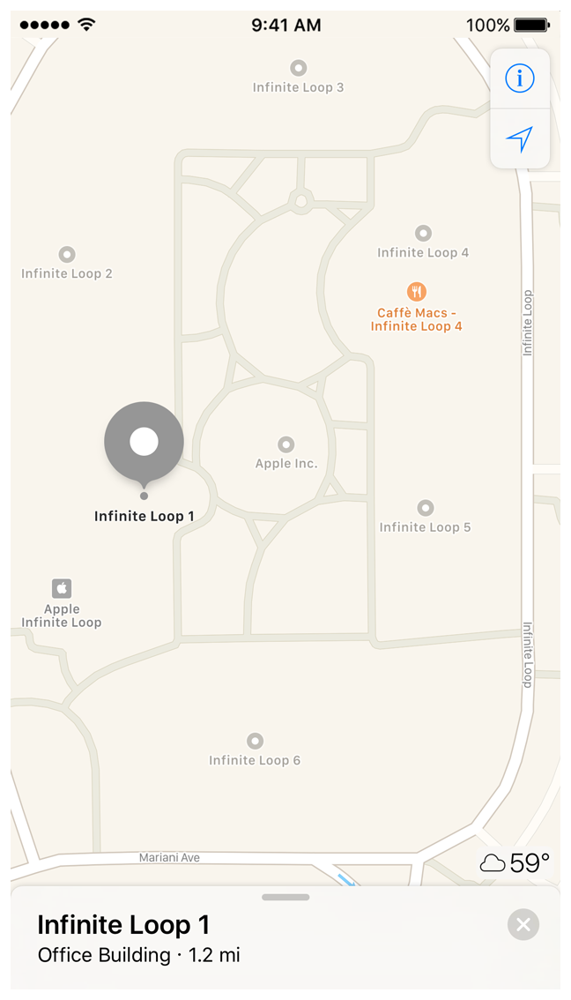

> Navigation: [Technologies](../technologies.md) · [Core Location](../corelocation.md)

# Converting between coordinates and user-friendly place names

<sub>Article</sub>

Convert between a latitude and longitude pair and a more user-friendly description of that location.

## Overview

The [CLLocationManager](cllocationmanager.md) object reports locations as a latitude/longitude pair. While these values uniquely represent any location on the planet, they are not values that users immediately associate with the location. Users are more familiar with names that describe a location, such as street names or city names. The [CLGeocoder](clgeocoder.md) class lets you convert between geographic coordinates and the user-friendly names associated with that location. You can convert from either a latitude/longitude pair to a user friendly place name, or the other way around.



User place names are represented by a [CLPlacemark](clplacemark.md) object, which contains properties for specifying the street name, city name, country or region name, postal code, and many others. Placemarks also contain properties describing relevant geographic features or points of interest at the location, such as the names of mountains, rivers, businesses, or landmarks.

Geocoder objects are one-shot objects—that is, you use each object to make a single conversion. You can create multiple geocoder objects and perform multiple conversions, but Apple rate limits the number of conversions you can perform. Making too many requests in a short period of time may cause some of those requests to fail. For tips on how to manage any conversions, see the overview of [CLGeocoder](clgeocoder.md).

### Convert a coordinate into a placemark

If you have a [CLLocation](cllocation.md) object, call the [- reverseGeocodeLocation:completionHandler:](<clgeocoder/reversegeocodelocation(__completionhandler_).md>) method of your geocoder object to retrieve a [CLPlacemark](clplacemark.md) object for that location. Typically, you convert coordinates into placemarks when you want to display information about the location to the user. For example, if the user selects a location on a map, you might want to show the address at that location.

Listing 1 shows how to obtain placemark information for the last location reported by the [CLLocationManager](cllocationmanager.md) object. Because calls to the geocoder object are asynchronous, the caller of this method passes in a completion handler, which is executed with the results.

Listing 1. Reverse geocoding a coordinate

```swift
func lookUpCurrentLocation(completionHandler: @escaping (CLPlacemark?)
                -> Void ) {
    // Use the last reported location.
    if let lastLocation = self.locationManager.location {
        let geocoder = CLGeocoder()
            
        // Look up the location and pass it to the completion handler
        geocoder.reverseGeocodeLocation(lastLocation, 
                    completionHandler: { (placemarks, error) in
            if error == nil {
                let firstLocation = placemarks?[0]
                completionHandler(firstLocation)
            }
            else {
	         // An error occurred during geocoding.
                completionHandler(nil)
            }
        })
    }
    else {
        // No location was available.
        completionHandler(nil)
    }
}
```

### Convert a placemark into a coordinate

If you have user-provided address information, call the methods of [CLGeocoder](clgeocoder.md) to obtain the corresponding location data. The [CLGeocoder](clgeocoder.md) class provides options for converting a user-typed string or for converting a dictionary of address-related information. That information is forwarded to Apple servers, which interpret the information and return the results.

Depending on the precision of the user-provided information, you may receive one result or multiple results. For example, passing a string of “100 Main St., USA” may return many results unless you also specify a search region or additional details. To help you decide which result is correct, the geocoder actually returns [CLPlacemark](clplacemark.md) objects, which contain both the coordinate and the original information that you provided.

Listing 2 shows how you might obtain a coordinate value from a user-provided string. The example calls the provided completion handler with only the first result. If the string does not correspond to any location, the method calls the completion handler with an error and an invalid coordinate.

Listing 2. Getting a coordinate from an address string

```swift
func getCoordinate( addressString : String, 
        completionHandler: @escaping(CLLocationCoordinate2D, NSError?) -> Void ) {
    let geocoder = CLGeocoder()
    geocoder.geocodeAddressString(addressString) { (placemarks, error) in
        if error == nil {
            if let placemark = placemarks?[0] {
                let location = placemark.location!
                    
                completionHandler(location.coordinate, nil)
                return
            }
        }
            
        completionHandler(kCLLocationCoordinate2DInvalid, error as NSError?)
    }
}
```

## See Also

### Geocoding

- [Converting a user’s location to a descriptive placemark](converting-a-user-s-location-to-a-descriptive-placemark.md) — Transform the user’s location that displays on a map into an informative textual description by reverse geocoding.
- [CLGeocoder](clgeocoder.md) — An interface for converting between geographic coordinates and place names. _(deprecated)_
- [CLPlacemark](clplacemark.md) — A user-friendly description of a geographic coordinate, often containing the name of the place, its address, and other relevant information. _(deprecated)_
