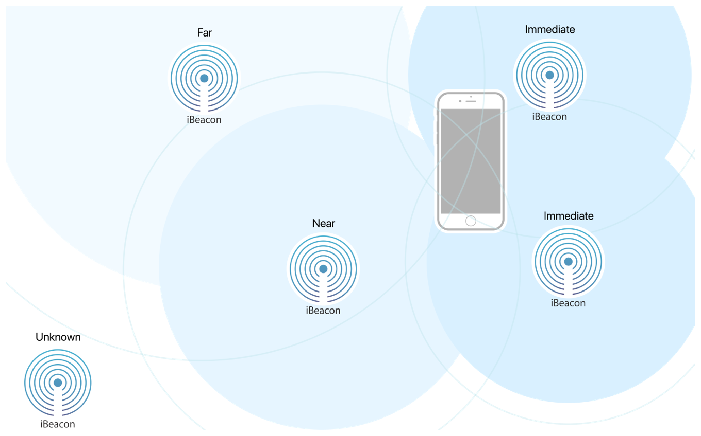

> Navigation: [Technologies](../technologies.md) · [Core Location](../corelocation.md)

# Determining the proximity to an iBeacon device

<sub>Article</sub>

Detect beacons and determine the relative distance to them.

## Overview

An iBeacon is a device that emits a Bluetooth signal that can be detected by your devices. Companies can deploy iBeacon devices in environments where proximity detection is a benefit to users, and apps can use the proximity of beacons to determine an appropriate course of action. You decide what actions to take based on the proximity of nearby beacons. For example, a department store might deploy beacons identifying each section of the store, and the corresponding app might point out sale items when the user is near each section.

Adding iBeacon support to your app involves detecting beacons in two different stages:

1. Use region monitoring to detect the presence of an iBeacon.
2. Use beacon ranging to determine the proximity to a detected iBeacon.

Using a two-step process for detecting beacons significantly reduces power consumption. Ranging requires taking frequent measurements of the strength of Bluetooth signals and computing the distance to the associated beacons. By contrast, region monitoring involves only passive listening for nearby beacons, which consumes far less power.

### Deploy your iBeacon hardware

When deploying your iBeacon hardware, you must program each iBeacon with an appropriate proximity UUID, major value, and minor value. These values identify each of your beacons uniquely and make it possible for your app to differentiate between those beacons later.

- The [UUID](clbeacon/uuid.md) (universally unique identifier) is a 128-bit value that uniquely identifies your app’s beacons.
- The [major](clbeacon/major.md) value is a 16-bit unsigned integer that you use to differentiate groups of beacons with the same UUID.
- The [minor](clbeacon/minor.md) value is a 16-bit unsigned integer that you use to differentiate groups of beacons with the same UUID and major value.

Only the UUID is required, but it is recommended that you program all three values into your iBeacon hardware. In your app, you can look for related groups of beacons by specifying only a subset of values.

### Detect the presence of beacons using region monitoring

Use region monitoring to alert your app when an iBeacon is nearby. To monitor for beacons, create a [CLBeaconRegion](clbeaconregion.md) object and register it with the [- startMonitoringForRegion:](<cllocationmanager/startmonitoring(for_).md>) method of your [CLLocationManager](cllocationmanager.md) object. The beacon region contains the proximity UUID, major value, and minor value of the beacons that you want to detect. Only beacons with matching values trigger a call to your delegate object.

Listing 1 shows an example of how to set up region monitoring for a company’s beacons. Because you typically define a UUID for your company once and do not change it later, the example includes a hard-coded version of that value. Prior to calling this method, you must have created a [CLLocationManager](cllocationmanager.md) object and assigned a delegate to it.

Listing 1. Setting up region monitoring for beacons

```swift
func monitorBeacons() {
    if CLLocationManager.isMonitoringAvailable(for: 
                  CLBeaconRegion.self) {
        // Match all beacons with the specified UUID
        let proximityUUID = UUID(uuidString: 
               "39ED98FF-2900-441A-802F-9C398FC199D2")
        let beaconID = "com.example.myBeaconRegion"
            
        // Create the region and begin monitoring it.
        let region = CLBeaconRegion(proximityUUID: proximityUUID!,
               identifier: beaconID)
        self.locationManager.startMonitoring(for: region)
    }
}
```

When a matching iBeacon is detected, the [CLLocationManager](cllocationmanager.md) object notifies its delegate by calling the [- locationManager:didEnterRegion:](<cllocationmanagerdelegate/locationmanager(__didenterregion_).md>) method. Similarly, when a detected beacon moves out of range, the location manager calls the [- locationManager:didExitRegion:](<cllocationmanagerdelegate/locationmanager(__didexitregion_).md>) method. Use your delegate methods to start and stop beacon ranging.

If your app is not running when a beacon is detected, the system tries to launch your app.

> [!important] Important
> Apps must have authorization to use region monitoring, and they must be configured with the Location updates background mode to be launched. For more information, see [Requesting authorization to use location services](requesting-authorization-to-use-location-services.md).

### Determine the proximity to beacons using ranging

After detecting an iBeacon, use ranging to determine the relative distance between the beacon and the user’s device. Ranging reports when the two devices are far apart, near to each other, or in the immediate vicinity of each other; it does not offer a precise distance, nor should you rely on the strength of a beacon’s signal to compute that information yourself. Use the relative values to determine an appropriate course of action. For example, an app for an art museum might wait until the user is in the immediate vicinity of an iBeacon before offering information about the corresponding artwork.



The most logical place to start ranging is in your location manager delegate’s [- locationManager:didEnterRegion:](<cllocationmanagerdelegate/locationmanager(__didenterregion_).md>) method when a beacon is first detected. (The place to stop ranging is in your delegate’s [- locationManager:didExitRegion:](<cllocationmanagerdelegate/locationmanager(__didexitregion_).md>) method.) To begin ranging, pass the same [CLBeaconRegion](clbeaconregion.md) object you used for region monitoring to your location manager’s [- startRangingBeaconsInRegion:](<cllocationmanager/startrangingbeacons(in_).md>) method.

Listing 2 shows an implementation of this delegate method that turns on ranging for a detected beacon. The method also adds the beacon to an internal array so that the app can stop and restart ranging at any time. For example, you might stop ranging when your app is in the background to save power.

Listing 2. Ranging for beacons

```swift
func locationManager(_ manager: CLLocationManager, 
            didEnterRegion region: CLRegion) {
    if region is CLBeaconRegion {
        // Start ranging only if the devices supports this service.
        if CLLocationManager.isRangingAvailable() {
            manager.startRangingBeacons(in: region as! CLBeaconRegion)

            // Store the beacon so that ranging can be stopped on demand.
            beaconsToRange.append(region as! CLBeaconRegion)        
        }
    }
}
```

When ranging is active, the location manager object calls the [- locationManager:didRangeBeacons:inRegion:](<cllocationmanagerdelegate/locationmanager(__didrangebeacons_in_).md>) method of its delegate whenever there is a change to report. Use this method to take action based on the proximity of nearby beacons. Listing 3 shows how a museum app might use the proximity value to display information about the closest exhibit. In this example, the museum uses the major and minor values to identify each exhibit.

Listing 3. Acting on the nearest beacon

```swift
func locationManager(_ manager: CLLocationManager, 
            didRangeBeacons beacons: [CLBeacon], 
            in region: CLBeaconRegion) {
    if beacons.count > 0 {
        let nearestBeacon = beacons.first!
        let major = CLBeaconMajorValue(nearestBeacon.major)
        let minor = CLBeaconMinorValue(nearestBeacon.minor)
            
        switch nearestBeacon.proximity {
        case .near, .immediate:
            // Display information about the relevant exhibit.
            displayInformationAboutExhibit(major: major, minor: minor)
            break
                
        default:
           // Dismiss exhibit information, if it is displayed.
           dismissExhibit(major: major, minor: minor)
           break
           }
        }
    }
```

> [!tip] Tip
> When deploying beacons, consider giving each one a unique combination of UUID, major, and minor values so that you can distinguish among them. If multiple beacons use the same UUID, major, and minor values, the array of beacons delivered to the [- locationManager:didRangeBeacons:inRegion:](<cllocationmanagerdelegate/locationmanager(__didrangebeacons_in_).md>) method might be differentiated only by their proximity and accuracy values.

## See Also

### iBeacon

- [Ranging for Beacons](ranging-for-beacons.md) — Configure a device to act as a beacon and to detect surrounding beacons.
- [Turning an iOS device into an iBeacon device](turning-an-ios-device-into-an-ibeacon-device.md) — Broadcast iBeacon signals from an iOS device.
- [CLBeacon](clbeacon.md) — Information about an observed iBeacon device and its relative distance to a person’s device.
- [CLCondition](clcondition-swift.protocol.md) — The abstract base class for all other monitor conditions.
