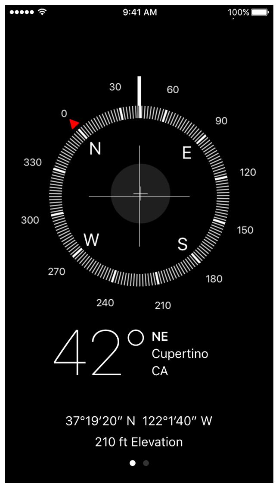

> Navigation: [Technologies](../technologies.md) · [Core Location](../corelocation.md)

# Getting heading and course information

Article

Use a device’s orientation and course information for navigation.

## Overview

Heading and course information are commonly used by navigation apps to help guide the user to a destination. The heading of a user’s device is its current orientation relative to magnetic or true north. Devices with GPS can report course information, which represents the direction in which the device is moving. The Compass app in iOS uses heading information to implement a magnetic compass interface, as shown in [Figure 1](/documentation/corelocation/getting_heading_and_course_information#2904075). Augmented reality apps might use this information to determine which direction the user is facing.

### Get the current heading

You use heading information to determine the current orientation of the user’s device. For example, an augmented reality app might use the current heading to help determine what information to show on the user’s screen. Headings are usually reported relative to the top of the device, but you can configure how values are reported using the [headingOrientation](cllocationmanager/headingorientation.md) property of your [CLLocationManager](cllocationmanager.md) object.

After determining whether heading information is available, call the [- startUpdatingHeading](<cllocationmanager/startupdatingheading().md>) method of your [CLLocationManager](cllocationmanager.md) object to begin the delivery of heading updates. The location manager delivers updates to the [- locationManager:didUpdateHeading:](<cllocationmanagerdelegate/locationmanager(__didupdateheading_).md>) method of its delegate whenever the heading information changes.

> [!note] Note
> Heading information is available only on devices with a built-in magnetometer; it’s not available in iOS Simulator. The magnetometer determines a device’s orientation relative to magnetic north. When location data is available, Core Location also reports the device’s orientation relative to true north.

### Get course information

Course information reflects the speed and direction in which a device is moving and is available only on devices with GPS hardware. Don’t confuse course information with heading information. Course direction reflects the direction in which the device is moving and is independent of the device’s physical orientation. The most common use of course information is in navigation apps.

Course information is included automatically in [CLLocation](cllocation.md) objects delivered to your app as part of its location updates. When enough location data has been gathered to compute a course, the location manager fills in the [speed](cllocation/speed.md) and [course](cllocation/course.md) properties of the location object with the appropriate values.

## See Also

### Compass headings

- [CLHeading](clheading.md) — The orientation of the user’s device, relative to true or magnetic north.
