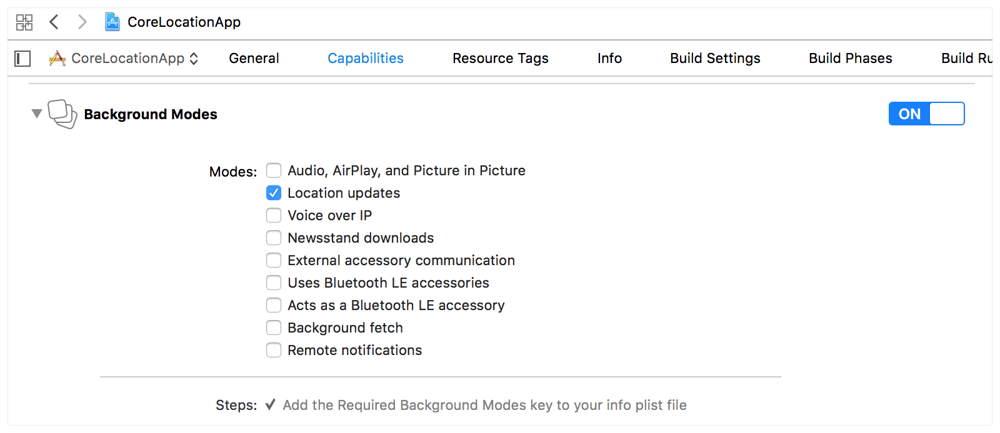

> Navigation: [Technologies](../technologies.md) · [Core Location](../corelocation.md)

# Handling location updates in the background

Article

Configure your app to receive location updates when it isn’t running in the foreground.

## Overview

On some Apple devices, the operating system preserves battery life by suspending the execution of background apps. For example, on iOS, iPadOS, and watchOS, the system suspends the execution of most apps shortly after they move to the background. In this suspended state, apps don’t run and don’t receive location updates from the system. Instead, the system enqueues location updates and delivers them when the app runs again, either in the foreground or background. If your app needs updates in a more timely manner, you can ask the system to not suspend your app while location services are active.

Consider carefully whether your app really needs background location updates. Most apps need location data only while someone actively uses the app. Consider background updates only when your app needs to receive those updates in real time, perhaps to:

- Track the precise path taken during a hike or fitness workout.
- Provide navigation instructions in real time.
- Generate time-sensitive notifications or updates.
- Take immediate action when someone enters or exits a particular geographic region.

If you need background location updates for an iOS, iPadOS, or watchOS app, update your project to support those updates. On macOS, you don’t need to add support for background updates because the system doesn’t suspend apps when they move to the background. Apps running in visionOS don’t receive background updates.

### Add the background mode capability

The background mode capability lets the system know whether your app uses background updates. To add this capability, navigate to the Signing & Capabilities tab of your app target and enable the Location updates option. When you enable this capability, Xcode updates your app’s `Info.plist` file with the keys needed to indicate your app supports background updates.

### Receive location updates in the background

Create an instance of [CLBackgroundActivitySession](clbackgroundactivitysession-3mzv3.md) to start a background activity session so that you can receive location updates. It’s your responsibility to communicate that location updates will arrive before going to the background, and handle updates as they arrive.

Create a [CLServiceSession](clservicesession-pt7n.md) requiring the relevant form of authorization  ([CLServiceSession.AuthorizationRequirement.whenInUse](clservicesession-pt7n/authorizationrequirement/wheninuse.md) or [CLServiceSession.AuthorizationRequirement.always](clservicesession-pt7n/authorizationrequirement/always.md)). Create the session while your app is in the foreground. If your app terminates, you must recreate the [CLServiceSession](clservicesession-pt7n.md) immediately upon launch in the background.

Core Location sets When in Use authorization implicitly when you process events from [CLMonitor](clmonitor-2r51v.md), [CLLocationUpdate](cllocationupdate.md), or use a [CLBackgroundActivitySession](clbackgroundactivitysession-3mzv3.md). The exception is if you set the `NSLocationRequireExplicitServiceSession` in your app’s `Info.plist`.

> [!important] Important
> For Always authorization, inform the user that location updates arrive in the background. This provides transparency and lets the user know what’s happening.

### Process location updates after an app launch

The system can terminate apps at any time to free up memory or other system resources. If your app actively receives and processes location updates and terminates, it should restart those APIs upon launch in order to continue receiving updates. When you start those services, the system resumes the delivery of queued location updates. Don’t start these services at launch time if your app’s authorization status is undetermined.

## See Also

### Location updates

- [Getting the current location of a device](getting-the-current-location-of-a-device.md) — Start location services and provide information the system needs to optimize power usage for those services.
- [Creating a location push service extension](creating-a-location-push-service-extension.md) — Add and configure an extension to enable your location-sharing app to access a person’s location in response to a request from someone else.
- [CLLocation](cllocation.md) — The latitude, longitude, and course information reported by the system.
- [CLLocationCoordinate2D](cllocationcoordinate2d.md) — The latitude and longitude associated with a location, specified using the WGS 84 reference frame.
- [CLFloor](clfloor.md) — The floor of a building on which the user’s device is located.
- [CLVisit](clvisit.md) — Information about the user’s location during a specific period of time.
- [CLLocationSourceInformation](cllocationsourceinformation.md) — Information about the source that provides a location.
- [Monitoring location changes with Core Location](monitoring-location-changes-with-core-location.md) — Define boundaries and act on user location updates.
- [CLServiceSession](clservicesession-pt7n.md) — An object that provides diagnostics about an app’s authorization to use location services.
