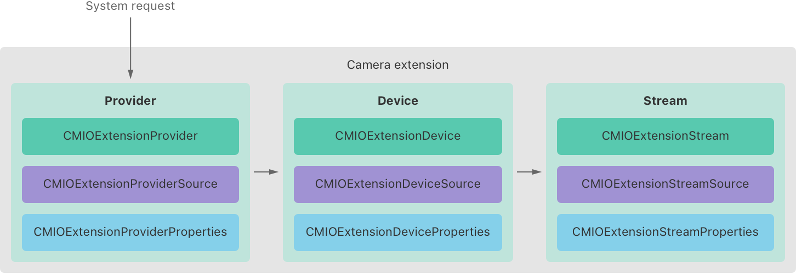
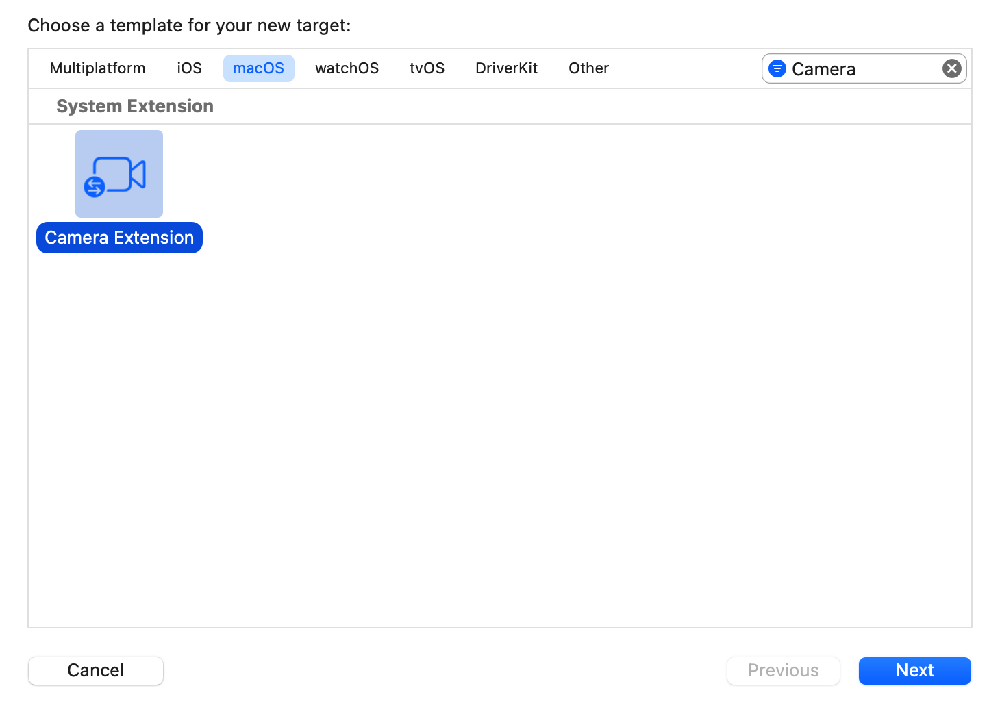
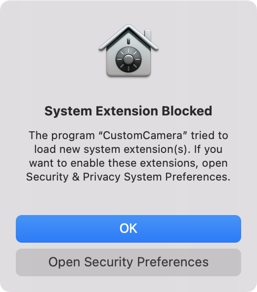

> Navigation: [Technologies](../technologies.md) · [Core Media I/O](../coremediaio.md)

# Creating a camera extension with Core Media I/O

<sub>Article</sub>

Build high-performance camera drivers that are secure and simple to deploy.

## Overview

Camera extensions are a new type of system extension available in macOS 12.3 and later. They provide a simple, secure model for building high-performance camera drivers for macOS. You package and install them with your app, which makes them simple to deploy, including through the App Store.

> [!note] Related Sessions from WWDC22
> Session 10022: [Create camera extensions with Core Media I/O](https://developer.apple.com/wwdc22/10022)

The following illustration shows a high-level view of a camera extension.



<sub>An illustration that shows a box with the title Camera extension aligned to its top edge. The box contains three smaller boxes arranged horizontally. From left-to-right they are labeled Provider, Device, and Stream respectively. Each box itself contains three smaller boxes arranged vertically. Each box shows the provider, source, and properties object for each component.</sub>

A camera extension consists of three primary components:

- A [CMIOExtensionProvider](cmioextensionprovider.md) represents the primary interface to the extension. The provider and its source manage the extension’s device and client connections, and also define properties common to the extension such as its name and manufacturer.
- A [CMIOExtensionDevice](cmioextensiondevice.md) represents a hardware or software device that the extension publishes as a selectable camera in apps like FaceTime. A device and its source configure supporting resources like buffer pools that it uses when streaming data. A device also defines properties for values such as its model name and transport type.
- A [CMIOExtensionStream](cmioextensionstream.md) represents a stream of data to send to clients. A stream and its source specify the stream’s format, minimum and maximum frame rates, and direction. A stream’s source object is responsible for starting and stopping the stream’s flow of data.

To simplify creating your own extensions, Xcode provides a Camera Extension template that provides a fully functional extension implementation. It creates a virtual camera device that renders a horizontal white line that moves up and down the display. This article shows how to configure the template’s output to build your own camera extension.

> [!note] Note
> See the [System Extensions](../systemextensions.md) framework for additional information on building, installing, and debugging system extensions.

### Add entitlements to your host app

You package your camera extension as part of your app bundle. To allow your app to install and communicate with the extension, your app target requires two additional capabilities. Select the target in Xcode, and click the Signing & Capabilities pane. Add the following capabilities to the target:

- System Extension. This capability enables the app to install system extensions.
- App Groups. This capability enables the app to define a common group container for the app and the extension to share, which allows them to communicate.

Adding the capabilities to the target writes the values to an entitlements file. For example, an app with a bundle identifier of `com.example.CustomCamera` would have an entitlements file similar to the following:

```objc
<plist version="1.0">
    <dict>
        <key>com.apple.security.app-sandbox</key>
        <true/>
        <key>com.apple.developer.system-extension.install</key>
        <true/>
        <key>com.apple.security.application-groups</key>
        <array>
            <string>$(TeamIdentifierPrefix)com.example.CustomCamera</string>
        </array>
    </dict>
</plist>
```

### Create a camera extension target

Add a new target to your app using the Camera Extension template. In Xcode, go to the File menu and choose File \> New and select the Target menu item. In the dialog that appears, select the macOS pane and find the Camera Extension template as shown below.



<sub>An Xcode New Target dialog. At the top-left of the dialog is a label with the value Choose a template for your new target. Below the label shows a row of tabs, with the macOS tab selected. To the right of the tab bar is a search field that displays the word, Camera. Below that shows the Camera Extension template selected. Along the bottom of the dialog are three buttons. The left-most button has the title Cancel. The two right-most buttons have the titles Previous and Next, respectively. The Previous button is in a disabled state, and the Next button is in a highlighted state.</sub>

Click the Next button. On the screen that follows, give the extension an appropriate name and leave the other values set to their defaults, and then click the Finish button.

The template creates a new target and folder with the name you specified. The folder contains the following files:

- A `[CameraExtensionName]Provider.swift` file that provides the complete extension implementation.
- A `main.swift` file that provides the minimal code for the system to initialize the extension.
- An `Info.plist` that defines the `CMIOExtensionMachServiceName` for the extension and a [NSSystemExtensionUsageDescriptionKey](../systemextensions/nssystemextensionusagedescriptionkey.md) that describes the extension’s purpose to the user.
- A `[CameraExtensionName].entitlements` file that defines a default app group.

### Configure the extension

So that your app and extension can communicate, open the `[CameraExtensionName].entitlements` file and update it to use the same app group name that you defined in your app, as in the example below.

```swift
<plist version="1.0">
    <dict>
        <key>com.apple.security.app-sandbox</key>
        <true/>
        <key>com.apple.security.application-groups</key>
        <array>
            <string>(TeamIdentifierPrefix)com.example.CustomCamera</string>
        </array>
    </dict>
</plist>
```

Next, open the `[CameraExtensionName]Provider.swift` file. This file provides a complete implementation for all components of a camera extension. Look through the file and familiarize yourself with the code.

You can quickly find essential user-customizable strings by searching the file for the string, `SampleCapture`, and replacing the values as appropriate. A particularly important string to customize is the [localizedName](cmioextensiondevice/localizedname.md) that you specify for the [CMIOExtensionDevice](cmioextensiondevice.md), because it’s the string that apps display in their camera selection UI.

### Activate the extension

The system automatically installs a camera extension when a user installs your app. However, before your extension is available for the system to use, your app needs to activate it by performing an activation request like shown below.

```swift
// The bundle identifier of your extension.
let identifier = "com.example.apple-samplecode.CustomCamera.CameraExtension"

// Submit an activation request.
let activationRequest = OSSystemExtensionRequest.activationRequest(forExtensionWithIdentifier: identifier, queue: .main)
activationRequest.delegate = self
OSSystemExtensionManager.shared.submitRequest(activationRequest)
```

Only apps that reside in the `/Applications` directory can activate an extension. To test your extension, move your app from Xcode’s build results to the `/Applications` folder. Launch your app from its new location to test its activation request. When it attempts to activate the extension, the system prompts the user with a dialog like shown below.



<sub>A dialog requesting user approval to activate a Camera Extension. The dialog title is System Extension Blocked. Its message indicates the app attempted to load a new system extension, and it includes directions to open the Security & Privacy System Preferences. The dialog has an OK button to dismiss the notice and an Open Security Preferences button below it. Pressing Open Security Preferences opens System Settings to the appropriate location.</sub>

Before the extension is available to the system, a person with Admin privileges for the Mac must explicitly allow access to it in the Systems & Privacy screen of System Settings.


<sub>An image that shows a label on the left, with the value System software from application CustomCamera was blocked from loading. On the right side of the image is a button with the label, Allow.</sub>

> [!tip] Tip
> During development of your extension, it’s often useful to temporarily disable some security restrictions imposed by the system. See [Debugging and testing system extensions](../driverkit/debugging-and-testing-system-extensions.md) for more information.

### Access the custom camera

After you’ve allowed the system to use your custom extension, it’s automatically available as a selectable camera in system apps like FaceTime and PhotoBooth. Camera extensions are also fully compatible with [AVFoundation](../avfoundation.md) capture APIs, which means you can access your extension as an [AVCaptureDevice](../avfoundation/avcapturedevice.md) object and use it like any other device. For example, to retrieve your custom camera extension (as well as any others on the system), retrieve it as an [externalUnknown](../avfoundation/avcapturedevice/devicetype-swift.struct/externalunknown.md) device type as shown below.

```swift
// Discover devices with a device type of `externalUnknown`.
let discoverySession = AVCaptureDevice.DiscoverySession(deviceTypes: [.externalUnknown],
                                                        mediaType: .video,
                                                        position: .unspecified)
// Access the external devices.
let externalDevices = discoverySession.devices
```

## See Also

### Providers

- [Overriding the default USB video class extension](overriding-the-default-usb-video-class-extension.md) — Create a simple DriverKit extension to override the default driver-matching behavior for USB devices.
- [CMIOExtensionProvider](cmioextensionprovider.md) — An object that manages device connections for a provider.
- [CMIOExtensionProviderSource](cmioextensionprovidersource.md) — A protocol for objects that act as provider sources.
- [CMIOExtensionProviderProperties](cmioextensionproviderproperties.md) — An object that manages the properties of an extension provider.
