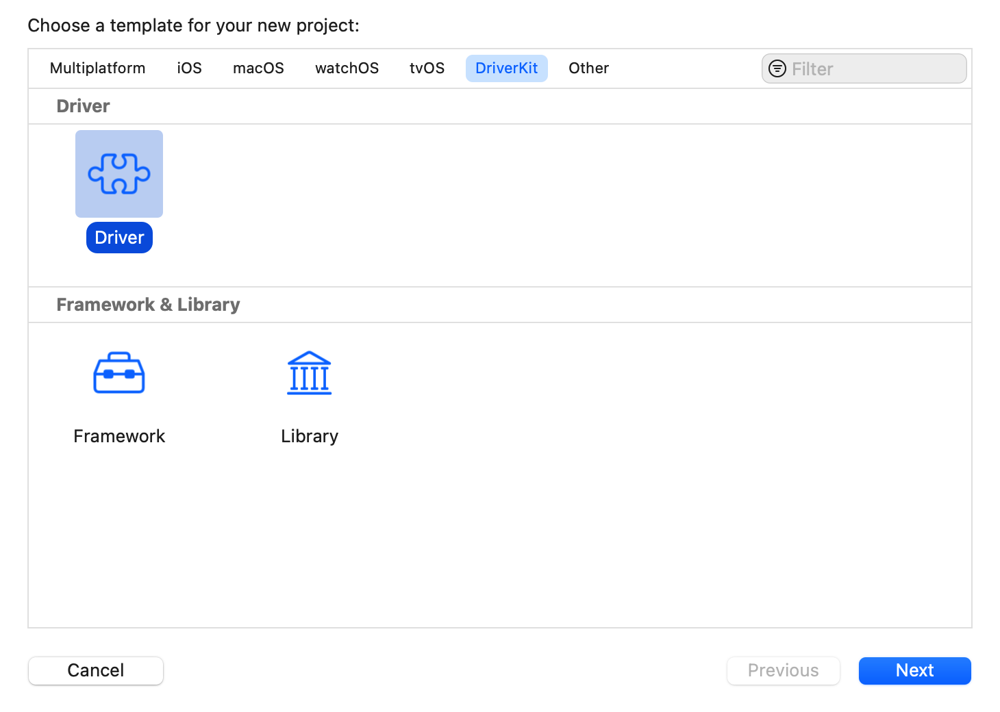

> Navigation: [Technologies](../technologies.md) · [Core Media I/O](../coremediaio.md)

# Overriding the default USB video class extension

<sub>Article</sub>

Create a simple DriverKit extension to override the default driver-matching behavior for USB devices.

## Overview

Starting in macOS 12.3, the operating system provides a class-compliant Core Media I/O (CMIO) extension that enables the use of USB cameras and other video capture devices. When you connect a USB camera, the system finds its default driver and connects it with the camera. To override the system’s default matching behavior so that you can load a custom CMIO extension instead, create a simple [DriverKit](../driverkit.md) extension.

### Create a DriverKit extension

In a standalone Xcode project, or as a target within an existing project, create a new DriverKit extension. In Xcode’s menu, select File \> New and choose either the Project or Target menu items as appropriate. In the dialog that appears, select the DriverKit tab and the Driver template, and click the Next button.



<sub>An Xcode New Project dialog. At the top-left of the dialog is a label with the value Choose a template for your new project. Below the label shows a row of tabs, with the DriverKit tab selected. Below the tab bar shows the Driver template selected. Along the bottom of the dialog are three buttons. The left-most button has the title Cancel. The two right-most buttons have the titles Previous and Next, respectively. The Previous button is in a disabled state, and the Next button is in a highlighted state.</sub>

In the dialog that follows, give the driver an appropriate Product Name and click the Finish button to create it.

The default IOKit interface generator (`.iig`) and C++ implementation files that the template creates provide the sufficient implementation for your driver. The driver is effectively codeless, but the system requires a minimal binary for entitlement purposes.

### Configure the Info.plist file

Specify your matching parameters as one or more entries in the [IOKitPersonalities](../bundleresources/information-property-list/iokitpersonalities.md) dictionary inside the DriverKit extension’s `Info.plist` file. The following example shows the standard configuration to provide within this file.

```swift
<key>IOKitPersonalities</key>
<dict>
    <key>Camera-Identifier</key>
    <dict>
        <key>CFBundleIdentifierKernel</key>
        <string>com.apple.UVCService</string>
        <key>IOClass</key>
        <string>UVCService</string>
        <key>IOProviderClass</key>
        <string>IOUSBHostInterface</string>
        <key>bConfigurationValue</key>
        <string>*</string>
        <key>bInterfaceNumber</key>
        <string>*</string>
        <integer>14</integer>
        <key>bInterfaceSubClass</key>
        <string>*</string>
        <key>IOUserClass</key>
        <string>[DRIVERKIT CLASS NAME]</string>
        <key>IOUserServerName</key>
        <string>[DRIVERKIT SERVER NAME]</string>
        <key>IOProbeScore</key>
        <integer>9999</integer>
        <key>idVendor</key>
        <integer>123</integer>
        <key>idProduct</key>
        <integer>123</integer>
        <key>IOProviderMergeProperties</key>
        <dict>
            <key>CameraAssistantBundleID</key>
            <string>[YOUR CMIO EXTENSION ID]</string>
        </dict>
    </dict>

</dict>
```

Set [IOUserClass](../bundleresources/information-property-list/iouserclass.md) and [IOUserServerName](../bundleresources/information-property-list/iouserservername.md) values as appropriate for your newly created extension. Set a high `IOProbeScore` value to give priority to your driver, and set the identifiers of the vendor and product to match. In the `IOProviderMergeProperties`, specify the identifier of your custom CMIO extension to load in place of the default driver.

With the configuration of your DriverKit extension complete, refer to [Installing System Extensions and Drivers](../systemextensions/installing-system-extensions-and-drivers.md) for information on how to package and install your extension.

## See Also

### Providers

- [Creating a camera extension with Core Media I/O](creating-a-camera-extension-with-core-media-i-o.md) — Build high-performance camera drivers that are secure and simple to deploy.
- [CMIOExtensionProvider](cmioextensionprovider.md) — An object that manages device connections for a provider.
- [CMIOExtensionProviderSource](cmioextensionprovidersource.md) — A protocol for objects that act as provider sources.
- [CMIOExtensionProviderProperties](cmioextensionproviderproperties.md) — An object that manages the properties of an extension provider.
