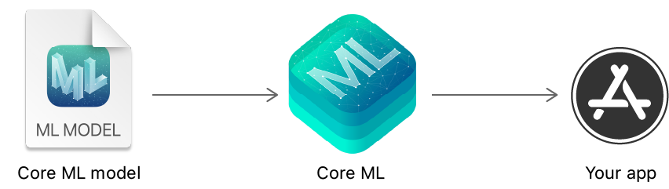
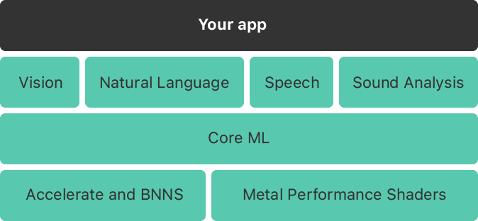

> Navigation: [Technologies](technologies.md)

# Core ML

Framework

Integrate machine learning models into your app.

## Overview

Use [Core ML](coreml.md) to integrate machine learning models into your app. [Core ML](coreml.md) provides a unified representation for all models. Your app uses [Core ML](coreml.md) APIs and user data to make predictions, and to train or fine-tune models, all on a person’s device.

Flow diagram going from left to right. Starting on the left is a Core ML model file icon. Next, in the center is the Core ML framework icon, and on the right is a generic app icon, labeled “your app”.

A model is the result of applying a machine learning algorithm to a set of training data. You use a model to make predictions based on new input data. Models can accomplish a wide variety of tasks that would be difficult or impractical to write in code. For example, you can train a model to categorize photos, or detect specific objects within a photo directly from its pixels.

You build and train a model with the [Create ML app](https://developer.apple.com/machine-learning/create-ml/) bundled with Xcode. Models trained using [Create ML](createml.md) are in the [Core ML](coreml.md) model format and are ready to use in your app. Alternatively, you can use a wide variety of other machine learning libraries and then use [Core ML Tools](https://coremltools.readme.io) to convert the model into the [Core ML](coreml.md) format. Once a model is on a person’s device, you can use [Core ML](coreml.md) to retrain or fine-tune it on-device, with that person’s data.

[Core ML](coreml.md) optimizes on-device performance by leveraging the CPU, GPU, and Neural Engine while minimizing its memory footprint and power consumption. Running a model strictly on a person’s device removes any need for a network connection, which helps keep a person’s data private and your app responsive.

The framework is the foundation for domain-specific frameworks and functionality. It supports [Vision](vision.md) for analyzing images, [Natural Language](naturallanguage.md) for processing text, [Speech](speech.md) for converting audio to text, and [Sound Analysis](soundanalysis.md) for identifying sounds in audio. [Core ML](coreml.md) itself builds on top of low-level primitives like [Accelerate](accelerate.md) and [BNNS](accelerate/bnns-library.md), as well as [Metal Performance Shaders](metalperformanceshaders.md).

A block diagram of the machine learning stack. The top layer is a single block labeled “Your app,” which spans the entire width of the block diagram. The second layer has four blocks labeled “Vision,” “Natural Language,” “Speech,” and “Sound Analysis.” The third layer is labeled “Core ML,” which also spans the entire width. The fourth and final layer has two blocks, “Accelerate and BNNS” and “Metal Performance Shaders.”

If your app integrates AI models using the latest architectures and inference techniques, see [Core AI](coreai.md).

## Topics

### Core ML models

- [Getting a Core ML Model](coreml/getting-a-core-ml-model.md) — Obtain a Core ML model to use in your app.
- [Updating a Model File to a Model Package](coreml/updating-a-model-file-to-a-model-package.md) — Convert a Core ML model file into a model package in Xcode.
- [Integrating a Core ML Model into Your App](coreml/integrating-a-core-ml-model-into-your-app.md) — Add a simple model to an app, pass input data to the model, and process the model’s predictions.
- [MLModel](coreml/mlmodel.md) — An encapsulation of all the details of your machine learning model.
- [Model Customization](coreml/model-customization.md) — Expand and modify your model with new layers.
- [Model Personalization](coreml/model-personalization.md) — Update your model to adapt to new data.

### Model inputs and outputs

- [Making Predictions with a Sequence of Inputs](coreml/making-predictions-with-a-sequence-of-inputs.md) — Integrate a recurrent neural network model to process sequences of inputs.
- [MLFeatureValue](coreml/mlfeaturevalue.md) — A generic wrapper around an underlying value and the value’s type.
- [MLSendableFeatureValue](coreml/mlsendablefeaturevalue.md) — A sendable feature value.
- [MLFeatureProvider](coreml/mlfeatureprovider.md) — An interface that represents a collection of values for either a model’s input or its output.
- [MLDictionaryFeatureProvider](coreml/mldictionaryfeatureprovider.md) — A convenience wrapper for the given dictionary of data.
- [MLBatchProvider](coreml/mlbatchprovider.md) — An interface that represents a collection of feature providers.
- [MLArrayBatchProvider](coreml/mlarraybatchprovider.md) — A convenience wrapper for batches of feature providers.
- [MLModelAsset](coreml/mlmodelasset.md) — An abstraction of a compiled Core ML model asset.

### App integration

- [Downloading and Compiling a Model on the User’s Device](coreml/downloading-and-compiling-a-model-on-the-user-s-device.md) — Install Core ML models on the user’s device dynamically at runtime.
- [Model Integration Samples](coreml/model-integration-samples.md) — Integrate tabular, image, and text classifcation models into your app.

### Model encryption

- [Generating a Model Encryption Key](coreml/generating-a-model-encryption-key.md) — Create a model encryption key to encrypt a compiled model or model archive.
- [Encrypting a Model in Your App](coreml/encrypting-a-model-in-your-app.md) — Encrypt your app’s built-in model at compile time by adding a compiler flag.

### Compute devices

- [MLComputeDevice](coreml/mlcomputedevice.md) — Compute devices for framework operations.
- [MLCPUComputeDevice](coreml/mlcpucomputedevice.md) — An object that represents a CPU compute device.
- [MLGPUComputeDevice](coreml/mlgpucomputedevice.md) — An object that represents a GPU compute device.
- [MLNeuralEngineComputeDevice](coreml/mlneuralenginecomputedevice.md) — An object that represents a Neural Engine compute device.
- [MLComputeDeviceProtocol](coreml/mlcomputedeviceprotocol.md) — An interface that represents a compute device type.

### Compute plan

- [MLComputePlan](coreml/mlcomputeplan-1w21n.md) — A class representing the compute plan of a model.
- [MLModelStructure](coreml/mlmodelstructure-swift.enum.md) — An enum representing the structure of a model.
- [MLComputePolicy](coreml/mlcomputepolicy.md) — The compute policy determining what compute device, or compute devices, to execute ML workloads on.
- [withMLTensorComputePolicy(_:_:)](<coreml/withmltensorcomputepolicy(____)-8stx9.md>) — Calls the given closure within a task-local context using the specified compute policy to influence what compute device tensor operations are executed on.
- [withMLTensorComputePolicy(_:_:)](<coreml/withmltensorcomputepolicy(____)-6z33x.md>) — Calls the given closure within a task-local context using the specified compute policy to influence what compute device tensor operations are executed on.

### Model state

- [MLState](coreml/mlstate.md) — Handle to the state buffers.
- [MLStateConstraint](coreml/mlstateconstraint.md) — Constraint of a state feature value.

### Model tensor

- [MLTensor](coreml/mltensor.md) — A multi-dimensional array of numerical or Boolean scalars tailored to ML use cases, containing methods to perform transformations and mathematical operations efficiently using a ML compute device.
- [MLTensorScalar](coreml/mltensorscalar.md) — A type that represents the tensor scalar types supported by the framework. Don’t use this type directly.
- [MLTensorRangeExpression](coreml/mltensorrangeexpression.md) — A type that can be used to slice a dimension of a tensor. Don’t use this type directly.
- [pointwiseMin(_:_:)](<coreml/pointwisemin(____).md>) — Computes the element-wise minimum of two tensors.
- [pointwiseMax(_:_:)](<coreml/pointwisemax(____).md>) — Computes the element-wise minimum between two tensors.
- [withMLTensorComputePolicy(_:_:)](<coreml/withmltensorcomputepolicy(____).md>) — Calls the given closure within a task-local context using the specified compute policy to influence what compute device tensor operations are executed on.

### Model structure

- [MLModelStructure](coreml/mlmodelstructure-swift.enum.md) — An enum representing the structure of a model.

### Model errors

- [MLModelError](coreml/mlmodelerror-swift.struct.md) — Information about a Core ML model error.
- [Code](coreml/mlmodelerror-swift.struct/code.md) — Information about a Core ML model error.
- [MLModelErrorDomain](coreml/mlmodelerrordomain.md) — The domain for Core ML errors.

### Model deployments

- [MLModelCollection](coreml/mlmodelcollection.md) — A set of Core ML models from a model deployment. _(deprecated)_

### Reference

- [CoreML Enumerations](coreml/coreml-enumerations.md)
