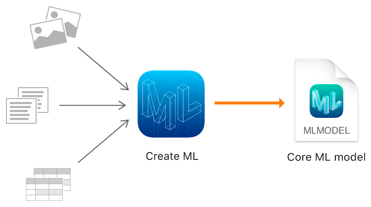
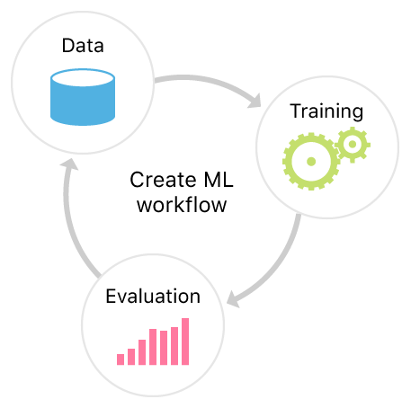

> Navigation: [Technologies](technologies.md)

# Create ML

Framework

Create machine learning models for use in your app.

## Overview

Use Create ML with familiar tools like Swift and macOS playgrounds to create and train custom machine learning models on your Mac. You can train models to perform tasks like recognizing images, extracting meaning from text, or finding relationships between numerical values.

You train a model to recognize patterns by showing it representative samples. For example, you can train a model to recognize dogs by showing it lots of images of different dogs. After you’ve trained the model, you test it out on data it hasn’t seen before, and evaluate how well it performed the task. When the model is performing well enough, you’re ready to integrate it into your app using [Core ML](coreml.md).

Create ML leverages the machine learning infrastructure built in to Apple products like Photos and Siri. This means your image classification and natural language models are smaller and take much less time to train.

## Topics

### Image models

- [Creating an Image Classifier Model](createml/creating-an-image-classifier-model.md) — Train a machine learning model to classify images, and add it to your Core ML app.
- [MLImageClassifier](createml/mlimageclassifier.md) — A model you train to classify images.
- [MLObjectDetector](createml/mlobjectdetector.md) — A model you train to classify one or more objects within an image.
- [MLHandPoseClassifier](createml/mlhandposeclassifier.md) — A task that creates a hand pose classification model by training with images of people’s hands that you provide.

### Video models

- [Creating an Action Classifier Model](createml/creating-an-action-classifier-model.md) — Train a machine learning model to recognize a person’s body movements.
- [Detecting human actions in a live video feed](createml/detecting-human-actions-in-a-live-video-feed.md) — Identify body movements by sending a person’s pose data from a series of video frames to an action-classification model.
- [MLActionClassifier](createml/mlactionclassifier.md) — A model you train with videos to classify a person’s body movements.
- [MLHandActionClassifier](createml/mlhandactionclassifier.md) — A task that creates a hand action classification model by training with videos of people’s hand movements that you provide.
- [MLStyleTransfer](createml/mlstyletransfer.md) — A model you train to apply an image’s style to other images or videos.

### Text models

- [Creating a text classifier model](createml/creating-a-text-classifier-model.md) — Train a machine learning model to classify natural language text.
- [Creating a word tagger model](createml/creating-a-word-tagger-model.md) — Train a machine learning model to tag individual words in natural language text.
- [MLTextClassifier](createml/mltextclassifier.md) — A model you train to classify natural language text.
- [MLWordTagger](createml/mlwordtagger.md) — A word-tagging model you train to classify natural language text at the word level.
- [MLGazetteer](createml/mlgazetteer.md) — A collection of terms and their labels, which augments a tagger that analyzes natural language text.
- [MLWordEmbedding](createml/mlwordembedding.md) — A map of strings in a vector space that enable your app to find similar strings by looking at a string’s neighbors.

### Sound models

- [MLSoundClassifier](createml/mlsoundclassifier.md) — A machine learning model you train with audio files to recognize and identify sounds on a device.

### Motion models

- [MLActivityClassifier](createml/mlactivityclassifier.md) — A model you train to classify motion sensor data.

### Tabular models

- [Creating a model from tabular data](createml/creating-a-model-from-tabular-data.md) — Train a machine learning model by using Core ML to import and manage tabular data.
- [MLClassifier](createml/mlclassifier.md) — A model you train to classify data into discrete categories.
- [MLRegressor](createml/mlregressor.md) — A model you train to estimate continuous values.
- [MLRecommender](createml/mlrecommender.md) — A model you train to make recommendations based on item similarity, grouping, and, optionally, item ratings.

### Tabular data

- [MLDataTable](createml/mldatatable.md) — A table of data for training or evaluating a machine learning model.
- [MLDataValue](createml/mldatavalue.md) — The value of a cell in a data table.
- [Data visualizations](createml/data-visualizations.md) — Render images of data tables and columns in a playground.

### Model accuracy

- [Improving Your Model’s Accuracy](createml/improving-your-model-s-accuracy.md) — Use metrics to tune the performance of your machine learning model.
- [MLClassifierMetrics](createml/mlclassifiermetrics.md) — Metrics you use to evaluate a classifier’s performance.
- [MLRegressorMetrics](createml/mlregressormetrics.md) — Metrics you use to evaluate a regressor’s performance.
- [MLWordTaggerMetrics](createml/mlwordtaggermetrics.md) — Metrics you use to evaluate a word tagger’s performance.
- [MLRecommenderMetrics](createml/mlrecommendermetrics.md) — Metrics you use to evaluate a recommender’s performance.
- [MLObjectDetectorMetrics](createml/mlobjectdetectormetrics.md) — Metrics you use to evaluate an object detector’s performance.

### Model training Control

- [MLJob](createml/mljob.md) — The representation of a model’s asynchronous training session you use to monitor the session’s progress or terminate its execution.
- [MLTrainingSession](createml/mltrainingsession.md) — The current state of a model’s asynchronous training session.
- [MLTrainingSessionParameters](createml/mltrainingsessionparameters.md) — The configuration settings for a training session.
- [MLCheckpoint](createml/mlcheckpoint.md) — The state of a model’s asynchronous training session at a specific point in time during the feature extraction or training phase.

### Supporting types

- [MLCreateError](createml/mlcreateerror.md) — The errors Create ML throws while performing various operations, such as training models, making predictions, writing models to a file system, and so on.
- [MLModelMetadata](createml/mlmodelmetadata.md) — Information about a model that’s stored in a Core ML model file.
- [MLSplitStrategy](createml/mlsplitstrategy.md) — Data partitioning approaches, typically for creating a validation dataset from a training dataset.

### Articles

- [Data visualizations](createml/create-ml-utilties.md) — Render images of data tables and columns in a playground.
- [Detecting human actions in a live video feed](createml/detecting-human-actions-in-a-live-video-feed.md) — Identify body movements by sending a person’s pose data from a series of video frames to an action-classification model.
- [Gathering Training Videos for an Action Classifier](createml/recording-or-choosing-training-videos.md) — Collect quality example videos that effectively train action classifiers.

### Functions

- [show(_:)](<createml/show(__).md>) — Generates a streaming visualization of the untyped column. _(deprecated)_
- [show(_:_:)](<createml/show(____).md>) — Generates a streaming plot visualization of the two untyped columns. _(deprecated)_

### Enumerations

- [MLBoundingBoxAnchor](createml/mlboundingboxanchor.md) — A location within a bounding box that an annotation’s coordinates use as their reference point.
- [MLBoundingBoxCoordinatesOrigin](createml/mlboundingboxcoordinatesorigin.md) — The location within an image that an annotation’s coordinates use as their origin.
- [MLBoundingBoxUnits](createml/mlboundingboxunits.md) — The units a bounding box annotation uses to define its position and size.
