> Navigation: [Technologies](../technologies.md) · [Create ML](../createml.md)

# Creating an Image Classifier Model

<sub>Article</sub>

Train a machine learning model to classify images, and add it to your Core ML app.

## Overview

An _image classifier_ is a machine learning model that recognizes images. When you give it an image, it responds with a category label for that image.

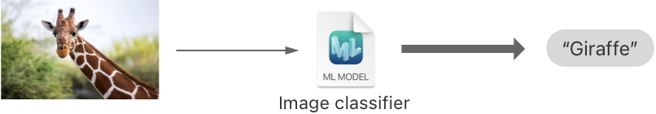

You train an image classifier by showing it many examples of images you’ve already labeled. For example, you can train an image classifier to recognize animals by gathering photos of elephants, giraffes, lions, and so on.

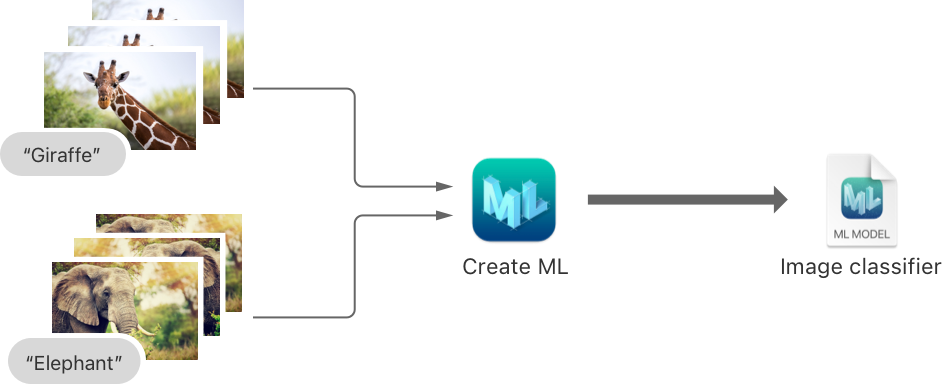

<sub>A flow diagram showing images of animals going into Create ML, which then produces an image classifier Core ML model file.</sub>

After the image classifier finishes training, you assess its accuracy and, if it performs well enough, save it as a Core ML model file. You then import the model file into your Xcode project to use the image classifier in your app.

### Gather Your Data

Use at least 10 images per category, but keep in mind that an image classifier performs better with a more diverse set of images. Consider including images of each category from multiple angles and in different lighting conditions.

Balance the number of images for each category. For example, don’t use 10 images for one category and then 1000 images for another.

The images can be in any format you can open in the Quicktime Player, such as JPEG and PNG. They don’t have to be a particular size, nor do they need to be the same size as each other. However, it’s best to use images that are at least 299 x 299 pixels.

If possible, gather images that best represent what you expect the model to see when you use it in your app. For example, if your app classifies images from a device’s camera in an outdoor setting, gather outdoor images from an identical or similar camera.

> [!note] Note
> By default, the image classifier uses the scene print feature extractor to accelerate the training process and works best with real-world objects. For more information, see [MLImageClassifier.FeatureExtractorType.scenePrint(revision:)](<mlimageclassifier/featureextractortype/sceneprint(revision_).md>).

### Organize Your Training Data

Prepare a training dataset by sorting the images into subfolders. Give each subfolder a name for the category of images contained within it. For example, you might use the label `Cheetah` for all the images of cheetahs.

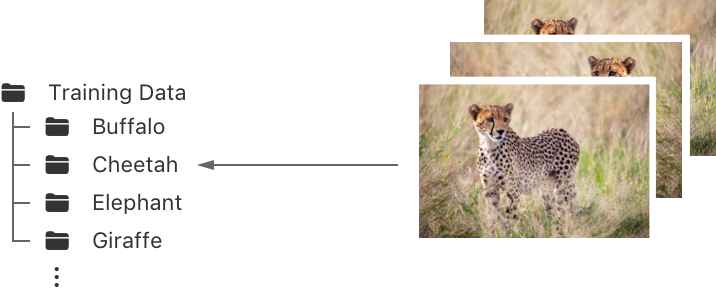

<sub>A diagram showing a folder called Training Data with subfolders that are named using the label corresponding to the category of images they contain. For example, all the cheetah images go into a subfolder named, Cheetah.</sub>

### Organize Your Testing Data

Testing your model with a testing dataset is a quick way to see how well your trained model might perform in the real world.

If your dataset has enough images, say 25 or more per category, create a testing dataset by duplicating the folder structure of the training dataset. Then move about 20 percent of the images from each category into the equivalent category folder in the testing dataset.

### Create an Image Classifier Project

Use Create ML to create an image classifier project. With Xcode open, Control-click the Xcode icon in the Dock and choose Open Developer Tool \> Create ML. Or, from the Xcode menu, choose Open Developer Tool \> Create ML.

In Create ML, choose File \> New Project to see the list of model templates. Select Image Classification and click Next.

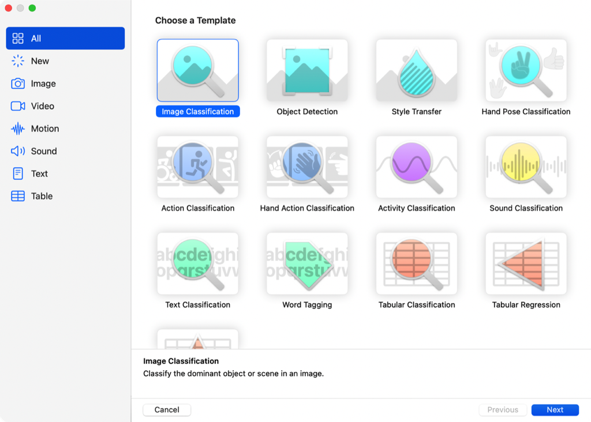

<sub>A screenshot of the Create ML project template window that has the Image Classification template selected. Other templates in the window include Style Transfer, Action Classification, Sound Classification, and Tabular Regression.</sub>

Change the project’s default name to a more meaningful one. If applicable, enter additional information for the models that come from this project, such as one or more authors and a short description.

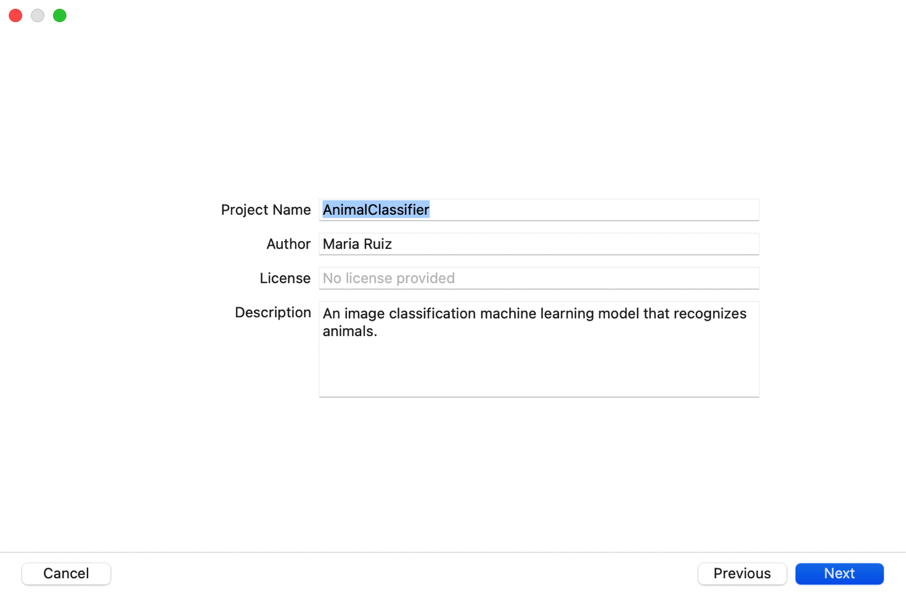

<sub>A screenshot of the new project options window with text fields for Project Name, Author, License, and Description. The first text fields have the values Animal Classifier, Maria Ruiz, and No license provided, respectively. The description text field reads, An image classification machine learning model that recognizes animals.</sub>

### Configure the Training Session

Drag the folder with your training dataset into the Training Data well in the project window.

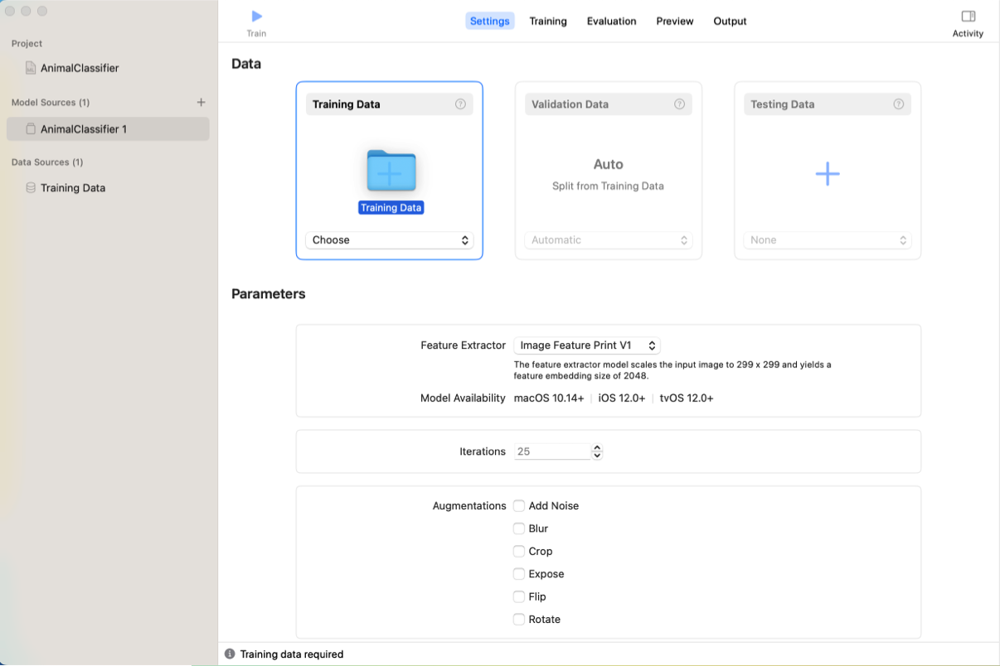

<sub>A screenshot of the project window in the Settings tab that shows the user dragging a Finder folder named Training Data onto the Training Data area.</sub>

If applicable, drag the folder with your testing dataset into the Testing Data well in the project window.

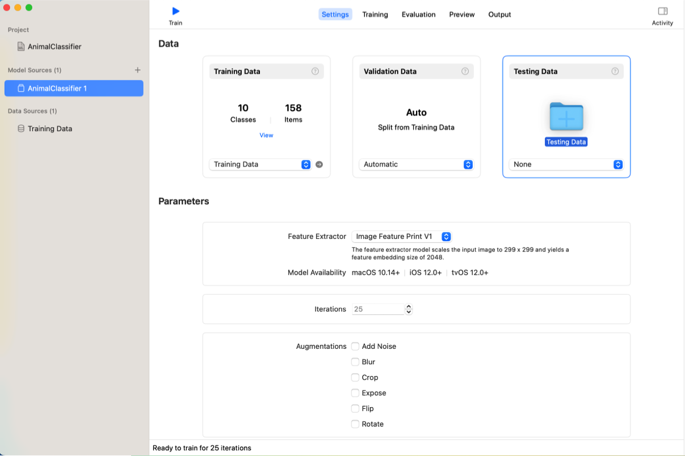

<sub>A screenshot of the project window in the Settings tab that shows the user dragging a Finder folder named Testing Data onto the Testing Data area. </sub>

You can adjust the following parameters before training your image classifier:

- **Feature Extractor** — A _Feature Extractor_ is the underlying base model that extracts image features for image classifier training session. There are 2 options for feature extraction. _Image Feature Print V2_ has a smaller output embedding size than _Image Feature Print V1_. This leads to faster training times, reduces the memory needed to store the extracted features, and can also increase accuracy. On the other hand, _Image Feature Print V1_ is compatible with older operating systems, including macOS 10.14 or later and iOS 12 or later. _Image Feature Print V2_ is compatible with macOS 14 or later and iOS 17 or later.
- **Iterations** — If you know how many training iterations you’d like use in your training session, change the default value. Include enough iterations for an accurate model; stopping too early may result in a model that’s less accurate.
- **Augmentations** — You can also turn on any or all of the image augmentations. Each augmentation copies the dataset’s images and applies a transform or filter that effectively gives the dataset more variety without gathering additional images.

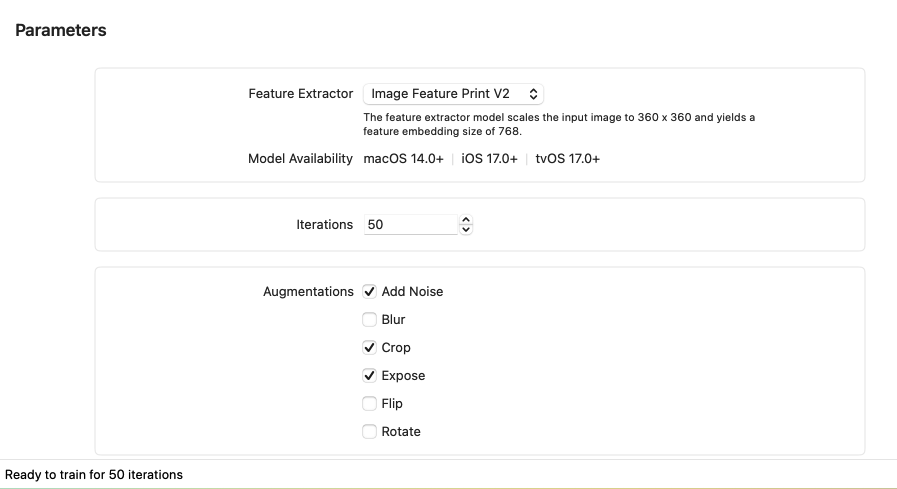

<sub>A screenshot of the project window in the Settings tab that highlights the Parameters section. The Feature Extractor is set to Image Feature Print V2. The Iterations parameter setting is set to 50 and the Augmentations setting has 6 checkboxes named, Add Noise, Blur, Crop, Expose, Flip, and Rotate.</sub>

### Train the Image Classifier

Click the Train button to start the training session. Create ML begins the session by quickly separating some of your training data into a validation dataset. Next, Create ML extracts features, such as edges, corners, textures, and regions of color, from the remaining training images. Create ML uses the images’ features to iteratively train the model and then checks its accuracy with the validation dataset.

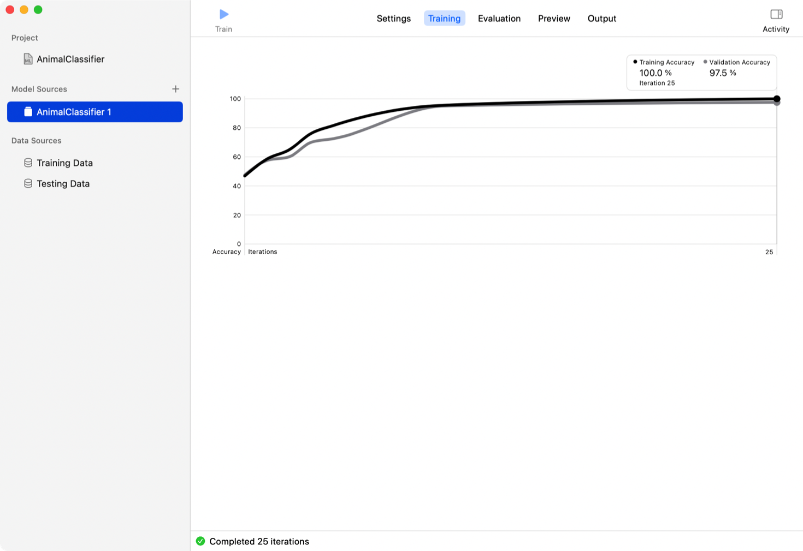

<sub>A screenshot of the project window in the Training tab showing a line graph of the model’s accuracy vs. the number of training iterations. The line generally progresses upward toward 100% and after 25 iterations ending at 100% and 97.5% for training and validation accuracy, respectively.</sub>

Create ML shows its progress in a graph, where the black and gray lines represent the model’s accuracy with the training and validation datasets, respectively.

### Assess the Model’s Accuracy

When Create ML finishes training the model, it tests the model using the testing dataset. When it’s finished testing the model, Create ML shows the training, validation, and testing accuracy scores in the Evaluation tab. Models typically have higher accuracy scores on the training dataset because it learned from those images. In this example, the image classifier model correctly identified:

- 100 percent of the training images
- 95 percent of the validation images
- 97 percent of the testing images

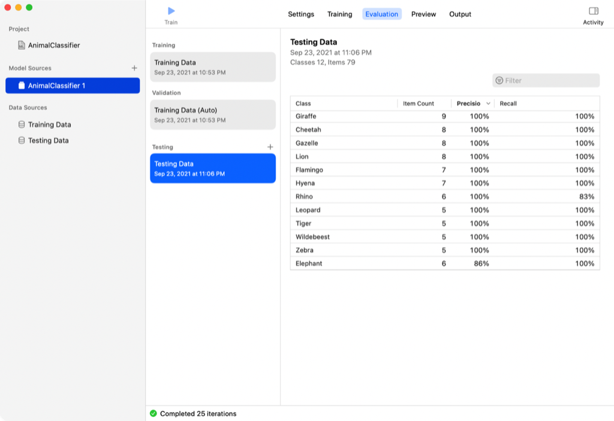

<sub>A screenshot of the project window in the Evaluation tab showing a table of the testing dataset with columns named, Class, Item Count, Precision, and Recall. The table is sorted by Precision in descending order, and the first row has the values, Giraffe, 9, 100%, and 100%, respectively.</sub>

_Precision_ is the number of true positives divided by the sum of true positives and false positives. _Recall_ is the number of true positives divided by the sum of true positives and false negatives.

If the evaluation performance isn’t good enough, you may need to train a new model with a dataset that has more variety. For example, you can gather additional images from new angles or in new environments, or add one or more image augmentation options. For details about evaluating a model, as well as strategies for improving the model’s performance, see [Improving Your Model’s Accuracy](improving-your-model-s-accuracy.md).

### Preview the Model

Click the Preview tab to try out the model with images it hasn’t seen before. To see the model’s predictions, drag image files to the column below the Train button.

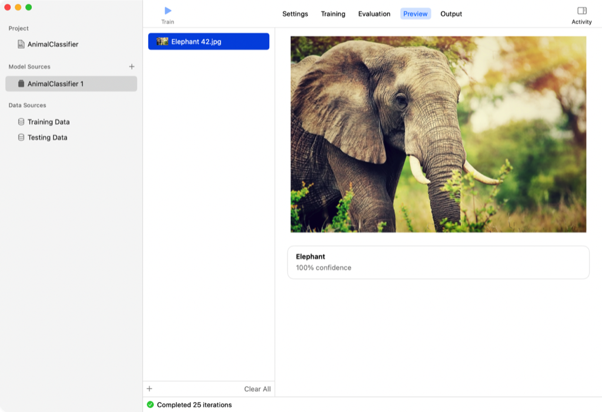

<sub>A screenshot of the project window in the Preview tab that predicts an image of an elephant as, elephant, with 100% confidence.</sub>

### Save the Model

When you’re satisfied with the model’s performance, save it to the file system (in a Core ML format). From the Output tab, save the model using any of these options:

- Click the Save button to save the model to the file system.
- Click the Export button to open the model in Xcode.
- Click the Share button to send the model to someone else, such as through Mail or Messages.
- Drag the model’s icon anywhere that accepts a file.

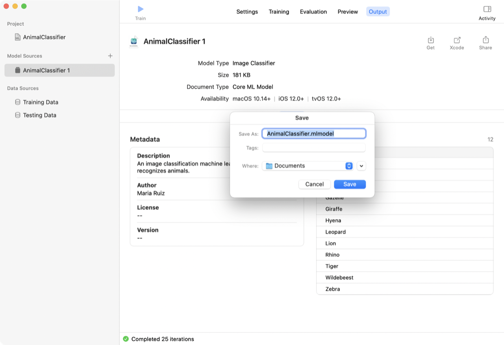

<sub>A screenshot of the project window in the Output tab showing a model save dialog after the user clicked the Get-button. The Get-button’s icon is a box with a down arrow leading into it.</sub>

### Add the Model to Your App

The last step is to add your trained model to an Xcode project. For example, your image classifier model can replace the model in the [Classifying Images with Vision and Core ML](../coreml/classifying-images-with-vision-and-core-ml.md) sample.

Download the sample and open the project in Xcode. Drag your model file into the navigation pane. Xcode adds the model to your project and shows you the model’s metadata, operating system availability, class labels, and so on.

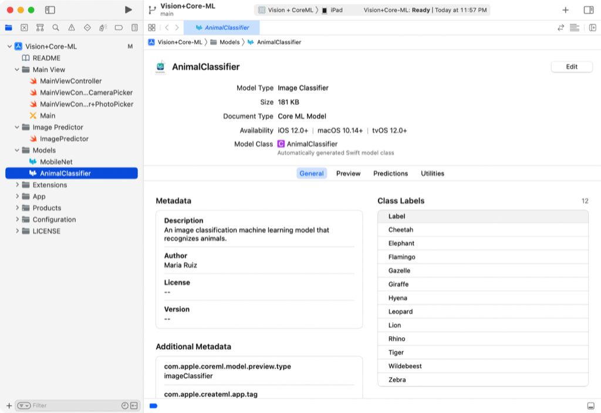

To use your model in code, you only need to change one line. The project instantiates the MobileNet model in exactly one place in the `ImagePredictor` class.

```swift
// Create an instance of the image classifier's wrapper class.
let imageClassifierWrapper = try? MobileNet(configuration: defaultConfig)
```

Change this line to use your image classification model class instead:

```swift
// Create an instance of the image classifier's wrapper class.
let imageClassifierWrapper = try? AnimalClassifier(configuration: defaultConfig)
```

These models are interchangeable because both take an image as input, and both output a label string. With your model substitution, the sample app classifies images as before, except now it uses your model and its associated labels.

### Automate Model Training and Assessment

You can use Create ML to train a useful image classifier with very little code or machine learning expertise, as described in the sections above. However, you can also use an [MLImageClassifier](mlimageclassifier.md) instance to script the model training process. The general tasks are the same: prepare data, train a model, assess performance, and save the Core ML model file. The difference is that you do everything programmatically.

For example, you can initialize two [DataSource](mlimageclassifier/datasource.md) instances, one for the training dataset and another for the testing dataset. Use the training data source to initialize an image classifier with [init(trainingData:parameters:)](<mlimageclassifier/init(trainingdata_parameters_)-4r6hr.md>). Then use the testing data source with its [evaluation(on:)](<mlimageclassifier/evaluation(on_)-9p8mi.md>) method, and assess the values in the [MLClassifierMetrics](mlclassifiermetrics.md) instance it returns.

## See Also

### Image models

- [MLImageClassifier](mlimageclassifier.md) — A model you train to classify images.
- [MLObjectDetector](mlobjectdetector.md) — A model you train to classify one or more objects within an image.
- [MLHandPoseClassifier](mlhandposeclassifier.md) — A task that creates a hand pose classification model by training with images of people’s hands that you provide.
