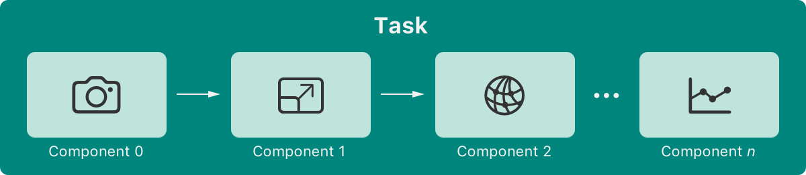

> Navigation: [Technologies](technologies.md)

# Create ML Components

Framework

Create more customizable machine learning models in your app.

## Overview

Create ML Components is a fundamental technology that exposes the underpinnings of monolithic tasks. You’re in full control and can create custom pipelines for greater flexibility.

A flowchart that depicts a task represented as 4 component rectangles. The flow begins in the bottom left rectangle which has a camera icon to represent an input image and a label that reads Component 0. This rectangle has two flow arrows — one points up to the single rectangle above the other three rectangles. This top rectangle has a wand and four stars icon that represents an enhancement to the image and a label that reads Component 1. The second flow arrow points to the bottom center rectangle which has a screen within a screen scaling icon that represents the resizing of the image and a label that reads Component 2. Next, the single top rectangle has a flow arrow that points down to the bottom right rectangle which has a photo icon that represents the finished image and a label that reads Component n. A series of three dots connects this rectangle to the center rectangle in the bottom row.

Use components to configure your machine learning tasks with a detailed level of granularity. Choose a specific classifier for images, video, or tabular data.

## Topics

### Image components

- [Augmenting images to expand your training data](createmlcomponents/augmenting-images-to-expand-your-training-data.md) — Improve your model by using transformed versions of your training images.
- [Creating a multi-label image classifier](createmlcomponents/creating-a-multi-label-image-classifier.md) — Train a machine learning model to assign multiple labels to an image.
- [ImageReader](createmlcomponents/imagereader.md) — An image file reader.
- [ImageFeatureExtractor](createmlcomponents/imagefeatureextractor.md) — A transformer that takes an image and outputs image features.
- [ImageCropper](createmlcomponents/imagecropper.md) — An image crop transformer.
- [ImageScaler](createmlcomponents/imagescaler.md) — An image scaling transformer.
- [ImageFeaturePrint](createmlcomponents/imagefeatureprint.md) — ImageFeaturePrint image feature extractor.
- [ImageBlur](createmlcomponents/imageblur.md) — An image blurring transformer.
- [ImageColorTransformer](createmlcomponents/imagecolortransformer.md) — An image color transformer.
- [ImageExposureAdjuster](createmlcomponents/imageexposureadjuster.md) — An image exposure adjusting transformer.
- [ImageFlipper](createmlcomponents/imageflipper.md) — An image flipper transformer.
- [ImageRotator](createmlcomponents/imagerotator.md) — An image rotating transformer.
- [RandomImageNoiseGenerator](createmlcomponents/randomimagenoisegenerator.md) — A transformer that adds random noise to an image.
- [MLModelImageFeatureExtractor](createmlcomponents/mlmodelimagefeatureextractor.md) — An image feature extractor provided by an MLModel.

### Pose components

- [Counting human body action repetitions in a live video feed](createmlcomponents/counting-human-body-action-repetitions-in-a-live-video-feed.md) — Use Create ML Components to analyze a series of video frames and count a person’s repetitive or periodic body movements.
- [Pose](createmlcomponents/pose.md) — A pose that contains joint keypoints from a person, a hand, or a combination.
- [JointKey](createmlcomponents/jointkey.md) — A key that uniquely identifies a joint.
- [JointPoint](createmlcomponents/jointpoint.md) — A joint in a pose that contains a location and scoring information.
- [PoseSelector](createmlcomponents/poseselector.md) — A transformer that selects one pose from an array of poses.
- [PoseSelectionStrategy](createmlcomponents/poseselectionstrategy.md) — Pose selection strategy.
- [JointsSelector](createmlcomponents/jointsselector.md) — Joints selector from a pose.
- [HumanBodyPoseExtractor](createmlcomponents/humanbodyposeextractor.md) — The human body pose image feature extractor.
- [HumanHandPoseExtractor](createmlcomponents/humanhandposeextractor.md) — The human hand pose image feature extractor.
- [HumanBodyActionCounter](createmlcomponents/humanbodyactioncounter.md) — A human body action repetition counting transformer that takes window of human body poses and produces cumulative human body action repetition counts.
- [HumanBodyActionPeriodPredictor](createmlcomponents/humanbodyactionperiodpredictor.md) — A human body action period predictor transformer that takes window of poses and produces a window of predictions.

### Audio components

- [AudioReader](createmlcomponents/audioreader.md) — An audio file reader.
- [AudioFeaturePrint](createmlcomponents/audiofeatureprint.md) — A stream transformer that extracts audio features from audio buffers.
- [AudioConvertingTransformer](createmlcomponents/audioconvertingtransformer.md) — A transformer for audio conversion.

### Time-based components

- [Creating a time-series classifier](createmlcomponents/creating-a-time-series-classifier.md) — Train a machine learning model to predict the class label of time-series signals.
- [Creating a time-series forecaster](createmlcomponents/creating-a-time-series-forecaster.md) — Forecast future data points by training a machine learning model using historical data.
- [DateFeatures](createmlcomponents/datefeatures.md) — A set of date and time features.
- [DateFeatureExtractor](createmlcomponents/datefeatureextractor.md) — A time and date feature extractor.
- [LinearTimeSeriesForecaster](createmlcomponents/lineartimeseriesforecaster.md) — A time-series forecasting estimator.
- [LinearTimeSeriesForecasterConfiguration](createmlcomponents/lineartimeseriesforecasterconfiguration.md) — The configuration for a linear time-series forecaster.
- [TimeSeriesForecasterBatches](createmlcomponents/timeseriesforecasterbatches.md) — A sequence of forecaster batches on a time series shaped array.
- [TimeSeriesForecasterAnnotatedWindows](createmlcomponents/timeseriesforecasterannotatedwindows.md) — A sequence of forecasting windows on a time series shaped array.
- [TemporalFeature](createmlcomponents/temporalfeature.md) — A temporal feature contains a segment identifier and a feature value.
- [TemporalSequence](createmlcomponents/temporalsequence.md) — Async sequence for temporal features.
- [TemporalSegmentIdentifier](createmlcomponents/temporalsegmentidentifier.md) — Uniquely identifiers a segment of a temporal sequence.
- [SlidingWindows](createmlcomponents/slidingwindows.md) — A sequence of windows on a time series shaped array.
- [SlidingWindowTransformer](createmlcomponents/slidingwindowtransformer.md) — A temporal transformer that groups input elements.
- [Downsampler](createmlcomponents/downsampler.md) — A temporal transformer that down samples the input stream.
- [VideoReader](createmlcomponents/videoreader.md) — A video file reader.
- [TemporalFileSegment](createmlcomponents/temporalfilesegment.md) — A URL and a time range identifying a specific segment of a time-based (temporal) file.
- [AnyTemporalIterator](createmlcomponents/anytemporaliterator.md) — A type-erased async iterator.
- [AnyTemporalSequence](createmlcomponents/anytemporalsequence.md) — A type-erased temporal sequence.
- [PreprocessedFeatureSequence](createmlcomponents/preprocessedfeaturesequence.md) — An asynchronous sequence of eagerly stored temporal features.

### Object detection components

- [DetectedObject](createmlcomponents/detectedobject.md) — An item in a detection result.
- [ObjectDetectionAnnotation](createmlcomponents/objectdetectionannotation.md) — An object detection annotation.
- [ObjectDetectionMetrics](createmlcomponents/objectdetectionmetrics.md) — Metrics for object detection model.

### Tabular components

- [TabularTransformer](createmlcomponents/tabulartransformer.md) — A tabular transformer that transforms a data frame.
- [TabularEstimator](createmlcomponents/tabularestimator.md) — A tabular estimator that creates a transformer by fitting to a data set in a data frame.
- [SupervisedTabularEstimator](createmlcomponents/supervisedtabularestimator.md) — A tabular estimator that creates a transformer by fitting to a data set in a data frame.
- [ColumnSelector](createmlcomponents/columnselector.md) — An operation that applies an estimator to a selection of columns.
- [ColumnSelectorTransformer](createmlcomponents/columnselectortransformer.md) — A transformer that applies a base transformer to specific columns in a data frame.
- [ColumnSelection](createmlcomponents/columnselection.md) — A selection of columns from a data frame.
- [ColumnConcatenator](createmlcomponents/columnconcatenator.md) — A transformer that concatenates every numerical column in a dataframe into to a shaped array for each row.
- [PreprocessingSupervisedTabularEstimator](createmlcomponents/preprocessingsupervisedtabularestimator.md) — A supervised tabular estimator that composes a preprocessing transformer and a supervised tabular estimator.
- [PreprocessingTabularEstimator](createmlcomponents/preprocessingtabularestimator.md) — An estimator that composes a preprocessing transformer and an estimator.
- [PreprocessingUpdatableSupervisedTabularEstimator](createmlcomponents/preprocessingupdatablesupervisedtabularestimator.md) — An updatable supervised estimator that composes a preprocessing transformer and an updatable supervised estimator.
- [PreprocessingUpdatableTabularEstimator](createmlcomponents/preprocessingupdatabletabularestimator.md) — An updatable estimator that composes a preprocessing transformer and an updatable estimator.

### Protocols

- [Transformer](createmlcomponents/transformer.md) — A transformer that takes an input and produces an output.
- [TemporalTransformer](createmlcomponents/temporaltransformer.md) — A transformer that takes an asynchronous input sequence of temporal features and produces an asynchronous output  sequence.
- [RandomTransformer](createmlcomponents/randomtransformer.md) — A transformer that takes an input and a random number generator and produces a randomized output.
- [Estimator](createmlcomponents/estimator.md) — An estimator that creates a transformer by fitting to a data set.
- [TemporalEstimator](createmlcomponents/temporalestimator.md) — An estimator that creates a transformer by fitting to a sequence of temporal features. _(deprecated)_
- [SupervisedEstimator](createmlcomponents/supervisedestimator.md) — An estimator that creates a transformer by fitting to a data set.
- [SupervisedTemporalEstimator](createmlcomponents/supervisedtemporalestimator.md) — An estimator that creates a transformer by fitting to a sequence of annotated temporal features. _(deprecated)_
- [UpdatableEstimator](createmlcomponents/updatableestimator.md) — An estimator that can be incrementally updated.
- [UpdatableSupervisedEstimator](createmlcomponents/updatablesupervisedestimator.md) — A supervised estimator that can be incrementally updated.
- [UpdatableSupervisedTemporalEstimator](createmlcomponents/updatablesupervisedtemporalestimator.md) — A supervised temporal estimator that can be incrementally updated. _(deprecated)_
- [UpdatableSupervisedTabularEstimator](createmlcomponents/updatablesupervisedtabularestimator.md) — A supervised tabular estimator that can be incrementally updated.
- [UpdatableTemporalEstimator](createmlcomponents/updatabletemporalestimator.md) — A temporal estimator that can be incrementally updated. _(deprecated)_
- [UpdatableTabularEstimator](createmlcomponents/updatabletabularestimator.md) — A tabular estimator that can be incrementally updated.

### Core ML adaptors

- [MLModelTransformerAdaptor](createmlcomponents/mlmodeltransformeradaptor.md) — A transformer that uses a Core ML model.
- [MLModelClassifierAdaptor](createmlcomponents/mlmodelclassifieradaptor.md) — A transformer that uses a Core ML model as a classifier.
- [MLModelRegressorAdaptor](createmlcomponents/mlmodelregressoradaptor.md) — A transformer that uses a Core ML model as a regressor.
- [ModelMetadata](createmlcomponents/modelmetadata.md) — User info keys that specify useful information about a model.

### Annotations

- [AnnotatedFiles](createmlcomponents/annotatedfiles.md) — An annotated files collection.
- [AnnotatedBatch](createmlcomponents/annotatedbatch.md) — A batch of annotated examples for fitting a supervised estimator.
- [AnnotatedFeature](createmlcomponents/annotatedfeature.md) — An annotated example for fitting a supervised estimator.
- [AnnotatedFeatureProvider](createmlcomponents/annotatedfeatureprovider.md) — An adaptor that converts a regular estimator to a tabular estimator by selecting features and annotations from columns.
- [AnnotatedPrediction](createmlcomponents/annotatedprediction.md) — An annotated prediction.
- [DataFrameTemporalAnnotationParameters](createmlcomponents/dataframetemporalannotationparameters.md) — Annotation parameters for the dataframe containing temporal annotations.

### Augmentations

- [ApplyEachRandomly](createmlcomponents/applyeachrandomly.md) — Applies each transformer randomly given a probability.
- [ApplyRandomly](createmlcomponents/applyrandomly.md) — Randomly applies the transformer with the given probability.
- [AugmentationBuilder](createmlcomponents/augmentationbuilder.md) — A series of augmentations.
- [AugmentationSequence](createmlcomponents/augmentationsequence.md) — An async sequence of augmented elements.
- [Augmenter](createmlcomponents/augmenter.md) — An augmenter.
- [ChooseRandomly](createmlcomponents/chooserandomly.md) — Apply single transformation randomly chosen from a list of transformers.
- [RandomImageCropper](createmlcomponents/randomimagecropper.md) — Crops an image at a random location.
- [ShuffleRandomly](createmlcomponents/shufflerandomly.md) — Apply transformations in a random order.
- [UniformRandomFloatingPointParameter](createmlcomponents/uniformrandomfloatingpointparameter.md) — Applies the transformer with a randomly generated input parameter.
- [UniformRandomIntegerParameter](createmlcomponents/uniformrandomintegerparameter.md) — Applies the transformer with a randomly generated input parameter.
- [UpsampledAugmentationSequence](createmlcomponents/upsampledaugmentationsequence.md) — An async sequence of augmented elements.

### Event handling

- [Event](createmlcomponents/event.md) — Maintains the status of the pipeline.
- [EventHandler](createmlcomponents/eventhandler.md) — A closure to handle processing events.
- [MetricsKey](createmlcomponents/metricskey.md) — A key that uniquely identifies a metric.

### Scalers

- [StandardScaler](createmlcomponents/standardscaler.md) — An estimator that standardizes the input by removing the mean and scaling to unit variance.
- [MaxAbsScaler](createmlcomponents/maxabsscaler.md) — An estimator that scales the input values so that the maximum absolute value is 1.0.
- [MinMaxScaler](createmlcomponents/minmaxscaler.md) — An estimator that scales the input values so that they all lie in a closed range.
- [NormalizationScaler](createmlcomponents/normalizationscaler.md) — An estimator that normalizes the input values using a normalization strategy.
- [RobustScaler](createmlcomponents/robustscaler.md) — An estimator that scales the input using statistics that are robust to outliers.

### Preprocessors

- [LinearTransformer](createmlcomponents/lineartransformer.md) — A transformer that runs an input through a scale and offset.
- [ImputeTransformer](createmlcomponents/imputetransformer.md) — A transformer that replaces missing values with a pre-defined value.
- [OneHotEncoder](createmlcomponents/onehotencoder.md) — An estimator that encodes categorical values to an integer array.
- [OrdinalEncoder](createmlcomponents/ordinalencoder.md) — An ordinal encoder estimator encodes categorical values to ordinal integer values.
- [NumericImputer](createmlcomponents/numericimputer.md) — An estimator that replaces missing values in the numeric input.
- [Reshaper](createmlcomponents/reshaper.md) — A transformer that reshapes a shaped array.
- [CategoricalImputer](createmlcomponents/categoricalimputer.md) — An estimator that replaces missing values in the categorical input.
- [OptionalUnwrapper](createmlcomponents/optionalunwrapper.md) — A transformer that unwraps optional elements and throws when encountering missing values.

### Regressors

- [Regressor](createmlcomponents/regressor.md) — A transformer that predicts a float value.
- [LinearRegressor](createmlcomponents/linearregressor.md) — A linear regressor.
- [LinearRegressorModel](createmlcomponents/linearregressormodel.md) — A trained linear regressor model.
- [MultivariateLinearRegressor](createmlcomponents/multivariatelinearregressor.md) — A multivariate linear regressor.
- [MultivariateLinearRegressorConfiguration](createmlcomponents/multivariatelinearregressorconfiguration.md) — A linear regressor configuration.
- [Model](createmlcomponents/multivariatelinearregressor/model.md) — A trained multivariate linear regressor model.
- [FullyConnectedNetworkRegressor](createmlcomponents/fullyconnectednetworkregressor.md) — A regressor that uses a fully connected network.
- [FullyConnectedNetworkRegressorModel](createmlcomponents/fullyconnectednetworkregressormodel.md) — A regressor model that uses a fully connected network.
- [BoostedTreeRegressor](createmlcomponents/boostedtreeregressor.md) — A gradient boosted decision tree regressor.
- [TreeRegressorModel](createmlcomponents/treeregressormodel.md) — A trained tree regressor model.
- [OptimizationStrategy](createmlcomponents/optimizationstrategy.md) — A linear optimization strategy.

### Serializers

- [EstimatorDecoder](createmlcomponents/estimatordecoder.md) — A type that can decode values from a model representation.
- [EstimatorEncoder](createmlcomponents/estimatorencoder.md) — A type that can encode values into a model representation.

### Classifiers

- [Classifier](createmlcomponents/classifier.md) — An estimator that predicts classification probabilities.
- [LogisticRegressionClassifier](createmlcomponents/logisticregressionclassifier.md) — A logistic regression classifier.
- [LogisticRegressionClassifierModel](createmlcomponents/logisticregressionclassifiermodel.md) — A trained logistic regression classifier model.
- [BoostedTreeClassifier](createmlcomponents/boostedtreeclassifier.md) — A gradient boosted decision tree classifier.
- [BoostedTreeConfiguration](createmlcomponents/boostedtreeconfiguration.md) — A boosted tree configuration.
- [FullyConnectedNetworkClassifier](createmlcomponents/fullyconnectednetworkclassifier.md) — A classifier that uses a fully connected network.
- [FullyConnectedNetworkClassifierModel](createmlcomponents/fullyconnectednetworkclassifiermodel.md) — A classifier model that uses a fully connected network.
- [FullyConnectedNetworkMultiLabelClassifier](createmlcomponents/fullyconnectednetworkmultilabelclassifier.md) — A classifier that uses a multi-label fully-connected network.
- [FullyConnectedNetworkMultiLabelClassifierModel](createmlcomponents/fullyconnectednetworkmultilabelclassifiermodel.md) — A multi-label classifier model that uses a fully-connected network.
- [FullyConnectedNetworkConfiguration](createmlcomponents/fullyconnectednetworkconfiguration.md) — A fully connected network configuration.
- [TreeClassifierModel](createmlcomponents/treeclassifiermodel.md) — A trained tree classifier model.
- [TimeSeriesClassifier](createmlcomponents/timeseriesclassifier.md)
- [TimeSeriesClassifierConfiguration](createmlcomponents/timeseriesclassifierconfiguration.md) — The configuration for a time-series classifier.

### Metrics

- [Classification](createmlcomponents/classification.md) — An item in a classification result.
- [ClassificationDistribution](createmlcomponents/classificationdistribution.md) — A classification distribution that contains a probability for each classification label.
- [ClassificationMetrics](createmlcomponents/classificationmetrics.md) — Classification metrics.
- [MultiLabelClassificationMetrics](createmlcomponents/multilabelclassificationmetrics.md) — Multi-label classification metrics.
- [rootMeanSquaredError(_:)](<createmlcomponents/rootmeansquarederror(__).md>) — Computes the root mean squared error between predicted and ground truth values.
- [rootMeanSquaredError(_:_:)](<createmlcomponents/rootmeansquarederror(____).md>) — Computes the root mean squared error between predicted and ground truth values.
- [maximumAbsoluteError(_:)](<createmlcomponents/maximumabsoluteerror(__).md>) — Computes the maximum absolute error between predicted and ground truth values.
- [maximumAbsoluteError(_:_:)](<createmlcomponents/maximumabsoluteerror(____).md>) — Computes the maximum absolute error between predicted and ground truth values.
- [meanAbsoluteError(_:)](<createmlcomponents/meanabsoluteerror(__).md>) — Computes the mean absolute error between predicted and ground truth values.
- [meanAbsoluteError(_:_:)](<createmlcomponents/meanabsoluteerror(____).md>) — Computes the mean absolute error between predicted and ground truth values.
- [meanAbsolutePercentageError(_:)](<createmlcomponents/meanabsolutepercentageerror(__).md>) — Computes the mean absolute percentage error between predicted and ground truth values.
- [meanSquaredError(_:)](<createmlcomponents/meansquarederror(__).md>) — Computes the root mean squared error between predicted and ground truth values.
- [meanSquaredError(_:_:)](<createmlcomponents/meansquarederror(____).md>) — Computes the mean squared error between predicted and ground truth values.

### Transformer adaptors

- [TransformerToEstimatorAdaptor](createmlcomponents/transformertoestimatoradaptor.md) — An estimator that always returns a predefined transformer.
- [TransformerToTemporalAdaptor](createmlcomponents/transformertotemporaladaptor.md) — A temporal transformer that applies a regular transformer to each value of a temporal sequence. _(deprecated)_
- [TransformerToUpdatableEstimatorAdaptor](createmlcomponents/transformertoupdatableestimatoradaptor.md) — An updatable estimator that always returns a predefined transformer.

### Updatable adaptors

- [UpdatableEstimatorToTemporalAdaptor](createmlcomponents/updatableestimatortotemporaladaptor.md) — An updatable temporal estimator wrapping an updatable estimator. _(deprecated)_
- [UpdatableEstimatorToSupervisedAdaptor](createmlcomponents/updatableestimatortosupervisedadaptor.md) — An adaptor that exposes an updatable estimator as an updatable supervised estimator.
- [UpdatableSupervisedEstimatorToTemporalAdaptor](createmlcomponents/updatablesupervisedestimatortotemporaladaptor.md) — An updatable supervised temporal estimator wrapping an updatable supervised estimator. _(deprecated)_
- [UpdatableTemporalEstimatorToSupervisedAdaptor](createmlcomponents/updatabletemporalestimatortosupervisedadaptor.md) — An adaptor that exposes an updatable temporal estimator as an updatable supervised temporal estimator. _(deprecated)_

### Estimator adaptors

- [EstimatorToSupervisedAdaptor](createmlcomponents/estimatortosupervisedadaptor.md) — An adaptor that exposes an estimator as a supervised estimator.
- [EstimatorToTemporalAdaptor](createmlcomponents/estimatortotemporaladaptor.md) — A temporal estimator wrapping an estimator. _(deprecated)_
- [SupervisedEstimatorToTemporalAdaptor](createmlcomponents/supervisedestimatortotemporaladaptor.md) — A supervised temporal estimator wrapping a supervised estimator. _(deprecated)_

### Tabular adaptors

- [TabularEstimatorToSupervisedAdaptor](createmlcomponents/tabularestimatortosupervisedadaptor.md) — An adaptor that exposes a tabular estimator as a tabular supervised estimator.
- [TabularTransformerToEstimatorAdaptor](createmlcomponents/tabulartransformertoestimatoradaptor.md) — A tabular estimator that always returns a predefined tabular transformer.
- [TabularTransformerToUpdatableEstimatorAdaptor](createmlcomponents/tabulartransformertoupdatableestimatoradaptor.md) — An updatable tabular estimator that always returns a predefined transformer.
- [UpdatableTabularEstimatorToSupervisedAdaptor](createmlcomponents/updatabletabularestimatortosupervisedadaptor.md) — An adaptor that exposes an updatable tabular estimator as an updatable supervised tabular estimator.

### Temporal adaptors

- [TemporalAdaptor](createmlcomponents/temporaladaptor.md) — A temporal transformer that applies a regular transformer to each value of a temporal sequence.
- [TemporalTransformerToEstimatorAdaptor](createmlcomponents/temporaltransformertoestimatoradaptor.md) — A temporal estimator that always returns a predefined temporal transformer. _(deprecated)_
- [TemporalEstimatorToSupervisedAdaptor](createmlcomponents/temporalestimatortosupervisedadaptor.md) — An adaptor that exposes a temporal estimator as a supervised temporal estimator. _(deprecated)_
- [TemporalTransformerToUpdatableEstimatorAdaptor](createmlcomponents/temporaltransformertoupdatableestimatoradaptor.md) — A temporal estimator that always returns a predefined temporal transformer. _(deprecated)_

### Composition with preprocessing

- [PreprocessingEstimator](createmlcomponents/preprocessingestimator.md) — An estimator that composes a preprocessing transformer and an estimator.
- [PreprocessingTemporalEstimator](createmlcomponents/preprocessingtemporalestimator.md) — A temporal estimator that composes a preprocessing transformer and a temporal estimator. _(deprecated)_
- [PreprocessingSupervisedEstimator](createmlcomponents/preprocessingsupervisedestimator.md) — A supervised estimator that composes a preprocessing transformer and a supervised estimator.
- [PreprocessingSupervisedTemporalEstimator](createmlcomponents/preprocessingsupervisedtemporalestimator.md) — A supervised temporal estimator that composes a preprocessing transformer and a supervised temporal estimator. _(deprecated)_
- [PreprocessingUpdatableEstimator](createmlcomponents/preprocessingupdatableestimator.md) — An updatable estimator that composes a preprocessing transformer and an updatable estimator.
- [PreprocessingUpdatableTemporalEstimator](createmlcomponents/preprocessingupdatabletemporalestimator.md) — An updatable temporal estimator that composes a preprocessing transformer and an updatable temporal estimator. _(deprecated)_
- [PreprocessingUpdatableSupervisedEstimator](createmlcomponents/preprocessingupdatablesupervisedestimator.md) — An updatable supervised estimator that composes a preprocessing transformer and an updatable supervised estimator.
- [PreprocessingUpdatableSupervisedTemporalEstimator](createmlcomponents/preprocessingupdatablesupervisedtemporalestimator.md) — An updatable supervised temporal estimator that composes a preprocessing transformer and an updatable supervised temporal estimator. _(deprecated)_

### Composition

- [ComposedTransformer](createmlcomponents/composedtransformer.md) — A transformer that composes two transformers by applying them one after the other.
- [ComposedTemporalTransformer](createmlcomponents/composedtemporaltransformer.md) — A temporal transformer that composes two temporal transformers by applying them one after the other.
- [ComposedTabularTransformer](createmlcomponents/composedtabulartransformer.md) — A transformer that composes two tabular transformers by applying them one after the other.

### Errors

- [AudioPreprocessingError](createmlcomponents/audiopreprocessingerror.md) — Audio preprocessing errors.
- [AudioReaderError](createmlcomponents/audioreadererror.md) — Audio reader errors.
- [CompatibilityError](createmlcomponents/compatibilityerror.md) — A compatibility error.
- [ConcatenationError](createmlcomponents/concatenationerror.md) — Errors thrown when concatenating numeric values.
- [DatasetError](createmlcomponents/dataseterror.md) — Dataset processing errors.
- [EstimatorEncodingError](createmlcomponents/estimatorencodingerror.md) — An estimator encoding error.
- [ModelCompatibilityError](createmlcomponents/modelcompatibilityerror.md) — Errors related to CoreML model compatibility.
- [ModelUpdateError](createmlcomponents/modelupdateerror.md) — An updatable model error.
- [OptimizationError](createmlcomponents/optimizationerror.md) — An optimization error.
- [PipelineDataError](createmlcomponents/pipelinedataerror.md) — Errors related to pipeline data affinity problems.
- [SerializationError](createmlcomponents/serializationerror.md) — A serialization error.
- [TabularPipelineDataError](createmlcomponents/tabularpipelinedataerror.md) — Errors related to tabular pipeline data affinity problems.
- [VideoReaderError](createmlcomponents/videoreadererror.md) — Video loader errors.
