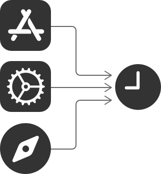

> Navigation: [Technologies](technologies.md)

# Device Activity

Framework

Monitor device activity with your app extension while maintaining privacy.

## Overview

Device Activity provides a privacy-preserving way for an application to monitor a person’s application and website activity. For instance, you can set up a bedtime schedule that monitors device activity while the person is supposed to be asleep. Your app extension can receive warnings before an activity’s schedule starts or ends, or when an activity is about to reach a predefined threshold. You can monitor the time spent on websites and apps to warn the person once they have reached their threshold.

A diagram depicting different kinds of device activity the framework can monitor. On the left are three icons in a vertical row, including an App store icon, a Settings icon, and a Safari icon. All three icons have arrows pointing to a clock.

## Topics

### Manage activities

- [DeviceActivityEvent](deviceactivity/deviceactivityevent.md) — An event that represents an application, category, or website activity.
- [DeviceActivityName](deviceactivity/deviceactivityname.md) — The unique name of an activity.
- [DeviceActivitySchedule](deviceactivity/deviceactivityschedule.md) — A calendar-based schedule for when to monitor a device’s activity.
- [DeviceActivityCenter](deviceactivity/deviceactivitycenter.md) — A class that enables an application’s extension to start monitoring scheduled device activity.

### Monitor activity

- [DeviceActivityMonitor](deviceactivity/deviceactivitymonitor.md) — The object that monitors scheduled device activity.

### Report activity

- [DeviceActivityReport](deviceactivity/deviceactivityreport.md) — A view that reports the user’s application, category, and web domain activity in a privacy-preserving way.
- [DeviceActivityReportExtension](deviceactivity/deviceactivityreportextension.md) — An app extension that reports device activity data.
- [DeviceActivityReportScene](deviceactivity/deviceactivityreportscene.md) — Defines a custom device activity report scene.
- [DeviceActivityReportBuilder](deviceactivity/deviceactivityreportbuilder.md) — A result builder that combines one or more `DeviceActivityReportScene`s into a single scene.

### Filter activity data

- [DeviceActivityFilter](deviceactivity/deviceactivityfilter.md) — A type that filters the device activity data to include in a report.
- [DeviceActivityData](deviceactivity/deviceactivitydata.md) — Activity data for a person on a specific device.
- [DeviceActivityResults](deviceactivity/deviceactivityresults.md) — An asynchronous sequence of filtered device activity results.

### Authorize access

- [DeviceActivityAuthorization](deviceactivity/deviceactivityauthorization.md)
- [DeviceActivityAuthorizing](deviceactivity/deviceactivityauthorizing.md)

### Handle errors

- [MonitoringError](deviceactivity/deviceactivitycenter/monitoringerror.md) — Errors that may occur when starting to monitor an activity.
