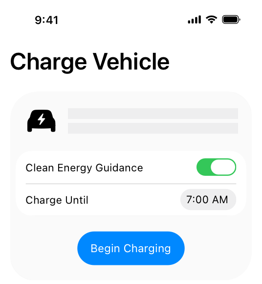

> Navigation: [Technologies](technologies.md)

# EnergyKit

Framework

Provide grid forecasts and energy insights to help people optimize their electricity usage.

## Overview

EnergyKit provides grid forecasts and energy insights to help people view their energy consumption patterns and choose when to use electricity at home. The framework delivers personalized forecasts for a home based on grid cleanliness and electricity rates, when available, enabling apps to optimize device operation for environmental impact and cost.

Use EnergyKit to build apps that manage home device electricity usage and support the transition to a cleaner electricity grid. You can use the framework for residential, metered locations such as smart thermostats (HVAC), and for electric vehicle charging.

An electric vehicle charging app interface with the Clean Energy Guidance feature enabled, set to charge until 7AM, and a 'Begin Charging' button displayed below the settings.

Using EnergyKit, your app can:

- Receive grid forecasts that identify when cleaner electricity is available and when electricity rates are lower, when rate plan information is available.
- Submit electrical load events that track device energy consumption during operation and provide data for the Home app.
- Request insights about a customer’s historical electricity usage correlated with grid cleanliness and electricity rate periods.
- Display rich activity logs and analytics in the Home app without building custom statistics or graphing UI.

## Receive energy guidance and submit energy use

The framework provides two complementary workflows:

- The [ElectricityGuidance](energykit/electricityguidance.md) structure identifies optimal times for electricity usage based on grid cleanliness and utility rates. Use this guidance to optimize when your managed devices consume electricity.
- Submit [ElectricVehicleLoadEvent](energykit/electricvehicleloadevent.md) and [ElectricHVACLoadEvent](energykit/electrichvacloadevent.md) instances that track energy consumption during device operation. Optionally submit [ElectricVehicleStatusEvent](energykit/electricvehiclestatusevent.md) instances that explain charging behavior and support informative activity logs in the Home app.

> [!important] Important
> Energy guidance is only available in the contiguous United States.
>
> To use EnergyKit, the system requires your app to have the [EnergyKit Entitlement](bundleresources/entitlements/com.apple.developer.energykit.md) entitlement with a value of `true`.

## Display energy data in the Home app

When you adopt the [EnergyKit LoadEvents Entitlement](bundleresources/entitlements/com.apple.developer.energykit.loadevents-experience.md), the Home app displays your electrical load events in a unified energy experience. The Home app shows:

- Historical charts with up to five years of energy data
- Activity logs that explain device behavior with timestamps and reasons
- Monthly trend notifications about energy usage patterns
- Whole-home energy overlays when people connect their utility account

This integration eliminates the need to build custom analytics UI, while providing a consistent experience across all energy devices in a person’s home.

## Topics

### Essentials

- [Optimizing home electricity usage](energykit/optimizing-home-electricity-usage.md) — Shift electric vehicle charging schedules to times when the grid is cleaner and potentially less expensive.
- [Providing charging history for electric vehicles](energykit/providing-informative-charging-history-for-electric-vehicles.md) — Track energy consumption and provide people detailed insights into the charging of their electric vehicle.
- [EnergyKit Entitlement](bundleresources/entitlements/com.apple.developer.energykit.md) — The entitlement the system requires for an app to use the EnergyKit framework.
- [EnergyKit LoadEvents Entitlement](bundleresources/entitlements/com.apple.developer.energykit.loadevents-experience.md) — An entitlement that works with the EnergyKit framework to share energy data and usage insights in the Home app. _(beta)_

### Electricity guidance

- [ElectricityGuidance](energykit/electricityguidance.md) — A data model that provides guidance on when electricity is cleaner and less expensive.

### Electric vehicle events

- [ElectricVehicleLoadEvent](energykit/electricvehicleloadevent.md) — A measurement of the electricity consumed or generated by an electric vehicle while connected to a charger.
- [ElectricVehicleStatusEvent](energykit/electricvehiclestatusevent.md) — An event that represents the status of an electric vehicle while connected to a charger.
- [ElectricVehicleChargingReason](energykit/electricvehiclechargingreason.md) — Information about a charging-state transition in an electric vehicle status event.

### HVAC events

- [ElectricHVACLoadEvent](energykit/electrichvacloadevent.md) — A measurement of the electricity consumed by an HVAC system.

### Device identification

- [ElectricalLoadDevice](energykit/electricalloaddevice.md) — A type that identifies an electrical load device for event submission.
- [ElectricalLoadEventProtocol](energykit/electricalloadeventprotocol.md) — A type that can represent an electrical load event.

### Energy venues

- [EnergyVenue](energykit/energyvenue.md) — A physical site that uses or produces electricity at that location.

### Electricity insights

- [ElectricityInsightService](energykit/electricityinsightservice.md) — A service for retrieving insights about electricity consumption.
- [ElectricityInsightQuery](energykit/electricityinsightquery.md) — A structure describing a query that you use to obtain environmental impact information in the form of electricity insight records.
- [ElectricityInsightRecord](energykit/electricityinsightrecord.md) — A structure that provides environmental impact and cost insights for electricity usage over a specific time period.
- [ElectricityInsightMeasure](energykit/electricityinsightmeasure.md) — A protocol for types that can measure electricity usage data.

### Supporting types

- [ElectricityFlowDirection](energykit/electricityflowdirection.md) — Information about which direction the electricity moves.
- [EnergyKitError](energykit/energykiterror.md) — A specialized error that provides localized messages describing the error and why it occurred.
