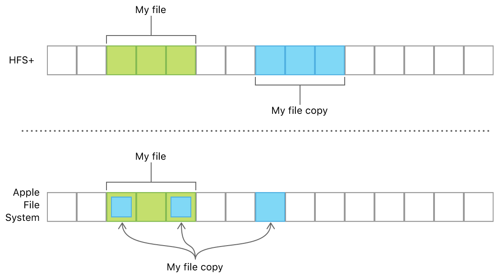
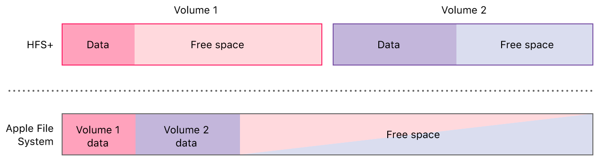
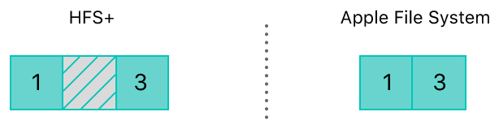

> Navigation: [Technologies](../technologies.md) · [Foundation](../foundation.md) · [File System](file-system.md)

# About Apple File System

<sub>Article</sub>

Use high-level APIs to get the most out of Apple File System.

## Overview

Apple File System replaces HFS Plus as the default file system for iOS 10.3 and later, and for macOS High Sierra and later. Apple File System offers improved file system fundamentals as well as several new features, including cloning, snapshots, space sharing, fast directory sizing, atomic safe-save, and sparse files.

Using high-level APIs in Foundation, such as [FileManager](filemanager.md) and [FileHandle](filehandle.md), to interact with files takes advantage of the new behavior provided by Apple File System automatically, without requiring changes your code.

If you need to interact with the file system directly, without using any frameworks or the operating system, read [Apple File System Reference](https://developer.apple.com/go/?id=apfs-file-format-spec).

### Clones Reduce the Cost of Copying

A clone is a copy of a file or directory that occupies no additional space on disk. Clones let you make fast, power-efficient file copies on the same volume. The [- copyItemAtURL:toURL:error:](<filemanager/copyitem(at_to_).md>) and [- copyItemAtPath:toPath:error:](<filemanager/copyitem(atpath_topath_).md>) methods of [FileManager](filemanager.md) automatically create a clone for Apple File System volumes, as shown in the listing below.

```swift
let origin = URL(fileURLWithPath: "/path/to/origin")
let destination = URL(fileURLWithPath: "/path/to/destination")
do {
    // Creates a clone for Apple File System volumes, or makes
    // a copy immediately for other file systems.
    try FileManager.default.copyItem(at: origin, to: destination)
} catch {
    // ... Handle the error ...
}
```

Modifications to the data are written elsewhere, and both files continue to share the unmodified blocks. You can use this behavior, for example, to reduce storage space required for document revisions and copies. The figure below shows a file named “My file” and its copy “My file copy” that have two blocks in common and one block that varies between them. On file systems like HFS Plus, they’d each need three on-disk blocks, but on an Apple File System volume, the two common blocks are shared.



### Free Space Is Shared Between Volumes

Many files systems, including HFS Plus, support only a single volume per partition. Because free space can’t be shared across partitions, each volume’s size is set when partitioning the storage device, and each volume can only grow into its available free space. In contrast, Apple File System supports multiple volumes within a single partition, which allows all of those volumes to share their free space. All of the volumes in an Apple File System partition can grow and shrink independently; space that’s freed when one volume shrinks can be used when another volume grows.



Each volume in the container can use the shared free space, so they all include that amount when reporting the available free space. For example, when you call [- attributesOfFileSystemForPath:error:](<filemanager/attributesoffilesystem(forpath_).md>) method of [FileManager](filemanager.md), the amount that’s reported includes all of the shared free space.

```swift
if let attributes = try? FileManager.default.attributesOfFileSystem(forPath: "/") {
    let availableFreeSpace = attributes[.systemFreeSize] 
}
```

Computing the sum of each volume’s available free space isn’t a reliable way to determine the total free space within a partition. In general, check whether the space required to perform a particular operation is available on the volume, rather than trying to calculate the partition’s total free space.

### Sparse Files Don’t Allocate Empty Blocks

In file systems that support sparse files, including Apple File System, on-disk blocks are allocated only when those blocks are actually written to. This behavior lets files that contain blank sections, such as disk images and database dumps, be saved on disk more efficiently.

When you use the [FileHandle](filehandle.md) class to create a new write handle, a sparse file is created automatically. For example, if you write a block of data, then seek one block by calling [- seekToFileOffset:](<filehandle/seek(tofileoffset_).md>), and then write another block, the data stored on disk is organized as follows:



HFS Plus and other formats that don’t support sparse files allocate three blocks for the file, one for each block that was written, and one empty block in the middle. With support for sparse files, only two blocks are allocated, and the empty block is omitted.

Because the sparse file in the Apple File system example above doesn’t contain a blank second block on disk, writing to the second block later results in blocks that are out of order, as shown in the figure below. High-level APIs like [FileHandle](filehandle.md) handle this fragmentation for you, and the performance loss due to fragmentation isn’t usually significant.


You can’t use [FileHandle](filehandle.md) to create a sparse file from an existing file that has blank data already stored on disk.

## See Also

### File system operations

- [Improving performance and stability when accessing the file system](improving-performance-and-stability-when-accessing-the-file-system.md) — Prevent data loss and app crashes by interacting with the file system in a coordinated, asynchronous manner and by avoiding unnecessary disk I/O.
- [Using the file system effectively](using-the-file-system-effectively.md) — Gain access to benefits like automatic backup or purging by using purpose-built directories provided by the system.
- [FileManager](filemanager.md) — A convenient interface to the contents of the file system, and the primary means of interacting with it.
- [FileManagerDelegate](filemanagerdelegate.md) — The interface a file manager’s delegate uses to intervene during operations or if an error occurs.
