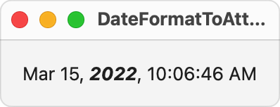

> Navigation: [Technologies](../../technologies.md) · [Foundation](../../foundation.md) · [Date](../date.md)

# Date.AttributedStyle

<sub>Structure</sub>

A structure that creates a locale-appropriate attributed string representation of a date instance.

> [!warning] Deprecated
> Use Date.FormatStyle.Attributed or Date.VerbatimFormatStyle.Attributed instead

<sub>iOS, iPadOS, Mac Catalyst, macOS, tvOS, visionOS, watchOS</sub>

```swift
struct AttributedStyle
```

## Overview

Use a [FormatStyle](formatstyle.md) instance to customize the lexical representation of a date as a string. Use the format style’s [attributed](formatstyle/attributed-swift.property.md) property to customize the visual representation of the date as a string. Attributed strings can represent the subcomponent characters, words, and phrases of a string with a custom combination of font size, weight, and color.

For example, the function below uses a date format style to create a custom lexical representation of a date, then retrieves an attributed string representation of the same date and applies a visual emphasis to the year component of the date.

```swift
// Applies visual emphasis to the year component of a formatted attributed date string.
private func makeAttributedString() -> AttributedString {
    let date = Date()
    let formatStyle = Date.FormatStyle(date: .abbreviated, time: .standard)
    var attributedString = formatStyle.attributed.format(date)
    for run in attributedString.runs {
        if let dateFieldAttribute = run.attributes.foundation.dateField,
           dateFieldAttribute == .year {
            // When you find a year, change its attributes.
            attributedString[run.range].inlinePresentationIntent = [.emphasized, .stronglyEmphasized]
        }
    }
    return attributedString
}
```

The expression `formatStyle.attributed.format(date)` above creates an attributed string representation of the date. This assigns instances of the [DateFieldAttribute](../attributescopes/foundationattributes/datefieldattribute.md) to indicate ranges of the string that represent different date fields. The example then loops over the [runs](../attributedstringprotocol/runs.md) of the attributed string to find any run with the [AttributeScopes.FoundationAttributes.DateFieldAttribute.Field.year](../attributescopes/foundationattributes/datefieldattribute/field/year.md) attribute. When it finds one, it adds the [inlinePresentationIntent](../attributescopes/foundationattributes/inlinepresentationintent.md) attributes [NSInlinePresentationIntentEmphasized](../inlinepresentationintent/emphasized.md) and [NSInlinePresentationIntentStronglyEmphasized](../inlinepresentationintent/stronglyemphasized.md).

The runs of the resulting attributed string have the following attributes:

| Run text | Attributes |
|---|---|
| `Mar` | [AttributeScopes.FoundationAttributes.DateFieldAttribute.Field.month](../attributescopes/foundationattributes/datefieldattribute/field/month.md) |
| `15` | [AttributeScopes.FoundationAttributes.DateFieldAttribute.Field.day](../attributescopes/foundationattributes/datefieldattribute/field/day.md) |
| `2022` | [AttributeScopes.FoundationAttributes.DateFieldAttribute.Field.year](../attributescopes/foundationattributes/datefieldattribute/field/year.md)  [NSInlinePresentationIntentEmphasized](../inlinepresentationintent/emphasized.md)  [NSInlinePresentationIntentStronglyEmphasized](../inlinepresentationintent/stronglyemphasized.md) |
| `10` | [AttributeScopes.FoundationAttributes.DateFieldAttribute.Field.hour](../attributescopes/foundationattributes/datefieldattribute/field/hour.md) |
| `06` | [AttributeScopes.FoundationAttributes.DateFieldAttribute.Field.minute](../attributescopes/foundationattributes/datefieldattribute/field/minute.md) |
| `46` | [AttributeScopes.FoundationAttributes.DateFieldAttribute.Field.second](../attributescopes/foundationattributes/datefieldattribute/field/second.md) |
| `AM` | [AttributeScopes.FoundationAttributes.DateFieldAttribute.Field.amPM](../attributescopes/foundationattributes/datefieldattribute/field/ampm.md) |

If you create a SwiftUI [Text](../../swiftui/text.md) view with this attributed string, SwiftUI renders the combination of [NSInlinePresentationIntentEmphasized](../inlinepresentationintent/emphasized.md) and [NSInlinePresentationIntentStronglyEmphasized](../inlinepresentationintent/stronglyemphasized.md) attributes as bold, italicized text, as seen in the following screenshot.



## Relationships

- **Conforms To**: [Copyable](../../swift/copyable.md), [Decodable](../../swift/decodable.md), [Encodable](../../swift/encodable.md), [Equatable](../../swift/equatable.md), [Escapable](../../swift/escapable.md), [FormatStyle](../formatstyle.md), [Hashable](../../swift/hashable.md), [Sendable](../../swift/sendable.md), [SendableMetatype](../../swift/sendablemetatype.md)

## Topics

### Modifying a Date Attributed Style

- [locale(_:)](<attributedstyle/locale(__).md>) — Modifies the date attributed style to use the specified locale. _(deprecated)_

### Applying Date Attributed Styles

- [format(_:)](<attributedstyle/format(__).md>) — Creates a locale-aware attributed string representation from a date value. _(deprecated)_

### Comparing Date Attributed Styles

- [==(_:_:)](<==(____).md>) — Returns true if the two `Date` values represent the same point in time.

## See Also

### Applying Visual Attributes to Dates

- [attributed](formatstyle/attributed-swift.property.md) — An attributed format style created from the date format style. _(deprecated)_
