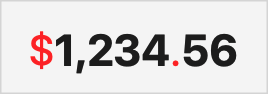

> Navigation: [Technologies](../../technologies.md) · [Foundation](../../foundation.md) · [FloatingPointFormatStyle](../floatingpointformatstyle.md)

# attributed

<sub>Instance Property</sub>

An attributed format style based on the floating-point format style.

<sub>iOS, iPadOS, Mac Catalyst, macOS, tvOS, visionOS, watchOS</sub>

```swift
var attributed: FloatingPointFormatStyle<Value>.Attributed { get }
```

## Discussion

Use this modifier to create a [Attributed](attributed-swift.struct.md) instance, which formats values as [AttributedString](../attributedstring.md) instances. These attributed strings contain attributes from the [NumberFormatAttributes](../attributescopes/foundationattributes/numberformatattributes.md) attribute scope. Use these attributes to determine which runs of the attributed string represent different parts of the formatted value.

The following example finds runs of the attributed string that represent different parts of a formatted currency, and adds additional attributes like [foregroundColor](../attributescopes/swiftuiattributes/foregroundcolor.md) and [inlinePresentationIntent](../attributescopes/foundationattributes/inlinepresentationintent.md).

```swift
func attributedPrice(price: Double) -> AttributedString {
    var attributedPrice = price.formatted(
        .currency(code: "USD")
        .attributed)

    for run in attributedPrice.runs {
        if run.attributes.numberSymbol == .currency ||
            run.attributes.numberSymbol == .decimalSeparator {
            attributedPrice[run.range].foregroundColor = .red
        }
        if run.attributes.numberPart == .integer ||
            run.attributes.numberPart == .fraction {
            attributedPrice[run.range].inlinePresentationIntent = [.stronglyEmphasized]
        }
    }
    return attributedPrice
}
```

User interface frameworks like SwiftUI can use these attributes when presenting the attributed string, as seen here:



## See Also

### Creating attributed strings

- [Attributed](attributed-swift.struct.md) — A format style that converts integers into attributed strings.
