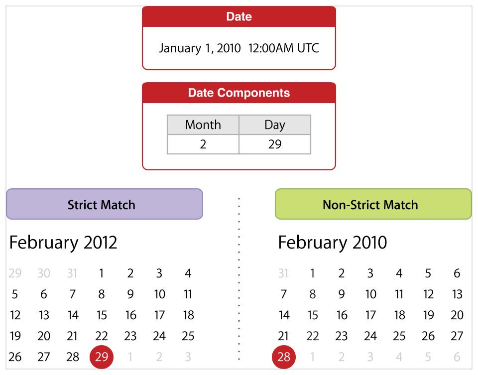
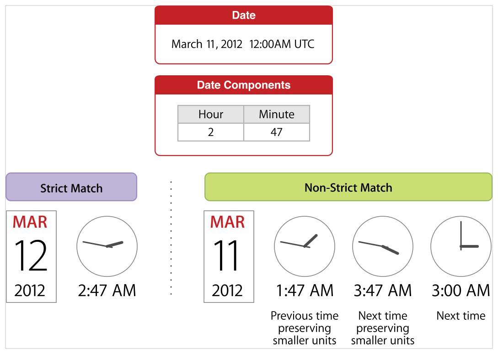
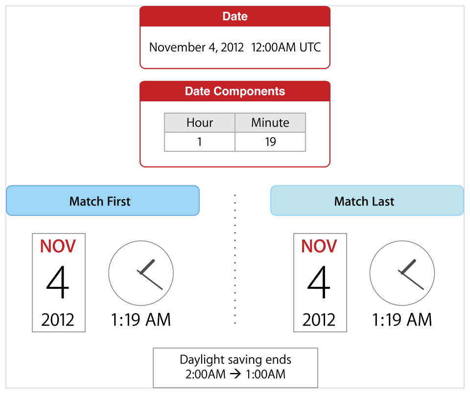
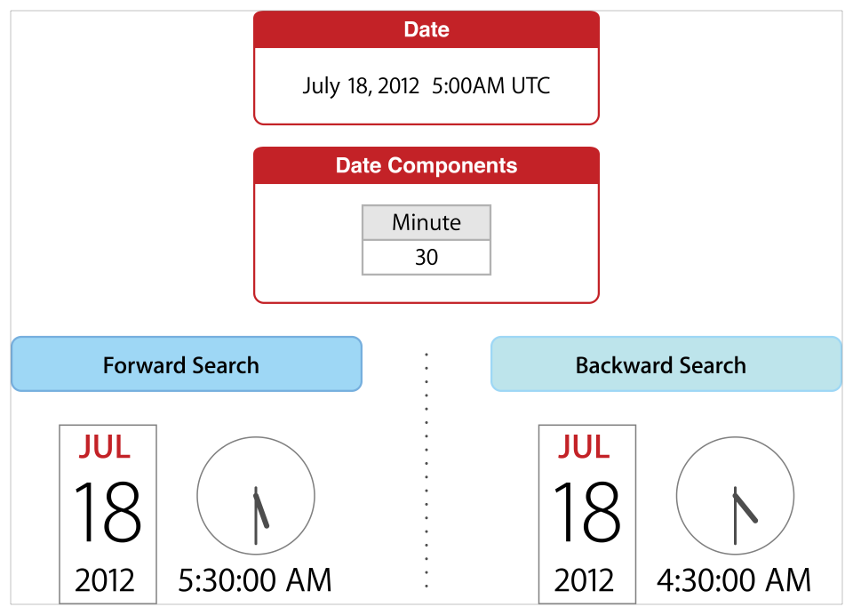

> Navigation: [Technologies](../../technologies.md) · [Foundation](../../foundation.md) · [NSCalendar](../nscalendar.md)

# enumerateDates(startingAfter:matching:options:using:)

<sub>Instance Method</sub>

Computes the dates that match (or most closely match) a given set of components, and calls the block once for each of them, until the enumeration is stopped.

<sub>iOS, iPadOS, Mac Catalyst, macOS, tvOS, visionOS, watchOS</sub>

```swift
func enumerateDates(startingAfter start: Date, matching comps: DateComponents, options opts: NSCalendar.Options = [], using block: (Date?, Bool, UnsafeMutablePointer<ObjCBool>) -> Void)
```

## Parameters

- `start` — The date for which to perform the calculation.

- `comps` — The date components to match. If no components are specified, the enumeration will not be executed. If the `nanoseconds` component is set to a nonzero value, the resulting dates will have floating point `seconds` values that most closely match the specified `nanoseconds` value. Otherwise, the resulting dates will have an integer `seconds` value.

- `opts` — Options for the enumeration. For possible values, see [Options](options.md). For usage, see _Discussion_ below.

- `block` — The block to apply to each enumerated date. The block takes three arguments: - **date** — The enumerated date. - **idx** — Whether `date` exactly matches the specified date components. - **stop** — A reference to a Boolean value. The block can set the value to [true](../../swift/true.md) to stop further processing of the array. The stop argument is an out-only argument. You should only ever set this Boolean to [true](../../swift/true.md) within the Block.

## Discussion

Executes a given block with dates that most closely match a given set of components after a given date, until the enumeration is stopped.

Strict & Non-Strict Matching

If you specify a strict matching option ([NSCalendarMatchStrictly](options/matchstrictly.md)), this method searches as far as necessary looking for a match, up to a an implementation-defined limit. If an exact match is not possible, `nil` is passed to the `date` argument of the block, and the enumeration is stopped. Otherwise, this method searches as far as the next instance of the next highest calendar unit in the given `NSDateComponents` object.

If you do not specify a strict matching option, you must specify one of the following options, or else an illegal argument exception will be thrown:

- **[NSCalendarMatchPreviousTimePreservingSmallerUnits](options/matchprevioustimepreservingsmallerunits.md)** — If specified, and there is no matching time before the end of the next instance of the next highest unit specified in the given `NSDateComponents` object, this method uses the _previous_ existing value of the missing unit and preserves the lower units’ values.
- **[NSCalendarMatchNextTimePreservingSmallerUnits](options/matchnexttimepreservingsmallerunits.md)** — If specified, and there is no matching time before the end of the next instance of the next highest unit specified in the given `NSDateComponents` object, this method uses the _next_ existing value of the missing unit and preserves the lower units’ values.
- **[NSCalendarMatchNextTime](options/matchnexttime.md)** — If specified, and there is no matching time before the end of the next instance of the next highest unit specified in the given `NSDateComponents` object, this method uses the _next_ existing value of the missing unit and _does not_ preserve the lower units’ values.

For example, if the date “February 29th” does not exist for a particular year, a non-strict match would return “February 28th” of that year instead.



<sub>Given the date “January 1st, 2010” and searching for the next date with month component equal to 2 and day component equal to 29, a strict match returns the date “February 29th, 2012”, whereas a non-strict match returns the date “February 28th, 2010”.</sub>

As another example, if the time “2:37AM” does not exist for a particular day, such as when advancing by an hour at the beginning of Daylight Savings Time, the following is true:

- If strict matching is specified, “2:37AM” on the following the next day is used.
- If [NSCalendarMatchPreviousTimePreservingSmallerUnits](options/matchprevioustimepreservingsmallerunits.md) is specified, “1:37AM” would be used instead, if that time exists.
- If [NSCalendarMatchNextTimePreservingSmallerUnits](options/matchnexttimepreservingsmallerunits.md) is specified, the date at the time “3:37AM” would be used instead, if that time exists.
- If [NSCalendarMatchNextTime](options/matchnexttime.md) is specified, the date at the time “3:00AM” would be used instead, if that time exists.



<sub>Given the date “March 11th, 2012 at 12:00AM UTC” and searching for the next date with hour component equal to 2 and minute component equal to 47, a strict match returns the date “March 12th, 2012 at 2:47AM UTC”, a non-strict match specifying the previous time preserving smaller units returns the date “March 11th, 2012 at 1:47AM UTC”, a non-strict match specifying the next time preserving smaller units returns the date “March 11th, 2012 at 3:47AM UTC”, and a non-strict match specifying the next time returns the date “March 11th, 2012 at 3:00AM UTC”.</sub>

Matching First or Last Occurrence

If you specify a “match first” option ([NSCalendarMatchFirst](options/matchfirst.md)) and there are two or more matching times (that is, all components are the same) before the end of the next instance of the next highest unit specified in the given `NSDateComponents` object, this method uses the _first_ occurrence.

If you specify a “match last” option ([NSCalendarMatchLast](options/matchlast.md)) and there are two or more matching times (that is, all components are the same) before the end of the next instance of the next highest unit specified in the given `NSDateComponents` object, this method uses the _last_ occurrence.

If neither “match first” or “match last” options are specified or both options are specified, this method behaves as if [NSCalendarMatchFirst](options/matchfirst.md) was specified.

There is no option to return middle occurrences of more than two occurrences of a matching time, if such exist.

For example, when Daylight Savings Time ends, clocks are set back by one hour at 2:00AM, such that times between 1:00AM and 1:59AM occur twice that day. The [NSCalendarMatchFirst](options/matchfirst.md) and [NSCalendarMatchLast](options/matchlast.md) search options return the first and last occurrence of these times.



<sub>Given the date “November 4th, 2012 at 12:00AM UTC” and searching for the next date with hour component equal to 1 and minute component equal to 19, the match first option returns the first instance of “November 4th, 2012 at 1:19AM UTC”, before Daylight Savings Time ends, and the match first option returns the second instance of “November 4th, 2012 at 1:19AM UTC”, after Daylight Savings Time ends.</sub>

Forward & Backward Search

If you specify a backward search option ([NSCalendarSearchBackwards](options/searchbackwards.md)), this method will search for previous matches before the given date. This method will return the same results as if the search were made in the forward direction from the distant past, but with the results in reverse order starting with the match most recent to the given date. That is, when searching backwards for a particular hour with no specified minute or second value, the resulting time is not “59” minutes and “59” seconds for the matching hour. When enumerating dates that repeat a time, such as when the clock turns back to 1:00AM from 2:00AM when Daylight Savings Time ends, the “first” time is determined as if the search were performed in the forwards direction.

For example, given a date with a time of “5:00AM” when searching for a minute component equal to 30, a forward search returns the time “5:30AM” and a backward search returns “4:30AM”.



<sub>Given the date “July 18th, 2012 at 5:00AM UTC” and searching for a minute component equal to 30, a forward search returns “July 18th, 2012 at 5:30AM UTC” and a backward search returns “July 18th, 2012 at 4:30AM UTC”.</sub>

## See Also

### Scanning Dates

- [- startOfDayForDate:](<startofday(for_).md>) — Returns the first moment of a given date as a date instance.
- [- nextDateAfterDate:matchingComponents:options:](<nextdate(after_matching_options_).md>) — Returns the next date after a given date matching the given components.
- [- nextDateAfterDate:matchingHour:minute:second:options:](<nextdate(after_matchinghour_minute_second_options_).md>) — Returns the next date after a given date that matches the given hour, minute, and second, component values.
- [- nextDateAfterDate:matchingUnit:value:options:](<nextdate(after_matching_value_options_).md>) — Returns the next date after a given date matching the given calendar unit value.
- [Options](options.md) — The options for arithmetic operations involving calendars.
- [NSWrapCalendarComponents](../nswrapcalendarcomponents-api.md) — A legacy constant used to control overflow in date calculations.
