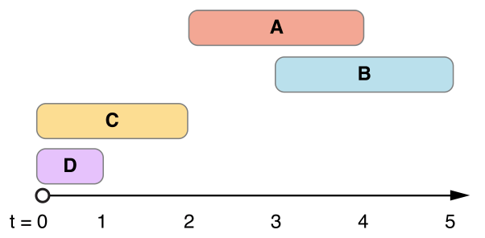

> Navigation: [Technologies](../../technologies.md) · [Foundation](../../foundation.md) · [NSDateInterval](../nsdateinterval.md)

# compare(_:)

<sub>Instance Method</sub>

Compares the receiver with the specified date interval.

<sub>iOS, iPadOS, Mac Catalyst, macOS, tvOS, visionOS, watchOS</sub>

```swift
func compare(_ dateInterval: DateInterval) -> ComparisonResult
```

## Parameters

- `dateInterval` — The date interval with which to compare the receiver.

## Return Value

Returns an [ComparisonResult](../comparisonresult.md) value that indicates the temporal ordering of the receiver and a given date interval:

- [NSOrderedAscending](../comparisonresult/orderedascending.md) if the receiver’s [startDate](startdate.md) occurs earlier than that of `dateInterval`, or both [startDate](startdate.md) values are equal and the [duration](duration.md) of the receiver is less than that of `dateInterval`.
- [NSOrderedDescending](../comparisonresult/ordereddescending.md) if the receiver’s [startDate](startdate.md) occurs later than that of `dateInterval`, or both [startDate](startdate.md) values are equal and the [duration](duration.md) of the receiver is greater than that of `dateInterval`.
- [NSOrderedSame](../comparisonresult/orderedsame.md) if the receiver’s [startDate](startdate.md) and [duration](duration.md) values are equal to those of `dateInterval`.

## Discussion

The following figure illustrates four `NSDateInterval` objects plotted on an arbitrary time axis. Each date interval spans its [duration](duration.md) from left to right, from its [startDate](startdate.md) to its [endDate](enddate.md).



The result of comparing the date interval labeled **A** with the date interval labeled **B** is [NSOrderedAscending](../comparisonresult/orderedascending.md), because **A** has a [startDate](startdate.md) that occurs earlier than that of **B**.

The result of comparing the date interval labeled **C** with the date interval labeled **D** is [NSOrderedDescending](../comparisonresult/ordereddescending.md), because because **C** and **D** have the same [startDate](startdate.md), and **C** has a [duration](duration.md) greater than that of **D**.

## See Also

### Comparing Date Intervals

- [- isEqualToDateInterval:](<isequal(to_).md>) — Indicates whether the receiver is equal to the specified date interval.
