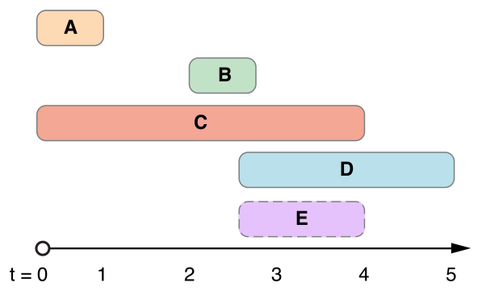

> Navigation: [Technologies](../../technologies.md) · [Foundation](../../foundation.md) · [NSDateInterval](../nsdateinterval.md)

# intersection(with:)

<sub>Instance Method</sub>

Returns the intersection between the receiver and the specified date interval.

<sub>iOS, iPadOS, Mac Catalyst, macOS, tvOS, visionOS, watchOS</sub>

```swift
func intersection(with dateInterval: DateInterval) -> DateInterval?
```

## Parameters

- `dateInterval` — The date interval with which to calculate the intersection of the receiver.

## Return Value

A date interval for the intersection of the receiver and `dateInterval`, or `nil` if no intersection occurs.

## Discussion

Calculating the intersection of date intervals is a commutative and associative operation. The intersection of a date interval with itself is equal to itself.

The following figure illustrates five `NSDateInterval` objects plotted on an arbitrary time axis. Each date interval spans its [duration](duration.md) from left to right, from its [startDate](startdate.md) to its [endDate](enddate.md).



The date intervals labeled **A** and **B** do not intersect, because the [startDate](startdate.md) of **B** occurs later than the [endDate](enddate.md) of **A**.

The date intervals  labeled **C** and **D** do intersect. The date interval labeled **E** represents the result of calculating the intersection between **C** and **D**.

## See Also

### Determining Intersections

- [- intersectsDateInterval:](<intersects(__).md>) — Indicates whether the receiver intersects with the specified date interval.
