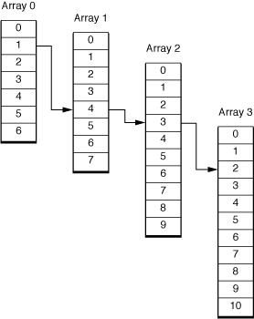

> Navigation: [Technologies](../technologies.md) · [Foundation](../foundation.md)

# NSIndexPath

<sub>Class</sub>

A list of indexes that together represent the path to a specific location in a tree of nested arrays.

<sub>iOS, iPadOS, Mac Catalyst, macOS, tvOS, visionOS, watchOS</sub>

```swift
class NSIndexPath
```

## Overview

In Swift, this object bridges to [IndexPath](indexpath.md); use [NSIndexPath](nsindexpath.md) when you need reference semantics or other Foundation-specific behavior.

Each index in an index path represents the index into an array of children from one node in the tree to another, deeper, node. For example, the index path `1.4.3.2` specifies the path shown in [Figure 1](/documentation/foundation/nsindexpath#1965825).



> [!note] Note
> The UIKit framework adds programming interfaces to the `NSIndexPath` class of the Foundation framework to facilitate the identification of rows and sections in [UITableView](../uikit/uitableview.md) objects and the identification of items and sections in [UICollectionView](../uikit/uicollectionview.md) objects. The API consists of class factory methods and properties for accessing the various indexed values. You use the factory methods to create an index path for the corresponding table view or collection view.

> [!important] Important
> The Swift overlay to the Foundation framework provides the [IndexPath](indexpath.md) structure, which bridges to the [NSIndexPath](nsindexpath.md) class. For more information about value types, see [Working with Foundation Types](../swift/working-with-foundation-types.md).

## Relationships

- **Inherits From**: [NSObject](../objectivec/nsobject-swift.class.md)

- **Conforms To**: [CVarArg](../swift/cvararg.md), [Copyable](../swift/copyable.md), [CustomDebugStringConvertible](../swift/customdebugstringconvertible.md), [CustomStringConvertible](../swift/customstringconvertible.md), [Equatable](../swift/equatable.md), [Escapable](../swift/escapable.md), [Hashable](../swift/hashable.md), [NSCoding](nscoding.md), [NSCopying](nscopying.md), [NSObjectProtocol](../objectivec/nsobjectprotocol.md), [NSSecureCoding](nssecurecoding.md)

## Topics

### Creating and Initializing Index Paths

- [- initWithIndex:](<nsindexpath/init(index_).md>) — Initializes an index path with a single node.
- [- initWithIndexes:length:](<nsindexpath/init(indexes_length_).md>) — Initializes an index path with the given nodes and length.

### Using Special Node Names

- [+ indexPathForRow:inSection:](<nsindexpath/init(forrow_insection_).md>) — Initializes an index path with the indexes of a specific row and section in a table view.
- [+ indexPathForItem:inSection:](<nsindexpath/init(foritem_insection_).md>) — Initializes an index path with the indexes of a specific item and section in a collection view.
- [section](nsindexpath/section.md) — An index number identifying a section in a table view or collection view.
- [row](nsindexpath/row.md) — An index number identifying a row in a section of a table view.
- [item](nsindexpath/item.md) — An index number identifying an item in a section of a collection view.

### Counting Nodes

- [length](nsindexpath/length.md) — The number of nodes in the index path.

### Adding and Removing Nodes

- [- indexPathByAddingIndex:](<nsindexpath/adding(__).md>) — Returns an index path containing the nodes in the receiving index path plus another given index.
- [- indexPathByRemovingLastIndex](<nsindexpath/removinglastindex().md>) — Returns an index path with the nodes in the receiving index path, excluding the last one.

### Comparing Index Paths

- [- compare:](<nsindexpath/compare(__).md>) — Indicates the depth-first traversal order of the receiving index path and another index path.

### Working with Indexes

- [- indexAtPosition:](<nsindexpath/index(atposition_).md>) — Provides the value at a particular node in the index path.
- [- getIndexes:range:](<nsindexpath/getindexes(__range_).md>) — Copies the indexes stored in the index path from the positions specified by the position range into the specified indexes.
- [- getIndexes:](<nsindexpath/getindexes(__).md>) — Copies the objects contained in the index path into indexes. _(deprecated)_

### Initializers

- [init(coder:)](<nsindexpath/init(coder_).md>)
