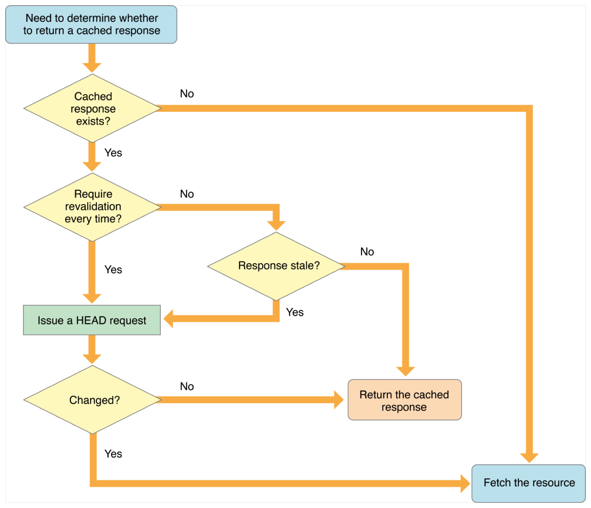

> Navigation: [Technologies](../../../technologies.md) · [Foundation](../../../foundation.md) · [NSURLRequest](../../nsurlrequest.md) · [CachePolicy](../cachepolicy-swift.enum.md)

# NSURLRequest.CachePolicy.useProtocolCachePolicy

<sub>Case</sub>

Use the caching logic defined in the protocol implementation, if any, for a particular URL load request.

<sub>iOS, iPadOS, Mac Catalyst, macOS, tvOS, visionOS, watchOS</sub>

```swift
case useProtocolCachePolicy
```

## Discussion

This is the default policy for URL load requests.

### HTTP caching behavior

For the HTTP and HTTPS protocols, [NSURLRequestUseProtocolCachePolicy](useprotocolcachepolicy.md) performs the following behavior:

1. If a cached response does not exist for the request, the URL loading system fetches the data from the originating source.
2. Otherwise, if the cached response does not indicate that it must be revalidated every time, and if the cached response is not stale (past its expiration date), the URL loading system returns the cached response.
3. If the cached response is stale or requires revalidation, the URL loading system makes a HEAD request to the originating source to see if the resource has changed. If so, the URL loading system fetches the data from the originating source. Otherwise, it returns the cached response.

This behavior is illustrated in the figure below.



<sub>Flow chart starting with “need to determine whether to return a cached response”, and then considering various factors to determine whether to return a cached response or to fetch it anew.</sub>

> [!note] Note
> For the formal definition of these semantics, see [RFC 2616](http://www.w3.org/Protocols/rfc2616/rfc2616-sec13.html#sec13).

> [!important] Important
> If you are making HTTP or HTTPS byte-range requests, always use the [NSURLRequestReloadIgnoringLocalCacheData](reloadignoringlocalcachedata.md) policy instead.

## See Also

### Policies

- [NSURLRequestReloadIgnoringLocalCacheData](reloadignoringlocalcachedata.md) — The URL load should be loaded only from the originating source.
- [NSURLRequestReloadIgnoringLocalAndRemoteCacheData](reloadignoringlocalandremotecachedata.md) — Ignore local cache data, and instruct proxies and other intermediates to disregard their caches so far as the protocol allows.
- [NSURLRequestReloadIgnoringCacheData](reloadignoringcachedata.md) — Replaced by [NSURLRequestReloadIgnoringLocalCacheData](reloadignoringlocalcachedata.md).
- [NSURLRequestReturnCacheDataElseLoad](returncachedataelseload.md) — Use existing cache data, regardless or age or expiration date, loading from originating source only if there is no cached data.
- [NSURLRequestReturnCacheDataDontLoad](returncachedatadontload.md) — Use existing cache data, regardless or age or expiration date, and fail if no cached data is available.
- [NSURLRequestReloadRevalidatingCacheData](reloadrevalidatingcachedata.md) — Use cache data if the origin source can validate it; otherwise, load from the origin.
