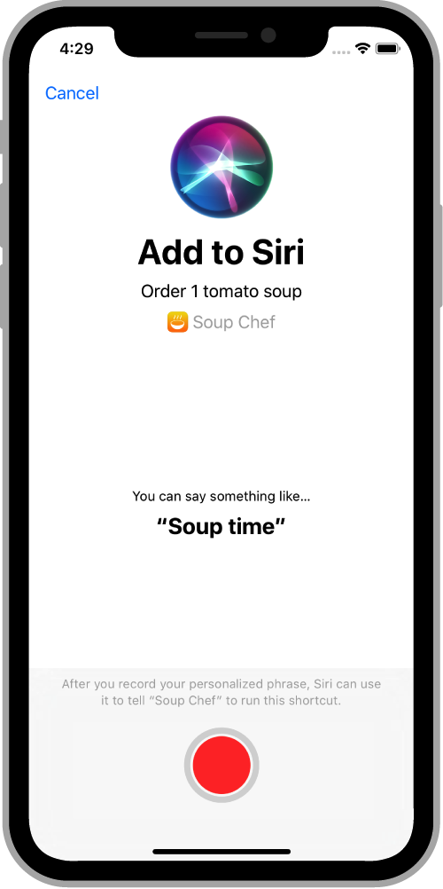

> Navigation: [Technologies](../../technologies.md) · [Foundation](../../foundation.md) · [NSUserActivity](../nsuseractivity.md)

# suggestedInvocationPhrase

<sub>Instance Property</sub>

A phrase suggested to the user when they create a shortcut.

<sub>iOS, iPadOS, Mac Catalyst, macOS, visionOS, watchOS</sub>

```swift
var suggestedInvocationPhrase: String? { get set }
```

## Discussion

The system displays the suggested invocation phrase to the user when they create the shortcut. Use a short, memorable phrase, such as “Soup time”.



> [!note] Note
> To access the [suggestedInvocationPhrase](suggestedinvocationphrase.md) property, import the _Intents_ framework.

## See Also

### Providing SiriKit with activity details

- [interaction](interaction.md) — The SiriKit interaction object to use when configuring your app.
- [shortcutAvailability](shortcutavailability.md) — A set of defined contexts in which an intent or activity might be relevant to a user.
