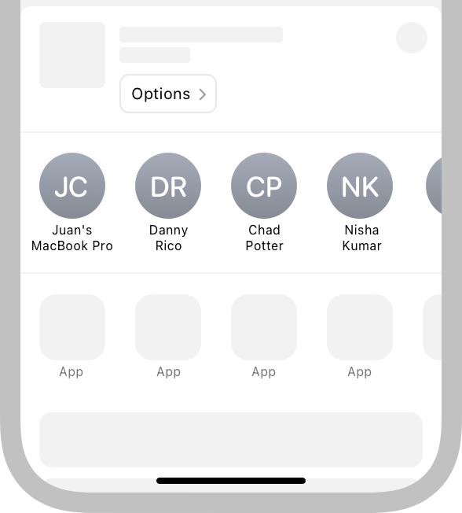
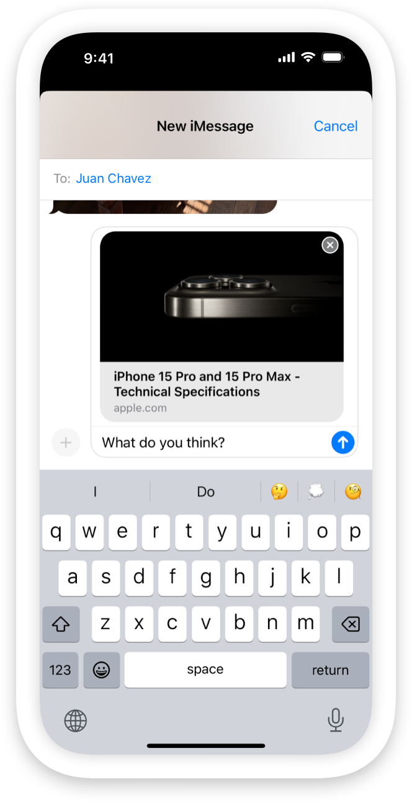
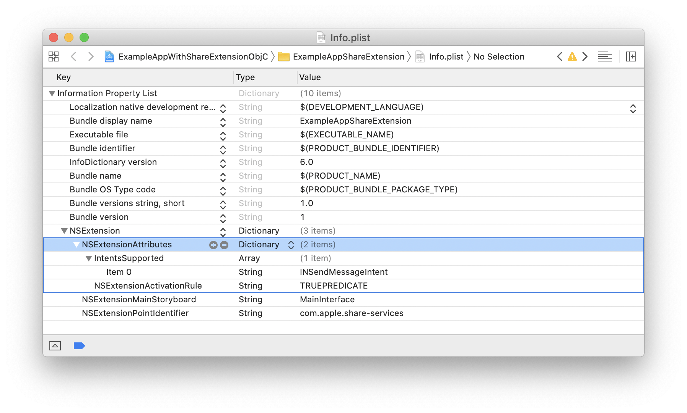

> Navigation: [Technologies](../technologies.md) · [Foundation](../foundation.md) · [App Extension Support](app-extension-support.md)

# Supporting suggestions in your app’s share extension

<sub>Article</sub>

Make your messaging app available for share sheet suggestions and use SiriKit intents to populate your app’s share extension.

## Overview

Using the iOS share sheet, people can launch your messaging app instantly from a list of suggestions when sharing content like a link, image, video, or file. The share sheet suggests conversations with people in apps that a person interacts with frequently, and updates its suggestions over time based on a person’s favorite apps and conversations. When a person shares an image in iOS 16 or later, the share sheet prioritizes conversations with people it identifies in the image.



<sub>A screenshot of an iPhone. The upper half shows the apple.com website in Safari. The bottom half of the screen shows the share sheet after the person has decided to share the website with someone. iOS suggests conversations in the Messages app and another app.</sub>

To allow iOS to include conversations from your messaging app in the list of suggestions:

- Add a share extension to your app as described in [Understand Share Extensions](https://developer.apple.com/library/archive/documentation/General/Conceptual/ExtensibilityPG/Share.html#//apple_ref/doc/uid/TP40014214-CH12-SW2).
- Declare support for the [INSendMessageIntent](../intents/insendmessageintent.md) intent type.
- Donate an [INSendMessageIntent](../intents/insendmessageintent.md) in your messaging app and its share extension.

As a person selects an app from the list of suggestions, the app’s sharing interface, implemented as a share extension, accesses additional metadata. iOS provides the [INSendMessageIntent](../intents/insendmessageintent.md) for you to prepopulate the interface of your app’s share extension. For example, you can access the [conversationIdentifier](../intents/insendmessageintent/conversationidentifier.md) property and preselect a conversation to share content so a person doesn’t need to search for a contact in a list or type a friend’s name.

A screenshot of an iPhone with the Safari browser displaying the apple.com homepage. The person tapped the Share button and selected an app from the list of suggestions. The platforms default sharing interface, based on an SLComposeViewController, is visible. Based on the available metadata, the extension has prepopulated the interface with a recipient (Juan Chavez).



<sub>A screenshot of an iPhone with the Safari browser displaying the apple.com homepage. The person tapped the Share button and selected an app from the list of suggestions. The platforms default sharing interface, based on an SLComposeViewController, is visible. Based on the available metadata, the extension has prepopulated the interface with a recipient (Juan Chavez).</sub>

### Add a share extension to your app

To add a share extension to your app, open your app’s project in Xcode and select File \> New \> Target from the menu bar. Xcode presents a sheet that contains templates for different kinds of targets. Select the share extension template from the iOS pane and follow the steps in Xcode’s interface to add one to your app. For more information, see [Understand Share Extensions](https://developer.apple.com/library/archive/documentation/General/Conceptual/ExtensibilityPG/Share.html#//apple_ref/doc/uid/TP40014214-CH12-SW2) in the App Extension Programming Guide.

### Support the send message intent

Open the Share extension’s `Info.plist`, and expand the [NSExtension](../bundleresources/information-property-list/nsextension.md) and [NSExtensionAttributes](../bundleresources/information-property-list/nsextension/nsextensionattributes.md) keys. Add a new entry with the [IntentsSupported](../bundleresources/information-property-list/nsextension/intentssupported.md) key and select `Array` for its value type. Add the string `INSendMessageIntent` as a new value to the array to declare support for the [INSendMessageIntent](../intents/insendmessageintent.md) intent type.



<sub>A screenshot of Xcode showing the Info.plist file for a Share extension that the developer created using Xcode’s share extension template. The entries below the NSExtension key are expanded and show the IntentsSupported key with an item that has the value set to INSendMessageIntent. The NSExtensionActivationRule entry is set to TRUEPREDICATE.</sub>

To make debugging easier, set the value of [NSExtensionActivationRule](../bundleresources/information-property-list/nsextension/nsextensionattributes/nsextensionactivationrule.md) to `TRUEPREDICATE` when you first add a share extension using Xcode’s template. Replace it with valid activation rules as described in [Declaring Supported Data Types for a Share or Action Extension](https://developer.apple.com/library/archive/documentation/General/Conceptual/ExtensibilityPG/ExtensionScenarios.html#//apple_ref/doc/uid/TP40014214-CH21-SW8) before submitting your app for review.

### Donate a send message intent

Donate an [INSendMessageIntent](../intents/insendmessageintent.md) only when a person sends or receives a message in your app and its share extension. Donate a [CNContact](../contacts/cncontact.md) along with [INSendMessageIntent](../intents/insendmessageintent.md) for [sender](../intents/insendmessageintent/sender.md) and [recipients](../intents/insendmessageintent/recipients.md) by adding values to the contact [contactIdentifier](../intents/inperson/contactidentifier.md) field when initializing an [INPerson](../intents/inperson.md).

As you initialize the [INSendMessageIntent](../intents/insendmessageintent.md) object, provide metadata that’s available later when a person choses your app’s share extension from the list of suggestions. The following code snippet donates an [INSendMessageIntent](../intents/insendmessageintent.md) with a [speakableGroupName](../intents/insendmessageintent/speakablegroupname.md), a [conversationIdentifier](../intents/insendmessageintent/conversationidentifier.md), and an [INImage](../intents/inimage.md).

```swift
// Create an INSendMessageIntent to donate an intent for a conversation with Juan Chavez.
let groupName = INSpeakableString(spokenPhrase: "Juan Chavez")
let sendMessageIntent = INSendMessageIntent(recipients: nil,
                                            content: nil,
                                            speakableGroupName: groupName,
                                            conversationIdentifier: "sampleConversationIdentifier",
                                            serviceName: nil,
                                            sender: nil)

// Add the person's avatar to the intent.
let image = INImage(named: "Juan Chavez")
sendMessageIntent.setImage(image, forParameterNamed: \.speakableGroupName)

// Donate the intent.
let interaction = INInteraction(intent: sendMessageIntent, response: nil)
interaction.donate(completion: { error in
    if error != nil {
        // Add error handling here.
    } else {
        // Do something, for example, send the content to a contact.
    }
})
```

When iOS includes a conversation within your app as a suggestion in the share sheet, it displays your app’s icon along with the [INImage](../intents/inimage.md) you associated with your [INSendMessageIntent](../intents/insendmessageintent.md). If there’s no [INImage](../intents/inimage.md) set on the intent, iOS uses the [image](../intents/inperson/image.md) property from the [INPerson](../intents/inperson.md) object for each recipient. If the [INPerson](../intents/inperson.md) object’s [image](../intents/inperson/image.md) is `nil`, iOS looks up the corresponding contact in the Contacts app using a person’s [contactIdentifier](../intents/inperson/contactidentifier.md). The share sheet then uses the contact’s image.

When a person shares an image in iOS 16 or later with the suggestions from Apple setting enabled, the share sheet prioritizes displaying conversations with people the system identifies in the image in the suggestions list. Include an [INImage](../intents/inimage.md) with the sharing intent you donate, so the system can attempt to identify people in the image. Provide an image that’s at least 360 pixels tall or wide to improve matching.

> [!tip] Tip
> Both your app and its share extension donate an [INSendMessageIntent](../intents/insendmessageintent.md). Write reusable code by creating an object that donates the intent and is available to both the extension and the app.

### Populate your share extension’s interface with metadata

When a person selects your app from the list of suggestions, you can access the metadata that you created when your app donated the [INSendMessageIntent](../intents/insendmessageintent.md). Use it to populate your share extension’s interface.

The following code listing shows a template implementation for an [SLComposeServiceViewController](../social/slcomposeserviceviewcontroller.md) subclass. It accesses the [intent](nsextensioncontext/intent.md) property, makes sure it’s an [INSendMessageIntent](../intents/insendmessageintent.md), and uses the intent’s [conversationIdentifier](../intents/insendmessageintent/conversationidentifier.md) to create a new `Recipient` object. It then uses the `Recipient` object to populate the share extension’s interface in the [configurationItems()](<../social/slcomposeserviceviewcontroller/configurationitems().md>) method.

```swift
import Intents
import Social
import UIKit

class ShareViewController: SLComposeServiceViewController {

    var recipient: Recipient = Recipient(withName: "Placeholder")
    
    override func viewDidLoad() {
        super.viewDidLoad()
        
        // Populate the recipient property with the metadata in case the person taps a suggestion from the share sheet.
        let intent = self.extensionContext?.intent as? INSendMessageIntent
        if intent != nil {
            let conversationIdentifier = intent!.conversationIdentifier
            self.recipient = recipient(identifier: conversationIdentifier!)
        }
    }

    func recipient(identifier: String) -> Recipient {
        // Create a recipient object, for example, by loading it from a data base.
        return Recipient(withName: identifier)
    }

    override func isContentValid() -> Bool {
        // Validate contentText and NSExtensionContext attachments here.
        return true
    }

    override func didSelectPost() {
        // This is called after the person selects Post. Upload contentText and NSExtensionContext attachments.
        
        // Inform the host that the selection is done, so it unblocks its UI.
        // Note: Alternatively, you could call super's -didSelectPost, which similarly completes the extension context.
        self.extensionContext!.completeRequest(returningItems: [], completionHandler: nil)
    }

    override func configurationItems() -> [Any]! {
        // To add configuration options via table cells at the bottom of the sheet, return an array of SLComposeSheetConfigurationItem here.
        
        // Use the Recipient object to populate the share sheet.
        let item = SLComposeSheetConfigurationItem()
        item?.title = NSLocalizedString("To:", comment: "The To: label when sharing content.")
        item?.value = self.recipient.name
        item?.tapHandler = {
            self.validateContent()
            item!.value = self.recipient.name
        }
        
        return [item!]
    }
}
```
