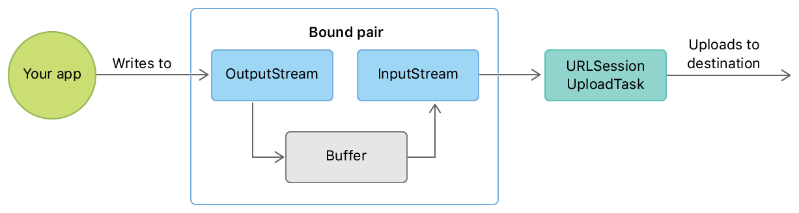

> Navigation: [Technologies](../technologies.md) · [Foundation](../foundation.md) · [URL Loading System](url-loading-system.md)

# Uploading streams of data

<sub>Article</sub>

Send a stream of data to a server.

## Overview

Streaming media apps and long-running apps that send continual updates use an ongoing stream to upload data, rather than sending a single block of data or a flat file. You can configure an instance of [URLSessionUploadTask](urlsessionuploadtask.md) (a subclass of [URLSessionTask](urlsessiontask.md)) to work with a stream that you provide, and then fill this stream with data indefinitely.

The task gets the stream by calling your session’s delegate, so you need to create a session and set your own code as its delegate.

### Create a URL session

Begin by creating a URLSession and providing it with a delegate. The following example creates a URL session with the default [URLSessionConfiguration](urlsessionconfiguration.md) and sets `self` as the delegate. You’ll implement [URLSessionTaskDelegate](urlsessiontaskdelegate.md) later, in [Provide the stream to the upload task](uploading-streams-of-data.md#Provide-the-stream-to-the-upload-task).

Creating a URLSession with a delegate

```swift
lazy var session: URLSession = URLSession(configuration: .default,
                                          delegate: self,
                                          delegateQueue: .main)

```

### Create a streaming upload task

Create the upload task with the [URLSession](urlsession.md) method [- uploadTaskWithStreamedRequest:](<urlsession/uploadtask(withstreamedrequest_).md>). This takes a [URLRequest](urlrequest.md) specifying the URL you want to upload to, along with other parameters. You start the task by calling [- resume](<urlsessiontask/resume().md>). The following example shows how to create and start an upload task, connecting to a server on the local machine (`127.0.0.1`) listening on port `12345`.

Creating an upload task

```swift
let url = URL(string: "http://127.0.0.1:12345")!
var request = URLRequest(url: url,
                         cachePolicy: .reloadIgnoringLocalCacheData,
                         timeoutInterval: 10)
request.httpMethod = "POST"
let uploadTask = session.uploadTask(withStreamedRequest: request)
uploadTask.resume()
```

### Use a bound pair of streams to provide an input stream

You provide the streaming data to the upload task as an [InputStream](inputstream.md). The task reads data from this stream and uploads it to the destination.

A good way to provide data to the input stream is to use a _bound pair_ of streams. The bound pair contains an [OutputStream](outputstream.md) that you write data to. Thanks to the binding of the streams, the data you write to the output stream is made available to the input stream, which the task can then read from. [Figure 1](/documentation/foundation/url_loading_system/uploading_streams_of_data#3037791) shows this arrangement.



<sub>Flow diagram showing how data written by an app to the output stream of a bound pair goes into a buffer, then to the bound pair’s input stream, then to the upload task, which sends it to the destination.</sub>

The following example shows a structure called `Streams` that consists of an [InputStream](inputstream.md) and an [OutputStream](outputstream.md). The listing creates a property of this type, called `boundStreams`, by calling the [+ getBoundStreamsWithBufferSize:inputStream:outputStream:](<stream/getboundstreams(withbuffersize_inputstream_outputstream_).md>) method of the [Stream](stream.md) class, passing in in-out references for the input and output streams.

Creating a bound pair of input and output streams

```swift
struct Streams {
    let input: InputStream
    let output: OutputStream
}
lazy var boundStreams: Streams = {
    var inputOrNil: InputStream? = nil
    var outputOrNil: OutputStream? = nil
    Stream.getBoundStreams(withBufferSize: 4096,
                           inputStream: &inputOrNil,
                           outputStream: &outputOrNil)
    guard let input = inputOrNil, let output = outputOrNil else {
        fatalError("On return of `getBoundStreams`, both `inputStream` and `outputStream` will contain non-nil streams.")
    }
    // configure and open output stream
    output.delegate = self
    output.schedule(in: .current, forMode: .default)
    output.open()
    return Streams(input: input, output: output)
}()

```

When you create the bound pair, make sure you specify a buffer size large enough to hold any data you write to the output stream, prior to the data being read from the input stream. The following example uses a 4096-byte buffer.

The listing also sets `self` as the output stream’s delegate. Declare that your class implements the [StreamDelegate](streamdelegate.md) protocol in order to receive events that indicate when the output stream is ready to receive new data. You’ll provide the implementation of [StreamDelegate](streamdelegate.md) later, in [Write data to the stream when it’s ready](uploading-streams-of-data.md#Write-data-to-the-stream-when-its-ready).

> [!tip] Tip
> Your implementations of [StreamDelegate](streamdelegate.md) and [URLSessionTaskDelegate](urlsessiontaskdelegate.md) may be in the same class or in different classes, whichever makes more sense for your app’s architecture.

### Provide the stream to the upload task

You provide the input stream to the upload task in your implementation of the [URLSessionTaskDelegate](urlsessiontaskdelegate.md) method [- URLSession:task:needNewBodyStream:](<urlsessiontaskdelegate/urlsession(__task_neednewbodystream_).md>), which is called after you start the upload task by calling [- resume](<urlsessiontask/resume().md>). The callback passes in a completion handler, which you call directly, passing in the `boundStreams.input` stream you created earlier. The following example shows an implementation of this method.

Providing the input stream to the upload task in the delegate callback

```swift
func urlSession(_ session: URLSession, task: URLSessionTask,
                needNewBodyStream completionHandler: @escaping (InputStream?) -> Void) {
    completionHandler(boundStreams.input)
}
```

### Write data to the stream when it’s ready

Write data to an output stream only when the stream is ready for it. You get notified of the stream’s readiness in the [StreamDelegate](streamdelegate.md) method [- stream:handleEvent:](<streamdelegate/stream(__handle_).md>). When this callback sends [NSStreamEventHasSpaceAvailable](stream/event/hasspaceavailable.md) as its `eventCode` parameter, the stream is ready to accept more data.

If you’re not ready to write while handling the event, and would prefer to write on your own schedule, you can set a flag variable and check it later to determine whether it’s is safe to write to the stream. The following example illustrates this technique. It handles the [NSStreamEventHasSpaceAvailable](stream/event/hasspaceavailable.md) event by just setting a private `canWrite` property to `true.`

While handling stream events, also check whether `eventCode` is [NSStreamEventErrorOccurred](stream/event/erroroccurred.md). This means that the stream has failed. When this happens, close the streams and abandon the upload.

Handling StreamDelegate events

```swift
func stream(_ aStream: Stream, handle eventCode: Stream.Event) {
    guard aStream == boundStreams.output else {
        return
    }
    if eventCode.contains(.hasSpaceAvailable) {
        canWrite = true
    }
    if eventCode.contains(.errorOccurred) {
        // Close the streams and alert the user that the upload failed.
    }
}

```

Once you’re handling the [NSStreamEventHasSpaceAvailable](stream/event/hasspaceavailable.md) event, you can write to the stream whenever you know it’s ready to receive more data. You write to the stream by calling its [- write:maxLength:](<outputstream/write(__maxlength_).md>) method, providing a reference to the raw bytes to be written, and the maximum number of bytes to write.

The following example uses a timer to wait for the private `canWrite` property to become true. Once this is the case, the code creates a string representing the current date and converts it to raw bytes. The listing then calls [- write:maxLength:](<outputstream/write(__maxlength_).md>) to send these bytes to the output stream. Because this output stream is bound to an input stream, the upload task can then automatically read these bytes from the input stream and send them to the destination URL.

Creating a timer to write to the output stream when the stream has space available

```swift
timer = Timer.scheduledTimer(withTimeInterval: 1.0, repeats: true) {
    [weak self] timer in
    guard let self = self else { return }

    if self.canWrite {
        let message = "*** \(Date())\r\n"
        guard let messageData = message.data(using: .utf8) else { return }
        let messageCount = messageData.count
        let bytesWritten: Int = messageData.withUnsafeBytes() { (buffer: UnsafePointer<UInt8>) in
            self.canWrite = false
            return self.boundStreams.output.write(buffer, maxLength: messageCount)
        }
        if bytesWritten < messageCount {
            // Handle writing less data than expected.
        }
    }
}

```

> [!tip] Tip
> If the data you want to stream is coming from an asynchronous process, like callbacks from a media capture device, you still have to wait for the output stream to be ready before you write to it. In these situations, you can use a circular buffer to hold your data until the stream is ready to accept it.

Once you write to the output stream, you can’t write again until your [StreamDelegate](streamdelegate.md) receives a new [NSStreamEventHasSpaceAvailable](stream/event/hasspaceavailable.md) event. This example enforces this constraint by setting the class’ `canWrite` property to `false`. It will be reset to `true` when a new [NSStreamEventHasSpaceAvailable](stream/event/hasspaceavailable.md) event is received by the output stream’s delegate, as shown earlier in `Handling StreamDelegate events`.

## See Also

### Uploading

- [Building a resumable upload server with SwiftNIO](building-a-resumable-upload-server-with-swiftnio.md) — Support HTTP resumable upload protocol in SwiftNIO by translating resumable uploads to regular uploads.
- [Uploading data to a website](uploading-data-to-a-website.md) — Post data from your app to servers.
- [Pausing and resuming uploads](pausing-and-resuming-uploads.md) — Pause and resume an upload without starting over, even when the connection is interrupted.
