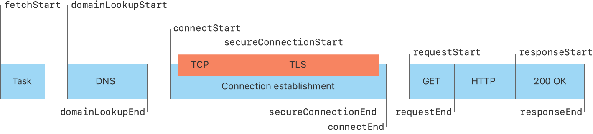

> Navigation: [Technologies](../technologies.md) · [Foundation](../foundation.md)

# URLSessionTaskTransactionMetrics

<sub>Class</sub>

An object that encapsualtes the performance metrics collected by the URL Loading System during the execution of a session task.

<sub>iOS, iPadOS, Mac Catalyst, macOS, tvOS, visionOS, watchOS</sub>

```swift
class URLSessionTaskTransactionMetrics
```

## Overview

Each [URLSessionTaskTransactionMetrics](urlsessiontasktransactionmetrics.md) object consists of a [request](urlsessiontasktransactionmetrics/request.md) and [response](urlsessiontasktransactionmetrics/response.md) property, corresponding to the request and response of the corresponding task. It also contains temporal metrics, starting with [fetchStartDate](urlsessiontasktransactionmetrics/fetchstartdate.md) and ending with [responseEndDate](urlsessiontasktransactionmetrics/responseenddate.md), as well as other characteristics like [networkProtocolName](urlsessiontasktransactionmetrics/networkprotocolname.md) and [resourceFetchType](urlsessiontasktransactionmetrics/resourcefetchtype.md).

### Understanding temporal metrics

The figure below shows the sequence of events for a URL session task, which correspond to the temporal metrics captured by [URLSessionTaskTransactionMetrics](urlsessiontasktransactionmetrics.md).



<sub>Diagram showing the temporal metrics for a URL session task. When a task starts, it performs a DNS lookup and then starts a connection. If the connection is encrypted, the user agent starts a TLS security handshake to secure the connection. After the connection to the server is established, the user agent requests the specified resource, and receives a response.</sub>

For all metrics with a start and end date, if an aspect of the task was not completed, then its corresponding end date metric is `nil`. This can happen if name lookup begins, but the operation either times out, fails, or the client cancels the task before the name can be resolved. In this case, the [domainLookupEndDate](urlsessiontasktransactionmetrics/domainlookupenddate.md) property is `nil`, along with all metrics for aspects that occurred afterwards.

### Measuring tasks using iCloud Private Relay

iCloud Private Relay can change the timing and sequence of events for your tasks by sending requests through a set of privacy proxies. All tasks that use iCloud Private Relay set the [proxyConnection](urlsessiontasktransactionmetrics/isproxyconnection.md) property in their transaction metrics. In this case, the [remoteAddress](urlsessiontasktransactionmetrics/remoteaddress.md) property contains the address of the proxy, and not the origin server.

Tasks to different hosts can reuse the same transport connection, just like how tasks can already share a connection when using HTTP/2. In these cases, a proxied task may not report any [secureConnectionStartDate](urlsessiontasktransactionmetrics/secureconnectionstartdate.md) or [secureConnectionEndDate](urlsessiontasktransactionmetrics/secureconnectionenddate.md).

## Relationships

- **Inherits From**: [NSObject](../objectivec/nsobject-swift.class.md)

- **Conforms To**: [CVarArg](../swift/cvararg.md), [CustomDebugStringConvertible](../swift/customdebugstringconvertible.md), [CustomStringConvertible](../swift/customstringconvertible.md), [Equatable](../swift/equatable.md), [Hashable](../swift/hashable.md), [NSObjectProtocol](../objectivec/nsobjectprotocol.md), [Sendable](../swift/sendable.md), [SendableMetatype](../swift/sendablemetatype.md)

## Topics

### Accessing request and response

- [request](urlsessiontasktransactionmetrics/request.md) — The transaction request.
- [response](urlsessiontasktransactionmetrics/response.md) — The transaction response.

### Accessing temporal metrics

- [fetchStartDate](urlsessiontasktransactionmetrics/fetchstartdate.md) — The time when the task started fetching the resource, from the server or locally.
- [domainLookupStartDate](urlsessiontasktransactionmetrics/domainlookupstartdate.md) — The time immediately before the task started the name lookup for the resource.
- [domainLookupEndDate](urlsessiontasktransactionmetrics/domainlookupenddate.md) — The time after the name lookup was completed.
- [connectStartDate](urlsessiontasktransactionmetrics/connectstartdate.md) — The time immediately before the task started establishing a TCP connection to the server.
- [secureConnectionStartDate](urlsessiontasktransactionmetrics/secureconnectionstartdate.md) — The time immediately before the task started the TLS security handshake to secure the current connection.
- [secureConnectionEndDate](urlsessiontasktransactionmetrics/secureconnectionenddate.md) — The time immediately after the security handshake completed.
- [connectEndDate](urlsessiontasktransactionmetrics/connectenddate.md) — The time immediately after the task finished establishing the connection to the server.
- [requestStartDate](urlsessiontasktransactionmetrics/requeststartdate.md) — The time immediately before the task started requesting the resource, regardless of whether it is retrieved from the server or local resources.
- [requestEndDate](urlsessiontasktransactionmetrics/requestenddate.md) — The time immediately after the task finished requesting the resource, regardless of whether it was retrieved from the server or local resources.
- [responseStartDate](urlsessiontasktransactionmetrics/responsestartdate.md) — The time immediately after the task received the first byte of the response from the server or from local resources.
- [responseEndDate](urlsessiontasktransactionmetrics/responseenddate.md) — The time immediately after the task received the last byte of the resource.

### Accessing data transfer metrics

- [countOfRequestBodyBytesBeforeEncoding](urlsessiontasktransactionmetrics/countofrequestbodybytesbeforeencoding.md) — The size of the upload body data, file, or stream, in bytes.
- [countOfRequestBodyBytesSent](urlsessiontasktransactionmetrics/countofrequestbodybytessent.md) — The number of bytes transferred for the request body.
- [countOfRequestHeaderBytesSent](urlsessiontasktransactionmetrics/countofrequestheaderbytessent.md) — The number of bytes transferred for the request header.
- [countOfResponseBodyBytesAfterDecoding](urlsessiontasktransactionmetrics/countofresponsebodybytesafterdecoding.md) — The size of data delivered to your delegate or completion handler.
- [countOfResponseBodyBytesReceived](urlsessiontasktransactionmetrics/countofresponsebodybytesreceived.md) — The number of bytes transferred for the response body.
- [countOfResponseHeaderBytesReceived](urlsessiontasktransactionmetrics/countofresponseheaderbytesreceived.md) — The number of bytes transferred for the response header.

### Accessing transaction characteristics

- [networkProtocolName](urlsessiontasktransactionmetrics/networkprotocolname.md) — The network protocol used to fetch the resource.
- [remoteAddress](urlsessiontasktransactionmetrics/remoteaddress.md) — The IP address string of the remote interface for the connection.
- [remotePort](urlsessiontasktransactionmetrics/remoteport.md) — The port number of the remote interface for the connection.
- [localAddress](urlsessiontasktransactionmetrics/localaddress.md) — The IP address string of the local interface for the connection.
- [localPort](urlsessiontasktransactionmetrics/localport.md) — The port number of the local interface for the connection.
- [negotiatedTLSCipherSuite](urlsessiontasktransactionmetrics/negotiatedtlsciphersuite.md) — The TLS cipher suite the task negotiated with the endpoint for the connection.
- [negotiatedTLSProtocolVersion](urlsessiontasktransactionmetrics/negotiatedtlsprotocolversion.md) — The TLS protocol version the task negotiated with the endpoint for the connection.
- [cellular](urlsessiontasktransactionmetrics/iscellular.md) — A Boolean value that indicates whether the connection operates over a cellular interface.
- [expensive](urlsessiontasktransactionmetrics/isexpensive.md) — A Boolean value that indicates whether the connection operates over an expensive interface.
- [constrained](urlsessiontasktransactionmetrics/isconstrained.md) — A Boolean value that indicates whether the connection operates over an interface marked as constrained.
- [proxyConnection](urlsessiontasktransactionmetrics/isproxyconnection.md) — A Boolean value that indicastes whether the task used a proxy connection to fetch the resource.
- [reusedConnection](urlsessiontasktransactionmetrics/isreusedconnection.md) — A Boolean value that indicates whether the task used a persistent connection to fetch the resource.
- [multipath](urlsessiontasktransactionmetrics/ismultipath.md) — A Boolean value that indicates whether the connection uses a successfully negotiated multipath protocol.
- [resourceFetchType](urlsessiontasktransactionmetrics/resourcefetchtype.md) — A value that indicates whether the resource was loaded, pushed, or retrieved from the local cache.
- [ResourceFetchType](urlsessiontaskmetrics/resourcefetchtype.md) — The manner in which a resource is fetched.
- [domainResolutionProtocol](urlsessiontasktransactionmetrics/domainresolutionprotocol.md) — DNS protocol used for domain resolution.
- [DomainResolutionProtocol](urlsessiontaskmetrics/domainresolutionprotocol.md)

### Creating transaction metrics

- [- init](<urlsessiontasktransactionmetrics/init().md>) — Creates a transaction metrics instance. _(deprecated)_
- [+ new](<urlsessiontasktransactionmetrics/new().md>) — Creates a new transaction metrics instance. _(deprecated)_

## See Also

### Accessing task metrics

- [transactionMetrics](urlsessiontaskmetrics/transactionmetrics.md) — An array of metrics for each individual request-response transaction made during the execution of the task.
- [taskInterval](urlsessiontaskmetrics/taskinterval.md) — The time interval between when a task is instantiated and when the task is completed.
- [redirectCount](urlsessiontaskmetrics/redirectcount.md) — The number of redirects that occurred during the execution of the task.
