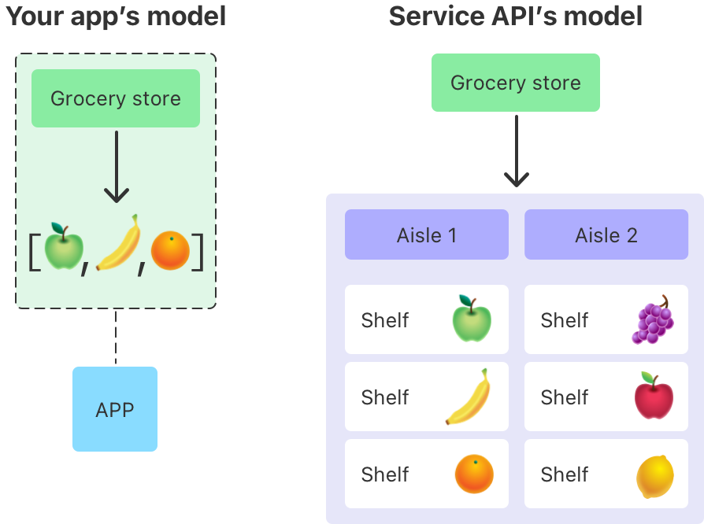

> Navigation: [Technologies](../technologies.md) · [Foundation](../foundation.md) · [Archives and Serialization](archives-and-serialization.md)

# Using JSON with custom types

<sub>Sample Code</sub>

Encode and decode JSON data, regardless of its structure, using Swift’s JSON support.

## Overview

JSON data you send or receive from other apps, services, and files can come in many different shapes and structures. Use the techniques described in this sample to handle the differences between external JSON data and your app’s model types.



<sub>A two-pane image showing two related data models. The pane on the left, titled Your App’s Model, shows a circle labeled app connected to a thought balloon. Inside the balloon, a label called Grocery Store points to an array of icons that includes an apple, a banana, and an orange. The second pane is titled Service API’s model. It also has a Grocery Store label, but this points to an array in which each member is a vertical list called Aisle, which contains multiple members called Shelf, each of which contains a different fruit. While the Aisle 1 element contains the same fruits as the first pane that showed the app’s model, Aisle 2 contains other fruits that the app doesn’t know about.</sub>

This sample defines a simple data type, `GroceryProduct`, and demonstrates how to construct instances of that type from several different JSON formats.

```swift
struct GroceryProduct: Codable {
    var name: String
    var points: Int
    var description: String?
}
```

The sample is an Xcode playground, which you interact with by executing the code in the playground. Each of the sections in this article refers to a different page in the playground.

### Read Data from Arrays

Use Swift’s expressive type system to avoid manually looping over collections of identically structured objects. This playground uses array types as values to see how to work with JSON that’s structured like this:

```swift
[
    {
        "name": "Banana",
        "points": 200,
        "description": "A banana grown in Ecuador."
    }
]
```

### Change Key Names

Learn how to map data from JSON keys into properties on your custom types, regardless of their names. For example, this playground shows how to map the `"product_name"` key in the JSON below to the `name` property on `GroceryProduct`:

```swift
{
    "product_name": "Banana",
    "product_cost": 200,
    "description": "A banana grown in Ecuador."
}
```

Custom mappings let you to apply the Swift [API Design Guidelines](https://swift.org/documentation/api-design-guidelines/) to the names of properties in your Swift model, even if the names of the JSON keys are different.

### Access Nested Data

Learn how to ignore structure and data in JSON that you don’t need in your code. This playground uses an intermediate type to see how to extract grocery products from JSON that looks like this to skip over unwanted data and structure:

```swift
[
    {
        "name": "Home Town Market",
        "aisles": [
            {
                "name": "Produce",
                "shelves": [
                    {
                        "name": "Discount Produce",
                        "product": {
                            "name": "Banana",
                            "points": 200,
                            "description": "A banana that's perfectly ripe."
                        }
                    }
                ]
            }
        ]
    }
]
```

### Merge Data at Different Depths

Combine or separate data from different depths of a JSON structure by writing custom implementations of protocol requirements from `Encodable` and `Decodable`. This playground shows how to construct a `GroceryProduct` instance from JSON that looks like this:

```
{
    "Banana": {
        "points": 200,
        "description": "A banana grown in Ecuador."
    }
}
```

## See Also

### JSON

- [JSONEncoder](jsonencoder.md) — An object that encodes instances of a data type as JSON objects.
- [JSONDecoder](jsondecoder.md) — An object that decodes instances of a data type from JSON objects.
- [JSONSerialization](jsonserialization.md) — An object that converts between JSON and the equivalent Foundation objects.

## Download

- [UsingJSONWithCustomTypes.zip](https://docs-assets.developer.apple.com/published/111eb89d287b/UsingJSONWithCustomTypes.zip)
