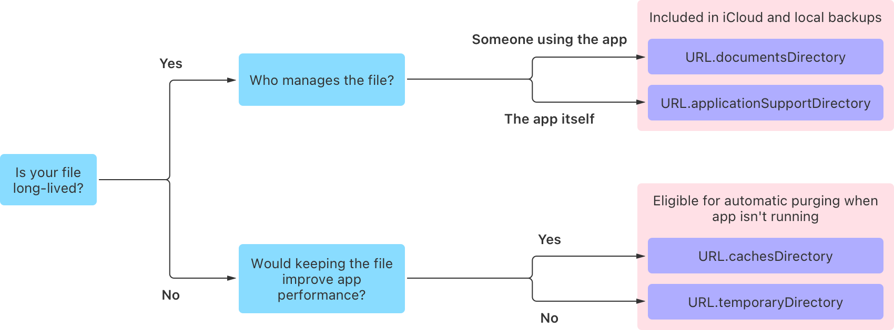

> Navigation: [Technologies](../technologies.md) · [Foundation](../foundation.md) · [File System](file-system.md)

# Using the file system effectively

Article

Gain access to benefits like automatic backup or purging by using purpose-built directories provided by the system.

## Overview

When apps persist data, they often use different files for different purposes. For example, when someone uses your app to create a document, the app stores the document permanently, and makes it available for automated backup. Your app may also create files it requires to function, but that won’t be visible while someone’s using the app. Still other types of files may be useful for a time, but eventually eligible for deletion. Foundation provides special directories for different kinds of files, some of which offer unique behaviors that can help your app to store files more efficiently.

By thoughtfully managing your use of file system resources, you can avoid wasting space, which provides the following advantages:

- Your app won’t prevent the system from performing an update due to lack of space.
- Your app becomes less likely to be deleted and redownloaded during a system update.
- The person using your app may be less likely to delete your app to free up storage space.
- Your app benefits from smaller, faster backups.

In addition, using the right directories for the right files provides useful features, like automatic backup or purging.

> [!tip] Tip
> If the data you need to persist is very small – several strings or name-value pairs – you might find it more convenient to use [UserDefaults](userdefaults.md) instead of managing flat files.

### Access common directories

On iOS, tvOS, watchOS, and visionOS, apps perform all their file access within the app’s bundle. There’s no access outside of the bundle, except in cases where higher-level APIs access outside files on the app’s behalf, like when you use [Media Player](../mediaplayer.md) to play songs from the device’s music library. A sandboxed macOS app uses a similar setup.

Within the bundle, the system provides specific directories, some with distinct behaviors, such as backing up, or periodically purging files. Access these directories with methods and properties from the [URL](url.md) and [FileManager](filemanager.md) types:

- In Swift, [URL](url.md) defines properties for common directories like [documentsDirectory](url/documentsdirectory.md), [cachesDirectory](url/cachesdirectory.md), [temporaryDirectory](url/temporarydirectory.md), and so on. Each of these properties is a single, nonoptional [URL](url.md) instance that you can use with [FileManager](filemanager.md).
- In Swift or Objective-C, you can use the [FileManager](filemanager.md) method [- URLsForDirectory:inDomains:](<filemanager/urls(for_in_).md>) to access common directories. The `for` parameter takes a [SearchPathDirectory](filemanager/searchpathdirectory.md), a type that defines constants to search for common directories like [NSDocumentDirectory](filemanager/searchpathdirectory/documentdirectory.md) and [NSCachesDirectory](filemanager/searchpathdirectory/cachesdirectory.md).

Use these APIs whenever possible. Don’t hard-code paths to what appear to be common directories, since apps like Finder may localize directory names and omit file extensions when presenting them in the user interface.

### Store long-lived files

When writing a document-based app with APIs like [UIDocument](../uikit/uidocument.md) and [NSDocument](../appkit/nsdocument.md), store files in the `Documents` folder. You can access this folder with the URL [documentsDirectory](url/documentsdirectory.md) or the search path [NSDocumentDirectory](filemanager/searchpathdirectory/documentdirectory.md).

You can also use this folder for other files managed by the person using your app, even if you don’t use the [UIDocument](../uikit/uidocument.md) or [NSDocument](../appkit/nsdocument.md) APIs.

The system backs up files in the `Documents` folder when connecting an iOS device to a macOS computer with a USB cable, or when performing an iCloud backup. The system can also make the contents of the `Documents` folder available for file sharing. Only store files in this folder that you want to expose to the person using your app.

Additionally, when you store files in the `Documents` folder in an iOS app, they also become visible in the system “Files” app.

For support files that your app needs to operate but that you don’t want to be openly visible, prefer the `ApplicationSupport` directory by using the URL property [applicationSupportDirectory](url/applicationsupportdirectory.md) or the search path [NSApplicationSupportDirectory](filemanager/searchpathdirectory/applicationsupportdirectory.md). This directory stores data like configuration files, templates, and modified versions of default files from your bundle. The system also includes the contents of this folder as part of regular backups.

> [!important] Important
> If you want to exclude an item in `Documents` or `ApplicationSupport` from backup, call [setResourceValues(_:)](<url/setresourcevalues(__).md>) with the value [isExcludedFromBackup](urlresourcevalues/isexcludedfrombackup.md) in Swift, or [- setResourceValue:forKey:error:](<nsurl/setresourcevalue(__forkey_).md>) with the key [NSURLIsExcludedFromBackupKey](urlresourcekey/isexcludedfrombackupkey.md) in Objective-C. Exclude from the backup any file that your app can recreate or redownload, particularly large media files.

### Store short-lived files

Your app may also use shorter-lived files that you don’t need backed up or stored permanently. Foundation provides several directories for storing these kinds of files.

Access the temporary directory with the URL property [temporaryDirectory](url/temporarydirectory.md), and the file manager property [temporaryDirectory](filemanager/temporarydirectory.md). Use this directory for files with a short lifespan, like the side effects of computational operations, or one-time downloads that can be discarded after use.

Only use the temporary directory for files that you don’t need to persist between launches of the app, because the system may purge this directory when your app isn’t running. There’s no guarantee of when or if the system will clear the directory, however, so delete temporary files as soon as you know you don’t need them.

For files that persist longer than temporary files, but are still purgeable, use the _caches_ directory. In the caches directory, store files the app doesn’t require to operate, but that improve performance, such as database cache files and transient, downloadable content.

Access the caches directory with the URL property [cachesDirectory](url/cachesdirectory.md) or the file manager search path [NSCachesDirectory](filemanager/searchpathdirectory/cachesdirectory.md). As with the temporary directory, the system may purge this directory when your app isn’t running. Your app needs to either be able to operate without these files, or regenerate them as needed. Additionally, invalidate and delete cache files when you can, and don’t waste storage on unnecessary files.

The system doesn’t back up either the temporary directory or the caches directory.

The following decision tree summarizes the factors to consider when choosing a storage directory, and the [URL](url.md) constants for those directories.

A graphic showing a decision tree, reading from left to right. The first decision point reads ‘Is your file long-lived?’ The ‘yes’ answer leads to another decision point: ‘Who manages the file?

### Access the rest of the file system in a non-sandboxed macOS app

A non-sandboxed macOS app can access files outside of its own container. This ability can be useful for apps that read from and write to other locations in the file system.

> [!tip] Tip
> To use files outside the app container of a sandboxed macOS app, see [Accessing files from the macOS App Sandbox](../security/accessing-files-from-the-macos-app-sandbox.md).

When a macOS app isn’t sandboxed, the common directory properties in [URL](url.md) provide different values. For example, in a non-sandboxed macOS app, [applicationSupportDirectory](url/applicationsupportdirectory.md) is “`~/Library/Application Support`”, and [cachesDirectory](url/cachesdirectory.md) is “`~/Library/Caches`”. This difference in values also applies when using [- URLsForDirectory:inDomains:](<filemanager/urls(for_in_).md>) with search path constants like [NSApplicationSupportDirectory](filemanager/searchpathdirectory/applicationsupportdirectory.md) and [NSCachesDirectory](filemanager/searchpathdirectory/cachesdirectory.md).

## See Also

### File system operations

- [Improving performance and stability when accessing the file system](improving-performance-and-stability-when-accessing-the-file-system.md) — Prevent data loss and app crashes by interacting with the file system in a coordinated, asynchronous manner and by avoiding unnecessary disk I/O.
- [FileManager](filemanager.md) — A convenient interface to the contents of the file system, and the primary means of interacting with it.
- [FileManagerDelegate](filemanagerdelegate.md) — The interface a file manager’s delegate uses to intervene during operations or if an error occurs.
- [About Apple File System](about-apple-file-system.md) — Use high-level APIs to get the most out of Apple File System.
