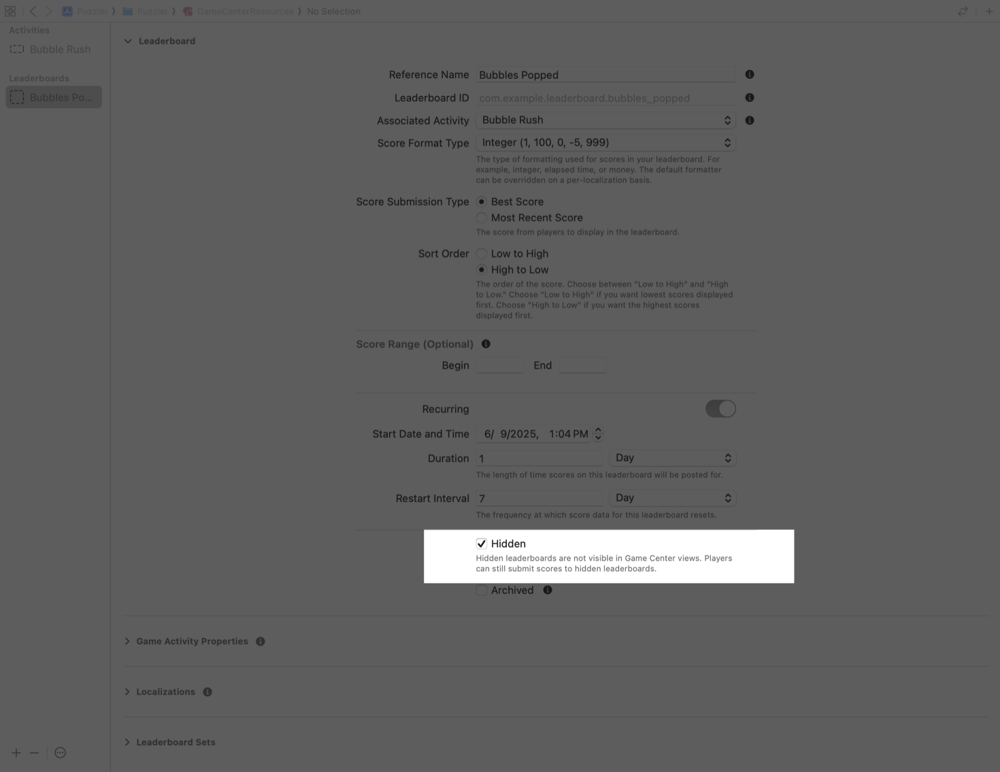

> Navigation: [Technologies](../technologies.md) · [GameKit](../gamekit.md)

# Choosing a leaderboard for your challenges

<sub>Article</sub>

Understand what gameplay works well when configuring challenges in your game.

## Overview

One feature of most games is the leaderboard; a place where players can compare scores and check their rankings. Some leaderboards work better for challenges than others. When you choose a leaderboard, it’s important to factor in the type of gameplay your game provides, whether your challenge is repeatable, and whether you need a leaderboard that resets after a certain period of time.

Before you can configure a challenge, your game needs to have a leaderboard — using either Game Center, or a leaderboard service outside of Game Center. For more information on creating leaderboards, see [Encourage progress and competition with leaderboards](encourage-progress-and-competition-with-leaderboards.md).

> [!note] Note
> You can still adopt challenges if you use a custom service to power your leaderboards. You configure a hidden leaderboard in Game Center and report scores to both Game Center and your server. Hidden leaderboards don’t appear in the Game Center UI.

With your leaderboard in place, you need to assess how well suited it is for challenges, including whether:

- It suits the scoring submission style and type
- A challenge is repeatable
- Scores from the challenge post to a classic or recurring leaderboard
- Leaderboards are grouped
- You want to adopt challenges when you have a custom built leaderboard service outside of Game Center.

## Determine a score submission style and type

Challenges are ideal for games with a tight gameplay loop and a clear metric to gauge skill or accomplishment, like:

- A racing game, where the leaderboard ranks players by fastest lap time on a particular track.
- A puzzle game, where a leaderboard refreshes daily as players compete to finish a daily puzzle in the fastest time.
- A bubble popping game, where the leaderboard lists the number of bubbles players pop within a limited time frame.

When reporting challenge scores to the leaderboard, only submit scores when gameplay ends. For example, with the bubble popping game, submit the total number of bubbles popped when the clock runs out, rather than reporting a person’s progress along the way.

Challenges aren’t ideal for games that give an unfair advantage to regular players. If you configure a challenge that tracks the all-time total bubbles popped by a player, new players are put in a no-win scenario when they’re invited to the challenge.

A challenge is a competition where players compete for the top spot, so set your leaderboard’s Score Submission Type to Best Score for the optimal challenge experience. For more information about the properties you configure with a leaderboard, see [Leaderboard properties](https://developer.apple.com/help/app-store-connect/reference/leaderboards#leaderboard-properties).

## Decide whether challenges are repeatable

Choose a leaderboard game mode by identifying whether your gameplay is repeatable. For example, if your racing game encourages players to compete for the fastest lap time, then it’s repeatable. Conversely, if your puzzle game offers a daily challenge puzzle, then it’s nonrepeatable. With the racing challenge, players can keep racing to get the fastest lap, while the puzzle challenge limits players to a single attempt.

For repeatable gameplay, players can choose one of three options: one attempt, three attempts, or unlimited attempts. For nonrepeatable gameplay, players can only configure a challenge with one attempt.

For nonrepeatable challenges, the current score on the leaderboard carries forward for the player and counts toward the challenge. Otherwise, for repeatable gameplay, the player’s existing score on the leaderboard won’t count toward the challenge.

> [!note] Note
> To provide a repeatable challenge you need to configure the challenge to use a recurring leaderboard.

## Choose between a classic and recurring leaderboard

When configuring a challenge, you can select a leaderboard that’s either classic or recurring:

- Classic leaderboards don’t reset the scores.
- Recurring leaderboards reset the scores at a specific interval.

For more information on classic leaderboards, see [Encourage progress and competition with leaderboards](encourage-progress-and-competition-with-leaderboards.md). For more information on recurring leaderboards, see [Creating recurring leaderboards](creating-recurring-leaderboards.md).

If you associate a challenge with a classic leaderboard, players can choose a duration that indicates how long other players may participate in the challenge. For a classic leaderboard, the allowed durations are one day, three days, and one week.

You don’t select a duration if you associate a challenge with a recurring leaderboard. The duration of the challenge is implicitly as long as the remainder of the leaderboard’s current recurrence duration. For example, if your game has a daily recurring leaderboard that resets at at midnight (12 a.m.), and your player creates a recurring leaderboard-based challenge at noon (12 p.m.), the duration on the challenge is 12 hours.

Make sure you give your players time to compete. Because the challenge duration inherits from the recurring leaderboard’s remaining duration, don’t configure a challenge on a recurring leaderboard that has a short duration.

## Add a grouped leaderboard for challenges

A Game Center group allow you to share leaderboard data between two or more games. You can associate a leaderboard group with your challenges to share the progress across the games that are within the group. At the time of gameplay, all participants need to use the game that initiates the challenge to compete. This is to ensure all players are on an even playing field for a fair competition as the gameplay experience may differ between the games.

## Adopt challenges with hidden leaderboards

The system can drive engagement to your game whether you use Game Center leaderboards or your own leaderboard system. To do so, you need to enable Game Center and configure a leaderboard in Xcode that shadows a leaderboard you already provide through your own system.



<sub>A screenshot of the GameKit configuration in Xcode with a leaderboard in a selected state. The leaderboard is configured to be Hidden. It shows help text that reads ‘Hidden leaderboards are not visible in Game Center views. Players can still submit scores to hidden leaderboards.’</sub>

When you configure the leaderboard in Xcode, set the leaderboard as hidden. A hidden leaderboard won’t show up in any list of leaderboards a person accesses through the Game Center dashboard, Games app, or other game events.

After creating a hidden leaderboard, configure your challenge to submit scores to it by calling [- submitScore:context:player:completionHandler:](<gkleaderboard/submitscore(__context_player_completionhandler_).md>). You can use the hidden leaderboard to track the player’s progress and outcome for the challenge. Submit the score to your custom leaderboard service and Game Center:

```swift
// Submit a score to a leaderboard you associate with a challenge.
try await GKLeaderboard.submitScore(points, 
                                    context: 0, 
                                    player: GKLocalPlayer.local,
                                    leaderboardIDs: ["com.example.leaderboard.bubbles_popped"]) 
```

If you prefer to submit scores through your own server, see
[Game Center leaderboards scores](../appstoreconnectapi/game-center-leaderboards-scores.md).

For more information on enabling Game Center, see [Initializing and configuring Game Center](initializing-and-configuring-game-center.md). To learn more about configuring leaderboard, see [Encourage progress and competition with leaderboards](encourage-progress-and-competition-with-leaderboards.md).

## See Also

### Challenges

- [Creating engaging challenges from leaderboards](creating-engaging-challenges-from-leaderboards.md) — Encourage friendly competition by adding challenges to your game.
- [GKChallengeDefinition](gkchallengedefinition.md) — An object that represents the static metadata you define for the challenge.
- [GKShowChallengeBanners](../bundleresources/information-property-list/gkshowchallengebanners.md) — A Boolean value that indicates whether GameKit can display challenge banners in a game. _(deprecated)_
