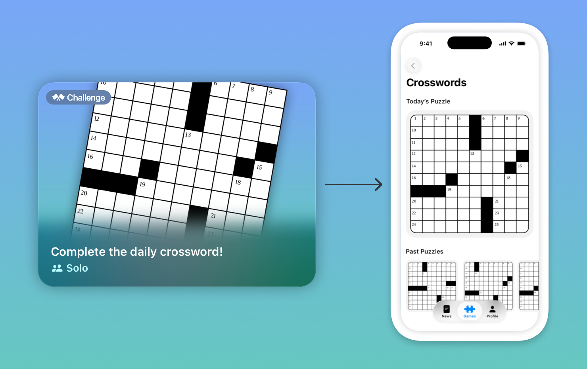
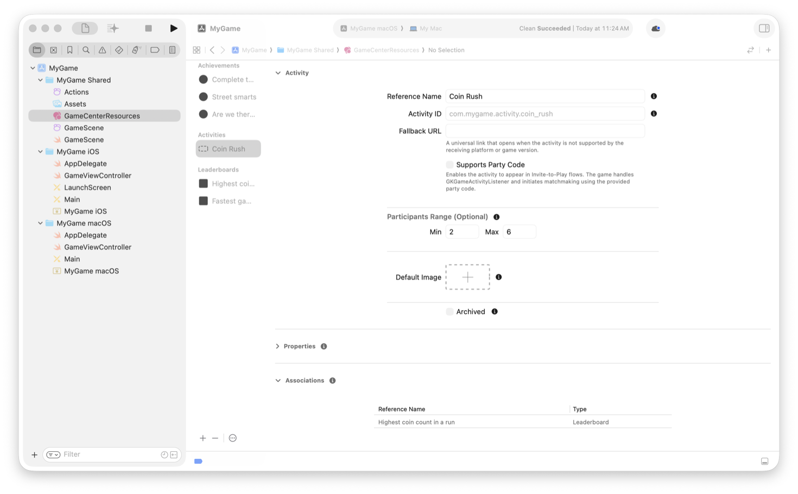
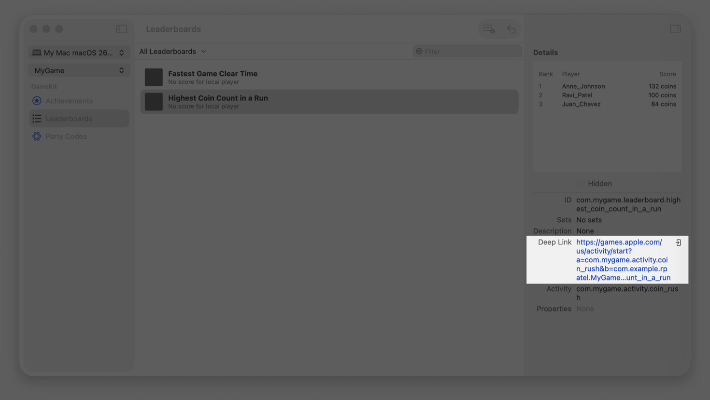

> Navigation: [Technologies](../technologies.md) · [GameKit](../gamekit.md)

# Creating activities for your game

<sub>Article</sub>

Use activities to surface game content to players and encourage them to connect with each other.

## Overview

Players discover and engage with games — along with connecting with friends and other players — through Game Center. Game activities present players with challenges in your game, like collecting pieces of a puzzle. They offer a way to keep people engaged with your game, and with each other. By regularly adding new activities — like finding parts of a map and piecing them together to find buried treasure — you encourage people to explore your game, or play as a team to accomplish a goal.



Activities provide a way to link players directly to your content. By describing your gameplay with activities, you can link the player to that part of your game when they engage with the activity. For example, when a player wants to complete your daily puzzle, you can send the player directly to that part of your game.

They also provide the Games app with information about what’s happening in your game. The Games app uses the activity configuration you specify to help drive engagement by deep linking to your content. You can configure activities with achievements, leaderboards, and challenges. To learn more about the Games app, see [Engage players with the Games app](https://developer.apple.com/wwdc25/215). To learn more about challenges, see [Creating engaging challenges from leaderboards](creating-engaging-challenges-from-leaderboards.md).

## Configure and test game activities

Configure activities in Xcode before accessing them in your code and testing locally with Game Progress Manager. When you’re ready to deploy your configuration, sync your updates with App Store Connect. For more information about configuring and testing Game Center features, see [Initializing and configuring Game Center](initializing-and-configuring-game-center.md).

For each activity you configure, you specify details like how many players it supports, and what achievement, leaderboard, or challenge to associate the activity with.



The capabilities you choose for an activity depends on the design of your game. For multiplayer activities, configure whether it supports party codes — a way players invite each other to activities. You also specify the number of players the activity supports. A challenge supports up to 16 players.

When you configure your activity, you can provide an optional collection of properties that are specific to your game. For example, you can add custom details about which level an activity is for and the difficulty.

> [!note] Note
> Use App Store Connect when you need to remove an activity that you sync. If you already pushed your configuration changes to App Store Connect, removing an activity from the local configuration file doesn’t remove it from App Store Connect.

Use the Game Progress Manager to test your activities on your local device before you push the configuration update to App Store Connect. After selecting a resource that you associate with an activity, you can open a deep link to verify the behavior of your activity.



<sub>A screenshot showing the Game Progress Manager with a leaderboard selected. The leaderboard is associated with a game activity that’s shown as a Deep Link. Click on the link to test the behavior of the link with your game.</sub>

For design guidance on game activities, see Human Interface Guidelines \> Technologies \> [Game Center](https://developer.apple.com/design/human-interface-guidelines/game-center). To learn more about the information you enter in App Store Connect, see [Game Activities properties](https://developer.apple.com/help/app-store-connect/reference/game-activities).

## Get the object that represents the activity

To retrieve the details of the activities you define you use a [GKGameActivityDefinition](gkgameactivitydefinition.md) object. A definition represents the static metadata that you configure in Xcode or App Store Connect. You use `GKGameActivityDefinition.all` to load all of the activities your game defines. If you want to load individual activities, use [+ loadGameActivityDefinitionsWithIDs:completionHandler:](<gkgameactivitydefinition/loadgameactivitydefinitions(ids_completionhandler_).md>) and provide the list of activities to load.

```swift
// Load the game’s activities.
let activityDescriptions = try await GKGameActivityDefinition.all
let activityID = “com.example.mygame.score_attack_mode”

// Find an activity by using an identifier.
let activityDescription = activityDescriptions.first(where: { $0.identifier == activityID })
```

After fetching the description of an activity, you can load the associated leaderboards or achievements that you configure to use with the activity:

```swift
// Load the resources associated with the activity.
let achievementDescription = try await activityDescription.associatedAchievementDescriptions
let leaderboards = try await activityDescription.leaderboards
```

## Handle deep linking through activity listener

A [GKGameActivity](gkgameactivity.md) object represents a single instance of an activity in your game. The [GKGameActivityListener](gkgameactivitylistener.md) delegate provides the ability to observe and receive activities from the system. The delegate provides a single callback that provides the identifier of the activity so you can route the player to the correct experience.

```swift
class SampleGameListener: GKGameActivityListener {
    func player(_ player: GKPlayer,
                wantsToPlay activity: GKGameActivity) async → Bool {
        switch activity.activityIdentifier {
        case “com.example.mygame.score_attack_mode”:
            startScoreAttackMode(with: activity)
            return true
        case “com.example.mygame.versus_mode”:
            startMultiplayerMode(with: activity, inviteCode: activity.partyCode)
            return true
        default:
            return false
        }
    }
}
```

When an app receives a deep link, it can contain a party code field on the activity instance. If the activity supports party codes, check [partyCode](gkgameactivity/partycode.md) to retrieve the code players share to join the activity. When you receive a [GKGameActivity](gkgameactivity.md) from `GameKit`, the party code you get is valid and ready to use.

When the framework provides an activity object it contains a party code that’s ready for use. If you want to supply your own party code, create an activity description and call [+ startWithDefinition:partyCode:error:](<gkgameactivity/start(definition_partycode_).md>) with the party code.

If your app generates party codes — or your app receives a code from player input — use [+ isValidPartyCode:](<gkgameactivity/isvalidpartycode(__).md>) to verify that the code is in a valid format.

You can use party codes with either `GameKit` multiplayer technologies or any alternative multiplayer solution. If your game adopts [GKMatch](gkmatch.md) for Game Center multiplayer matchmaking and networking, call [- findMatchWithCompletionHandler:](<gkgameactivity/findmatch(completionhandler_).md>) on the activity object to start the matchmaking process with the activity’s information. If you use Game Center matchmaking with your own networking, call [- findPlayersForHostedMatchWithCompletionHandler:](<gkgameactivity/findplayersforhostedmatch(completionhandler_).md>). When matchmaking, the system matches players together that receive the same party code:

```swift
// Start matchmaking to find a match.
let match = try await activity.findMatch()
sampleGameUI.startGame(match)
```

> [!note] Note
> The matchmaking process is similar to using [GKMatchmaker](gkmatchmaker.md) directly. If too many people try to join a game using the same party code, there’s a chance that friends of the inviter might join different games when exceeding the maximum number of players you set for the match.

## Add universal link support

Support older operating systems and other platforms by adding a [fallbackURL](gkgameactivitydefinition/fallbackurl.md). If the game activity API isn’t available on the system, players are directed to an invite page on the web when they open an invite they receive. When the player chooses to join an activity, the system invokes the `fallbackURL` you specify for it with the following URL pattern:

```
{startActivityURL}?a={activityIdentifier}&c={partyCode}
```

- **`startActivityURL`** — A URL that you provide and host.
- **`activityIdentifier`** — The value you specify in your activity definition.
- **`partyCode`** — A party code you use for matchmaking.

To learn more about universal links, see [Supporting universal links in your app](../xcode/supporting-universal-links-in-your-app.md).

## Start a game activity life cycle

Use the game activity object to start, pause, and end the activity. When you start a new game activity, you can start it with a valid party code or just an activity definition. Starting an activity begins tracking its state.

```swift
// Start the activity with a party code.
let activity = try GKGameActivity.start(activityDescription,
                                        partyCode: "2345-CFGH")
```

During gameplay for a round-based activity, you can call [- end](<gkgameactivity/end().md>) when players complete the round to submit score submissions. You associate leaderboards and achievements with the activity by calling the appropriate methods [- setScoreOnLeaderboard:toScore:context:](<gkgameactivity/setscore(on_to_context_).md>) or [- setProgressOnAchievement:toPercentComplete:](<gkgameactivity/setprogress(on_to_).md>).

```swift
// Set the score on a leaderboard for the local player.
let score = 100
let context = 1
activity.setScore(on: leaderboard, to: score, context: context)

// Set the progress on an achievement to 60 percent.
activity.setProgress(on: achievement, to: 60)
```

## Report progress for an activity

When you set the score on a leaderboard instance, or update the progress on an achievement, the framework tracks it in real time but doesn’t submit it as an attempt until the player completes the activity. This is helpful for games that frequently update score or achievement progress and avoids performing frequent network requests. It’s also helpful to avoid tracking incomplete scores or attempts. Instead, `GameKit` queues scores or progress until the player completes the activity.

To complete an activity, call [- end](<gkgameactivity/end().md>). Similarly, when you update the progress of an achievement, complete the activity for the system to the progress on your behalf.

```swift
// Start the activity
init(activity: GKGameActivity) {
    self.activity = activity
    activity.start()
}

// Handle tracking score updates at the local level.
var currentScore: Int {
    get {
        activity.scoreForLeaderboard(leaderboard) ?? 0
    }
    set {
        activity.setScoreOnLeaderboard(leaderboard, to: newValue)
    }
}

// End the activity to submit the score on your behalf.
deinit {
    activity.end()
}
```

## See Also

### Activities

- [GKGameActivity](gkgameactivity.md) — An object that represents a single instance of a game activity for the current game.
- [GKGameActivityDefinition](gkgameactivitydefinition.md) — An object that represents the static metadata you define for the activity.
- [GKGameActivityListener](gkgameactivitylistener.md) — An object that responds to activity events.
