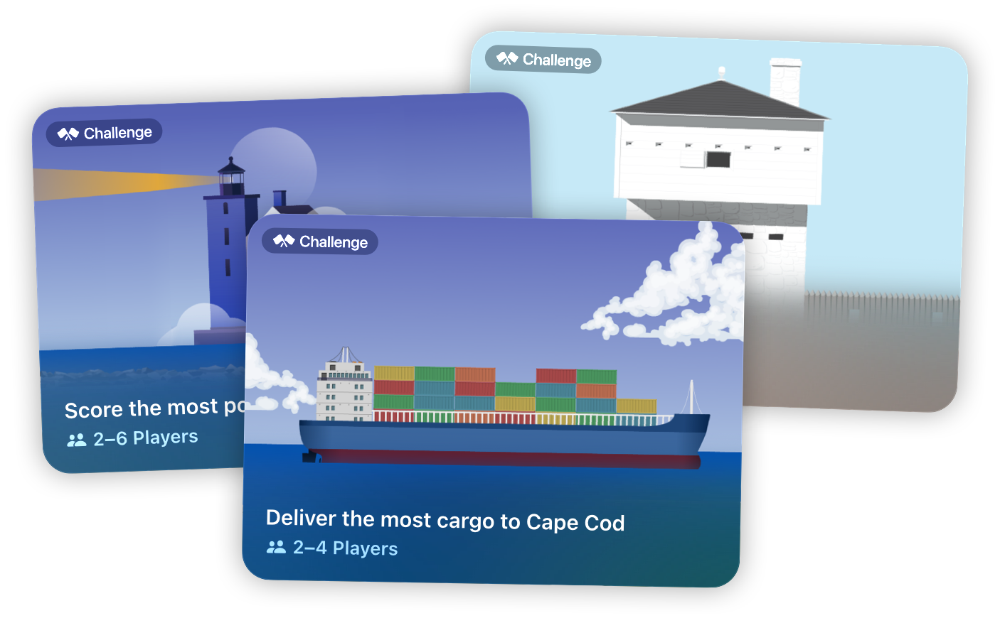
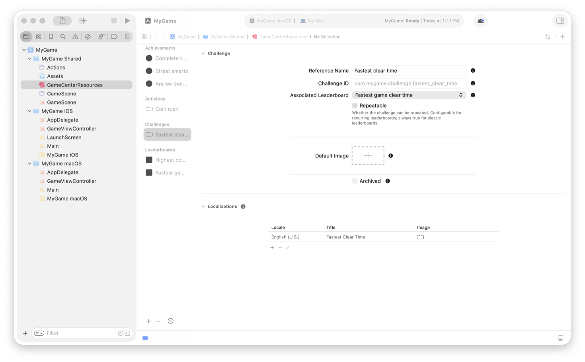

> Navigation: [Technologies](../technologies.md) · [GameKit](../gamekit.md)

# Creating engaging challenges from leaderboards

<sub>Article</sub>

Encourage friendly competition by adding challenges to your game.

## Overview

Challenges encourage your players to invite their friends into your game for friendly competitions in score-based rounds. Players see your challenges promoted throughout the Games app and other places around the OS as suggestions for enjoying their games with friends. They can invite their Game Center friends and anyone from their contacts, see scores appear in real-time, receive notifications at key moments until the game crowns a winner, and have a rematch. GameKit builds challenges on top of leaderboards, turning single-player game activities into a social experience players can share with their friends.



To adopt challenges, you just need an active Game Center leaderboard. When you associate a leaderboard with a challenge, for players participating in the challenge, the system automatically submits the same scores submitted for that leaderboard.

To learn more about the Games app, see [Engage players with the Games app](https://developer.apple.com/wwdc25/215). To learn more about leaderboards that work well for challenges, see [Choosing a leaderboard for your challenges](choosing-a-leaderboard-for-your-challenges.md).

## Configure challenges

Configure challenges in Xcode before accessing them in your code. When you’re ready to deploy your configuration, sync your updates with App Store Connect. For more information about configuring and testing Game Center features, see [Initializing and configuring Game Center](initializing-and-configuring-game-center.md).

When you configure a challenge, you specify details like the leaderboard with which to associate it and whether it’s repeatable. You also configure localization details for the challenge, like the display name.



If you make changes to your game, like adding a new leaderboard or adding a deep link using activities, you can configure a minimum version for a challenge. When you do, the Games app prompts a person to upgrade to the appropriate version of your game to participate in the challenge. For more information, see the “Set challenges minimum version” section in [Manage Challenges](https://developer.apple.com/help/app-store-connect/configure-game-center/manage-challenges).

To learn more about the information you enter in App Store Connect, see [Challenge properties](https://developer.apple.com/help/app-store-connect/reference/challenges).

## Report challenge progress

Players can use the Games app to create challenges and invite their friends to play. After a player creates a challenge, you use the standard reporting methods — [- submitScore:context:player:completionHandler:](<gkleaderboard/submitscore(__context_player_completionhandler_).md>) — for reporting updates to the leaderboard you associate with the challenge. For more information about getting and submitting leaderboard scores, see [Encourage progress and competition with leaderboards](encourage-progress-and-competition-with-leaderboards.md).

If you have a leaderboard that only tracks a player’s personal best or all-time score, you can still use it for a challenge. Submit the most recent score with every attempt, but set the leaderboard’s _Score Submission Type_ to _Best Score_. This setting only displays the player’s best score on the leaderboard, but also allows challenges to count the player’s most recent score submissions during the course of the challenge.

To help players navigate to the correct place when exploring your game, check your challenge definition to apply UI decorations.

```swift
// Check whether a definition has an active challenge.
if try await challengeDefinition.hasActiveChallenges {
    // Show a UI decoration.
}
```

## Get the object that represents the challenge

Use `GameKit` when you want to help facilitate challenge creation through your game. A [GKChallengeDefinition](gkchallengedefinition.md) class contains the static metadata you configure in Xcode or App Store Connect. Use `GKChallengeDefinition.all` to load all of the challenges that you define for a game:

```swift
// Load all challenges for a game.
let challengeDefinitions = try await GKChallengeDefinition.all
let challengeID = “com.example.mygame.challenge.sprint”
let leaderboardID = "com.example.mygame.leaderboard.highscore"

// Find a challenge definition by using an identifier.
let challenge = challengeDefinitions.first(where: { $0.identifier == challengeID })

// Find a leaderboard you associate with a challenge.
let leaderboard = challengeDefinitions.first(where: { $0.leaderboard?.baseLeaderboardID == leaderboardID })
```

## Create a challenge

If you don’t need to create a custom UI for challenge selection, use [- triggerAccessPointForPlayTogetherWithHandler:](<gkaccesspoint/triggerforplaytogether(handler_).md>) to present the default system UI that shows the available challenges for your game. After a player selects a challenge from the list, the view to create a challenge appears.

```swift
// Show the system UI to show a list of available challenges the player selects from.
await GKAccessPoint.shared.triggerForPlayTogether()
```

You can display the available challenges in your UI by fetching all of the challenge definitions. After a player selects the challenge they want to create, call [- triggerAccessPointWithChallengeDefinitionID:handler:](<gkaccesspoint/trigger(challengedefinitionid_handler_).md>) with the challenge identifier. This UI gives the player a familiar experience to create a challenge from. When determining where to present the system UI for a challenge, consider placing entry points at contextually relevant locations in your game.

```swift
// Show the system UI to create a challenge based on the configuration.
await GKAccessPoint.shared.trigger(challengeDefinitionID: challenge.identifier)
```

## Integrate your challenge with activities

When you create an activity, you can associate it with a leaderboard that you use for challenges. When a player receives a challenge notification on their device, the system uses a deep link to help you navigate them into the experience. Use [GKGameActivityListener](gkgameactivitylistener.md) to observe and receive activity events from the system.

When a player chooses to engage with your challenge, the system navigates them directly to it with your help. For example, to configure a daily mini crossword challenge, perform the following steps:

1. Create a recurring leaderboard that restarts daily, specifying a start time and daily duration.
2. Create a game activity with a deep link to the crossword that you associate with the recurring leaderboard.
3. Configure the challenge with the recurring leaderboard and set it as not repeatable.
4. Handle the activity event in your game to navigate the player to the right place when they engage with the challenge.

To learn more about adding activities to your game, and deep-linking to them, see [Creating activities for your game](creating-activities-for-your-game.md)

## Validate your challenge integration

When you submit a score to a challenge leaderboard, it consumes a challenge attempt, so it’s important to handle score submissions with care and perform score submissions at the right moments in your code. When you use the leaderboard APIs, consider the following when validating your integration:

- Submit scores at the end of the gameplay, like after a player finishes a race or scores their highest point value after a limited amount of time.
- Submit the most recent score the player earns at the end of an attempt.
- Submit a score if the player doesn’t beat their best score on the leaderboard.
- Submit a score if a player exits the challenge attempt early or when they close the game.
- For games that use a revive game mechanic, submit a score after a player accepts or declines the revive.
- Rely on your leaderboard configuration to resolve a player’s personal best score instead of submitting their personal best.
- Use leaderboards to track attempts — not real-time scores — instead of submitting scores for each point a player earns.

Make sure to call [- submitScore:context:player:completionHandler:](<gkleaderboard/submitscore(__context_player_completionhandler_).md>) during relevant moments of gameplay instead of when the player starts the game or navigates menus. Game Center handles error recovery and offline score submission, so don’t submit cores during your game’s startup.

When a player wants to engage with a challenge that you associate with an activity:

- Route the player to the correct destination, whether they previously launched the game (warm launch) or after a force quit (cold launch).
- When loading a challenge, avoid interrupting the player with content that’s not relevant to the challenge, like showing a message about an unrelated event.
- If your game involves a tutorial, start the challenge after the player learns more about how to play the game.
- If the challenge content requires additional player progression, provide the player with context on what to do to access the content.

## See Also

### Challenges

- [Choosing a leaderboard for your challenges](choosing-a-leaderboard-for-your-challenges.md) — Understand what gameplay works well when configuring challenges in your game.
- [GKChallengeDefinition](gkchallengedefinition.md) — An object that represents the static metadata you define for the challenge.
- [GKShowChallengeBanners](../bundleresources/information-property-list/gkshowchallengebanners.md) — A Boolean value that indicates whether GameKit can display challenge banners in a game. _(deprecated)_
