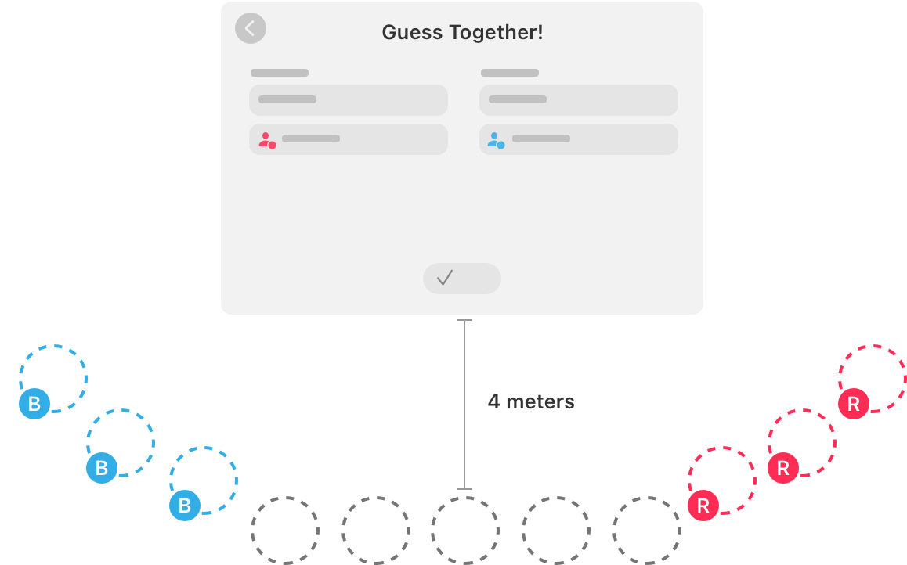
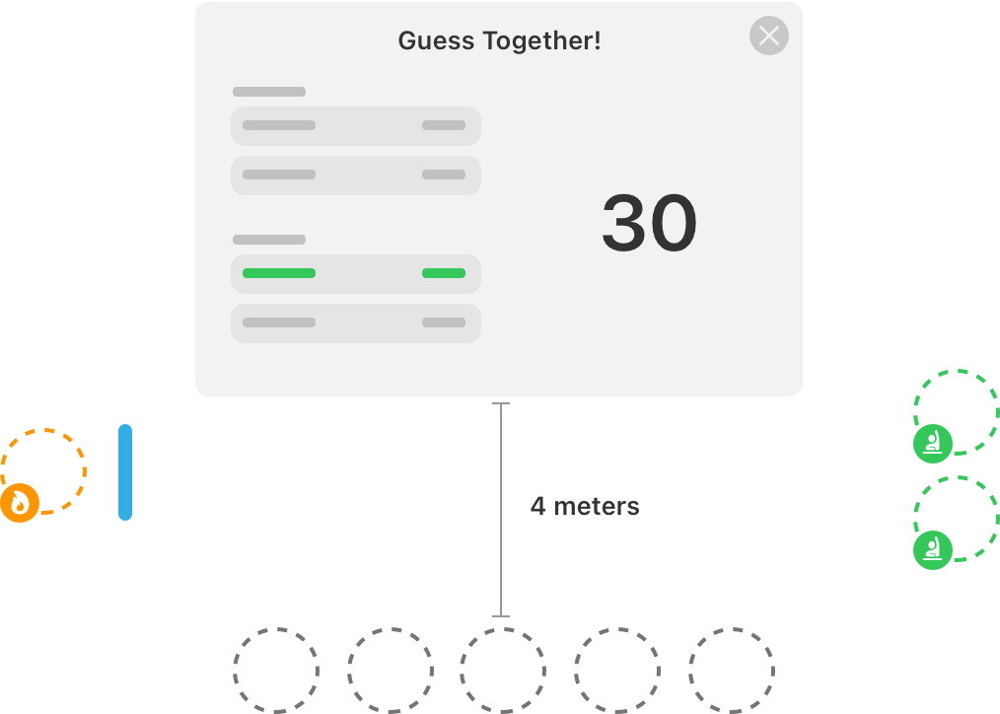

> Navigation: [Technologies](../technologies.md) · [Group Activities](../groupactivities.md)

# Building a guessing game for visionOS

<sub>Sample Code</sub>

Create a team-based guessing game for visionOS using Group Activities.

## Overview

This sample shows how to build a guessing game for two competing teams. Participants, using an Apple Vision Pro during a FaceTime call, can play as members of the red or blue team or watch from the audience. At each stage of the game, the sample positions participants according to their role as a team member or spectator.

After the initial welcome screen for the game, the participants select categories and divide into two teams. During the team-selection process, all participants start in the audience section. If a participant chooses to join a team, they move to the appropriate team area. During the game itself, the teams take turns guessing a word or phrase in a window that only one team member can see. The team member that sees the word or phrase can use any gestures or phrases to elicit a correct guess, but can’t say the word or phrase itself. If the team correctly guesses the word or phrase, the team scores a point. The team with the most points at the end of the game wins.

> [!note] Note
> This sample code project is associated with WWDC24 session [10201: Customize spatial Persona templates in SharePlay](https://developer.apple.com/videos/play/wwdc2024/10201).

> [!note] Note
> SharePlay requires the  [com.apple.developer.group-session](../bundleresources/entitlements/com.apple.developer.group-session.md) entitlement. For instructions on configuring this entitlement, see “Configure the SharePlay entitlements” section of doc:defining-your-apps-shareplay-activities#Configure-the-SharePlay-entitlements.

### Define the group activity

The [GroupActivity](groupactivity.md) protocol provides the system with the context and metadata to start an activity-related session. The sample defines a single `GroupActivity` to represent the game:

```swift
struct GuessTogetherActivity: GroupActivity, Transferable, Sendable {
    var metadata: GroupActivityMetadata = {
        var metadata = GroupActivityMetadata()
        metadata.title = "Guess Together"
        return metadata
    }()
}
```

For more information, see [Defining your app’s SharePlay activities](defining-your-apps-shareplay-activities.md).

### Encourage people to start a game

The welcome screen displays a custom `SharePlayButton`; tapping it starts the game. If the player is already in a FaceTime call, the `GuessTogetherActivity` activates. Otherwise, a [GroupActivitySharingController](groupactivitysharingcontroller-ybcy.md) displays a sheet inviting the player to start the FaceTime call. When a recipient accepts the FaceTime call, the system prompts them to join the `GuessTogetherActivity`:

```swift
struct SharePlayButton<ActivityType: GroupActivity & Transferable & Sendable>: View {
    @ObservedObject
    private var groupStateObserver = GroupStateObserver()
    
    @State
    private var isActivitySharingViewPresented = false
    
    @State
    private var isActivationErrorViewPresented = false
    
    private let activitySharingView: ActivitySharingView<ActivityType>
    
    let text: any StringProtocol
    let activity: ActivityType
    
    init(_ text: any StringProtocol, activity: ActivityType) {
        self.text = text
        self.activity = activity
        self.activitySharingView = ActivitySharingView {
            activity
        }
    }
    
    var body: some View {
        ZStack {
            ShareLink(item: activity, preview: SharePreview(text)).hidden()
            
            Button(text, systemImage: "shareplay") {
                if groupStateObserver.isEligibleForGroupSession {
                    Task.detached {
                        do {
                            _ = try await activity.activate()
                        } catch {
                            print("Error activating activity: \(error)")
                            
                            Task { @MainActor in
                                isActivationErrorViewPresented = true
                            }
                        }
                    }
                } else {
                    isActivitySharingViewPresented = true
                }
            }
            .tint(.green)
            .sheet(isPresented: $isActivitySharingViewPresented) {
                activitySharingView
            }
            .alert("Unable to start game", isPresented: $isActivationErrorViewPresented) {
                Button("Ok", role: .cancel) { }
            } message: {
                Text("Please try again later.")
            }
        }
    }
}

struct ActivitySharingView<ActivityType: GroupActivity & Sendable>: UIViewControllerRepresentable {
    let preparationHandler: () async throws -> ActivityType

    func makeUIViewController(context: Context) -> GroupActivitySharingController {
        GroupActivitySharingController(preparationHandler: preparationHandler)
    }

    func updateUIViewController(_: GroupActivitySharingController, context: Context) {}
}
```

For more information, see [Presenting SharePlay activities from your app’s UI](promoting-shareplay-activities-from-your-apps-ui.md).

### Join and manage the activity

The system creates a [GroupSession](groupsession.md) when a player activates an activity. Players can activate an activity in several ways, at any time. This sample uses an asynchronous task in `MainView` to monitor the creation of new `GroupSession` instances for `GuessTogetherActivity`. This task calls the `observeGroupSessions` method, which receives new sessions and creates a `SessionController` to manage gameplay. A separate task detects when the session ends and cleans up the `SessionController`.

```swift
// MainView

struct MainView: View {
    ...

    var body: some View {
        Group {
            ...
        }
        .task(observeGroupSessions)
    }
    
    /// Monitor for new Guess Together group activity sessions.
    @Sendable
    func observeGroupSessions() async {
        for await session in GuessTogetherActivity.sessions() {
            let sessionController = await SessionController(session, appModel: appModel)
            guard let sessionController else {
                continue
            }
            appModel.sessionController = sessionController

            // Create a task to observe the group session state and clear the
            // session controller when the group session invalidates.
            Task {
                for await state in session.$state.values {
                    guard appModel.sessionController?.session.id == session.id else {
                        return
                    }

                    if case .invalidated = state {
                        appModel.sessionController = nil
                        return
                    }
                }
            }
        }
    }
}
```

For more information, see [Joining and managing a shared activity](joining-and-managing-a-shared-activity.md).

### Synchronize game state by sending and receiving messages

When a player’s action changes the game state, `SessionController` uses [GroupSessionMessenger](groupsessionmessenger.md) to send an update to the other players. For example, when player X joins the red team, `TeamSelectionView` calls `SessionController.joinTeam`. This sets `SessionController.localPlayer.team`, sending a call to `SessionController.shareLocalPlayerState`.

```swift
// SessionController

func joinTeam(_ team: PlayerModel.Team?) {
    localPlayer.team = team
}

...

var localPlayer: PlayerModel {
    get {
        players[session.localParticipant]!
    }
    set {
        if newValue != players[session.localParticipant] {
            players[session.localParticipant] = newValue
            shareLocalPlayerState(newValue)
        }
    }
}
```

`SessionController.shareLocalPlayerState` uses `GroupSessionMessenger` to send player X’s new state to other players.

```swift
// SessionController+RemoteParticipantSynchronization

func shareLocalPlayerState(_ newValue: PlayerModel) {
    Task {
        do {
            try await messenger.send(newValue)
        } catch {
            // Failed to send the message.
        }
    }
}
```

At the same time, `SessionController.observeRemotePlayerModelUpdates` receives and processes player state updates. Each update modifies `SessionController.players` to reflect the synchronized player state. For example, when player X joins the red team, other players are notified and update their local representation of player X’s state accordingly.

```swift
// SessionController

...

private func observeRemotePlayerModelUpdates() {
    Task {
        for await (player, context) in messenger.messages(of: PlayerModel.self) {
            players[context.source] = player
        }
    }
}
```

For more information, see [Synchronizing data during a SharePlay activity](synchronizing-data-during-a-shareplay-activity.md).

### Enable spatial personas in an immersive space

To display spatial Personas when an immersive space is open, set the [supportsGroupImmersiveSpace](systemcoordinator/configuration-swift.struct/supportsgroupimmersivespace.md) property on [SystemCoordinator.Configuration](systemcoordinator/configuration-swift.struct.md) to `true`:

```swift
// SessionController

func configureSystemCoordinator() {
    systemCoordinator.configuration.supportsGroupImmersiveSpace = true
    
    ...
}
```

In an immersive space, the system provides a shared coordinate system for participants and content. This allows you to position entities consistently across all participants’ perspectives. For example, an entity positioned 0.5 meters in front of player X appears 0.5 meters in front of player X from player Y’s perspective.

For more information, see [Adding spatial Persona support to an activity](adding-spatial-persona-support-to-an-activity.md).

### Specify custom positions for participants

The game has three distinct stages:

- Category-selection stage, where players choose the words and phrases they want to try to elicit from their teammates.
- Team-selection stage, where players join one of the teams.
- Game stage, where the teams take turns playing the game.

Each time the current stage changes, the `SessionController` object updates the position of the participants in the space. When selecting a category, the participants appear side by side in front of the game window. During team selection and gameplay, the game arranges players using custom spatial templates. The game specifies each arrangement of participants by changing the configuration of the [SystemCoordinator](systemcoordinator.md) object.

```swift
// SessionController

func updateSpatialTemplatePreference() {
    switch game.stage {
    case .categorySelection:
        systemCoordinator.configuration.spatialTemplatePreference = .sideBySide
    case .teamSelection:
        systemCoordinator.configuration.spatialTemplatePreference = .custom(TeamSelectionTemplate())
    case .inGame:
        systemCoordinator.configuration.spatialTemplatePreference = .custom(GameTemplate())
    }
}
```

When the game moves to the team-selection stage, the session rearranges the participants according to which team they choose. All participants start in the audience initially facing the app window, which displays buttons to join either the red team or blue team.



<sub>An illustration of the arrangement of participants during the team selection process. Participants start facing the screen. When they select a team, they move to the side of the screen associated with their chosen team.</sub>

The `TeamSelectionTemplate` specifies the positions of seats during the team-selection process. Participants don’t have an assigned role initially, so the system places them in the audience seats. As participants join a team, the system moves them to the assigned seating area for their chosen team.

The spatial template specifies all seat positions up front, including seats for the blue and red teams, and the audience. Seat positions reflect the distance in meters from the app’s main window along the x and z axes. Seat roles reflect the role that a participant must have to occupy that seat. When a participant asks to join a team, the sample app assigns them the corresponding role. If a seat with that role is available, the participant receives the role and their spatial Persona moves to the next available seat.

```swift
struct TeamSelectionTemplate: SpatialTemplate {
    enum Role: String, SpatialTemplateRole {
        case blueTeam
        case redTeam
    }
    
    /// An array of seating positions the game uses to position spatial Personas during the team-selection stage.
    ///
    /// The game fills the seats with participants based on the order of the array's elements.
    let elements: [any SpatialTemplateElement] = [
        // Blue team:
        .seat(position: .app.offsetBy(x: -2.5, z: 3.5), role: Role.blueTeam),
        .seat(position: .app.offsetBy(x: -3.0, z: 3.0), role: Role.blueTeam),
        .seat(position: .app.offsetBy(x: -3.5, z: 2.5), role: Role.blueTeam),
        
        // Starting positions:
        .seat(position: .app.offsetBy(x: 0, z: 4)),
        .seat(position: .app.offsetBy(x: 1, z: 4)),
        .seat(position: .app.offsetBy(x: -1, z: 4)),
        .seat(position: .app.offsetBy(x: 2, z: 4)),
        .seat(position: .app.offsetBy(x: -2, z: 4)),
        
        // Red team:
        .seat(position: .app.offsetBy(x: 2.5, z: 3.5), role: Role.redTeam),
        .seat(position: .app.offsetBy(x: 3.0, z: 3.0), role: Role.redTeam),
        .seat(position: .app.offsetBy(x: 3.5, z: 2.5), role: Role.redTeam)
    ]
}
```

During gameplay, teams take turns playing the game while the audience watches. Audience members face the main window while the active team sits on either side of that window. The team member giving clues sits on one side of the window, while their teammates sit opposite. The template orients the active team members so that they face each other at the start of the game, with audience members facing the main window.



<sub>An illustration of the arrangement of participants during the game. The active team members sit on opposite sides of the app’s window, while the rest of the players sit in the audience facing the window.</sub>

The `GameTemplate` structure defines separate roles for the current player and the active team members. Members of the opposing team don’t receive a role until it’s their turn to play, so they initially sit in the audience positions. Because the active team members face each other, and not the app window, their seat positions include a `direction` parameter to specify where they look initially.

```swift
struct GameTemplate: SpatialTemplate {
    enum Role: String, SpatialTemplateRole {
        case player
        case activeTeam
    }
    
    static let playerPosition = Point3D(x: -2, z: 3)
    
    /// An array that represents the order in which the game adds participants to spatial template positions.
    var elements: [any SpatialTemplateElement] {
        let activeTeamCenterPosition = SpatialTemplateElementPosition.app.offsetBy(x: 2, z: 3)

        let playerSeat = SpatialTemplateSeatElement(
            position: .app.offsetBy(x: Self.playerPosition.x, z: Self.playerPosition.z),
            direction: .lookingAt(activeTeamCenterPosition),
            role: Role.player
        )
        
        let activeTeamSeats: [any SpatialTemplateElement] = [
            .seat(
                position: activeTeamCenterPosition.offsetBy(x: 0, z: -0.5),
                direction: .lookingAt(playerSeat),
                role: Role.activeTeam
            ),
            .seat(
                position: activeTeamCenterPosition.offsetBy(x: 0, z: 0.5),
                direction: .lookingAt(playerSeat),
                role: Role.activeTeam
            )
        ]
        
        let audienceSeats: [any SpatialTemplateElement] = [
            .seat(position: .app.offsetBy(x: 0, z: 5)),
            .seat(position: .app.offsetBy(x: 1, z: 5)),
            .seat(position: .app.offsetBy(x: -1, z: 5)),
            .seat(position: .app.offsetBy(x: 2, z: 5)),
            .seat(position: .app.offsetBy(x: -2, z: 5))
        ]
        
        return audienceSeats + [playerSeat] + activeTeamSeats
    }
}
```

For more information about building custom spatial templates, see [SpatialTemplate](spatialtemplate.md).

## See Also

### Custom spatial templates

- [SpatialTemplate](spatialtemplate.md) — An interface you use to create custom arrangements of spatial Personas in a scene.
- [SpatialTemplatePreference](spatialtemplatepreference.md) — A structure that specifies the preferred arrangement of participant spatial Personas in a shared simulation space.
- [SpatialTemplateSeatElement](spatialtemplateseatelement.md) — A spatial template element that represents a seat for a participant in the activity.
- [SpatialTemplateElement](spatialtemplateelement.md) — An interface that defines an element in your spatial template.
- [SpatialTemplateElementPosition](spatialtemplateelementposition.md) — A type that defines the position of an element in a spatial template.
- [SpatialTemplateElementDirection](spatialtemplateelementdirection.md) — The initial direction a participant faces when an activity starts.
- [SpatialTemplateRole](spatialtemplaterole.md) — An interface for defining roles that you assign to the participants of a group activity.

## Download

- [BuildingAGuessingGameForVisionOS.zip](https://docs-assets.developer.apple.com/published/8baa890170f0/BuildingAGuessingGameForVisionOS.zip)
