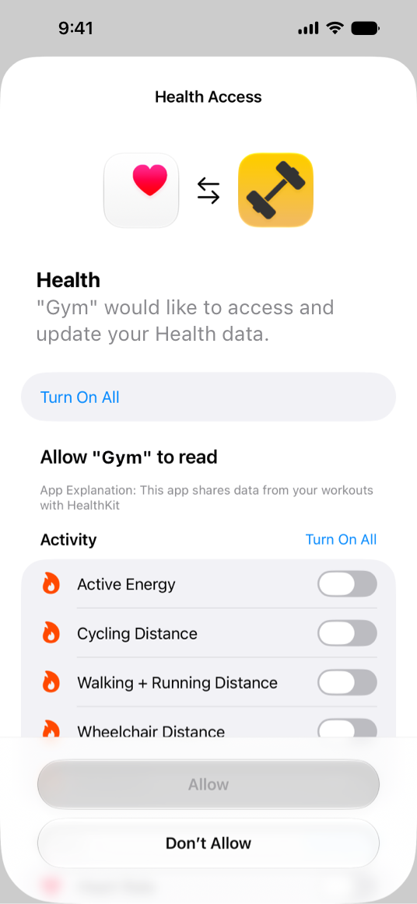
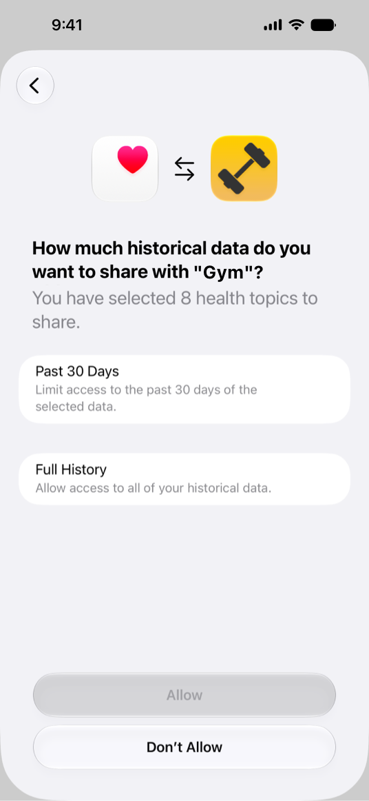

> Navigation: [Technologies](../technologies.md) · [HealthKit](../healthkit.md)

# Authorizing access to health data

<sub>Article</sub>

Request permission to read and share data in your app.

## Overview

To help protect people’s privacy, HealthKit requires fine-grain authorization. You need to request permission to both read and share each data type before your app attempts to use the data. However, you don’t need to request permission for all data types at once. Instead, it might make more sense to wait until you need to access the data before asking for permission.

As part of the privacy protections, your app doesn’t know whether someone granted or denied permission to read data from HealthKit. If they denied permission, attempts to read data from HealthKit return only samples that your app successfully saved to the HealthKit store. In addition, people can choose to grant your app access to only a limited window of recent data rather than their full history. When someone grants limited access, you can discover the earliest date from which your app is authorized to read data for a given type, but you can’t distinguish between full access and denied access for specific types; both appear the same to your app.

Additionally, to protect the privacy of Apple Vision Pro owner data, in a Guest User session, the guest can view previously authorized data, but can’t access unauthorized data or change the authorizations.

> [!important] Important
> In iOS 17.2 and later, the Journal app encourages people to reflect on their day-to-day experiences, including physical accomplishments, workouts, emotions, and moods. If your app saves data to HealthKit, high-level summaries of that data can appear as suggestions in the Journal app, or in other apps that use the [Journaling Suggestions](../journalingsuggestions.md) framework.

Requesting permission to read and share data is only one part of protecting personal privacy. For more information, see [Protecting user privacy](protecting-user-privacy.md).

## Enable HealthKit

Before you can request authorization to read or save HealthKit data, you need to add the HealthKit capability to your app. You also need to provide custom messages for the Health permissions sheet.

Xcode requires separate custom messages for reading and writing HealthKit data. Set the [NSHealthShareUsageDescription](../bundleresources/information-property-list/nshealthshareusagedescription.md) key to customize the message for reading data and the [NSHealthUpdateUsageDescription](../bundleresources/information-property-list/nshealthupdateusagedescription.md) key to customize the message for writing data.

For projects created using Xcode 13 or later, set these keys in the Target Properties list on the app’s Info tab. For projects created with Xcode 12 or earlier, set these keys in the app’s information property list. For more information, see [Information Property List](../bundleresources/information-property-list.md).

Finally, check that Health data is available on the current device by calling [+ isHealthDataAvailable](<hkhealthstore/ishealthdataavailable().md>) before calling any other HealthKit methods. For more information, see [Setting up HealthKit](setting-up-healthkit.md).

## Request permission

To request permission to read or write data, start by creating the HealthKit data types that you want to read or write. The following example creates data types for active energy burned, distance cycling, distance walking or running, distance in a wheelchair, and heart rate:

```swift
// Create the HealthKit data types your app
// needs to read and write.
let allTypes: Set = [
    HKQuantityType.workoutType(),
    HKQuantityType(.activeEnergyBurned),
    HKQuantityType(.distanceCycling),
    HKQuantityType(.distanceWalkingRunning),
    HKQuantityType(.distanceWheelchair),
    HKQuantityType(.heartRate)
]
```

Next, you can request read or write access to that data. To request access from the HealthKit store, call [requestAuthorization(toShare:read:)](<hkhealthstore/requestauthorization(toshare_read_).md>), as shown here:

```swift
do {
    // Check that Health data is available on the device.
    if HKHealthStore.isHealthDataAvailable() {
        
        // Asynchronously request authorization to the data.
        try await healthStore.requestAuthorization(toShare: allTypes, read: allTypes)
    }
} catch {    
    // Typically, authorization requests only fail if you haven't set the
    // usage and share descriptions in your app's information property list, 
    // or if Health data isn't available on the current device.
    fatalError("*** An unexpected error occurred while requesting authorization: \(error.localizedDescription) ***")
}
```

To request access from SwiftUI, use the [healthDataAccessRequest(store:shareTypes:readTypes:trigger:completion:)](<../swiftui/view/healthdataaccessrequest(store_sharetypes_readtypes_trigger_completion_).md>) modifier, like this:

```swift
import SwiftUI
import HealthKitUI

struct MyView: View {
    @State var accessRequested = false
    @State var trigger = false

    var body: some View {
        Button("Access health data") {
            // OK to read or write HealthKit data here.
        }
        .disabled(!accessRequested)
        
        // If HealthKit data is available, request authorization
        // when this view appears.
        .onAppear() {
            
            // Check that Health data is available on the device.
            if HKHealthStore.isHealthDataAvailable() {
                // Modifying the trigger initiates the health data
                // access request.
                trigger.toggle()
            }
        }
        
        // Requests access to share and read HealthKit data types
        // when the trigger changes.
        .healthDataAccessRequest(store: healthStore,
                                 shareTypes: allTypes,
                                 readTypes: allTypes,
                                 trigger: trigger) { result in
            switch result {
                
            case .success(_):
                accessRequested = true
            case .failure(let error):
                // Handle the error here.
                fatalError("*** An error occurred while requesting authentication: \(error) ***")
            }
        }
    }
}
```

> [!important] Important
> The [healthDataAccessRequest(store:shareTypes:readTypes:trigger:completion:)](<../swiftui/view/healthdataaccessrequest(store_sharetypes_readtypes_trigger_completion_).md>) modifier is only available if you import both SwiftUI and HealthKitUI.

When your app requests permission, the system displays an authorization sheet. HealthKit organizes data types into categories, such as Activity, Heart, and Nutrition, for easy access management by group. People can also toggle individual read and share permissions within each category.



> [!tip] Tip
> For guidance on best practices when requesting permission, see [Human Interface Guidelines \> HealthKit \> Privacy protection](https://developer.apple.com/design/human-interface-guidelines/healthkit#Privacy-protection).

After people review data type access, a second screen prompts them to choose how much historical data to grant your app, either a recent limited window or their full history.



> [!important] Important
> A person can change the permissions for your app at any time using either the Settings or Health app. After prompting for HealthKit authorization, your app appears in the Health app’s Sources tab, even if the person didn’t allow permission to read and share data.

## Respond to limited authorization

When someone grants your app access to only a recent window of data rather than their full history, your app is in a limited authorization state for those data types. Time-bound authorization applies only to sample types.

To determine whether the person restricts your app’s read access to a time window, call [- getEarliestAuthorizedSampleDateForTypes:completion:](<hkhealthstore/getearliestauthorizedsampledate(for_completion_).md>) after requesting authorization. HealthKit intentionally prevents your app from distinguishing between full access and denied access to specific types; both cases return no entry in the result dictionary. Limited authorization is the only authorization state your app can positively identify.

Avoid interpreting the absence of older samples as evidence they don’t exist; the person’s history may extend before the date the method returns. To request only the data the person allows, pass the provided `startDate` into your data-store query, like this:

```swift
let types: Set<HKObjectType> = [HKQuantityType(.stepCount)]
let authorizationDates = try await store.earliestAuthorizedSampleDate(for: types)

let queryStartDate = authorizationDates[HKQuantityType(.stepCount)] ?? .distantPast

let predicate = HKQuery.predicateForSamples(
    withStart: queryStartDate,
    end: .now,
    options: .strictStartDate
)
```

> [!tip] Tip
> If your app makes inferences on partial data, consider informing people that granting full access improves your app’s experience.

## Check for authorization before saving data

If someone grants permission to share a data type, you can create new samples of that type and save them to the HealthKit store. However, before attempting to save any data, check whether your app is authorized to share that data type by calling the [- authorizationStatusForType:](<hkhealthstore/authorizationstatus(for_).md>) method. If you haven’t yet requested permission, any attempts to save fail with an [HKErrorAuthorizationNotDetermined](hkerror/code/errorauthorizationnotdetermined.md) error. If they’ve denied permission, attempts to save fail with an [HKErrorAuthorizationDenied](hkerror/code/errorauthorizationdenied.md) error.

## Support Guest User sessions on Vision Pro

To protect their privacy, people can put their Vision Pro in a Guest User session before sharing it. This session lets the owner control which apps the guest can use and what data they can see. For more information, refer to [Let another person use your Apple Vision Pro with Guest User](https://support.apple.com/en-us/117742).

A Guest User session has the following effects on HealthKit:

- If the owner already authorized access to the data, the guest can read that data from the HealthKit store.
- The guest can’t authorize any additional data types.
- The system obscures Health data in the Privacy and Security and Health Data panels in Settings.
- Any attempts to save data or otherwise mutate data in the HealthKit store fails with an [HKErrorNotPermissibleForGuestUserMode](hkerror/code/errornotpermissibleforguestusermode.md) error (or [HKErrorHealthDataRestricted](hkerror/code/errorhealthdatarestricted.md) on apps running in iOS 17).

> [!important] Important
> An app’s permissions don’t change when an app runs in a Guest User session. Therefore, [- authorizationStatusForType:](<hkhealthstore/authorizationstatus(for_).md>) returns [true](../swift/true.md) if the owner previously granted authorization to write the data, even though the app can’t write it during a Guest User session.

The system doesn’t display the authorization sheet during a Guest User session, so any attempt to request authorization for HealthKit data types during a Guest User session fails silently.

If your app receives an [HKErrorNotPermissibleForGuestUserMode](hkerror/code/errornotpermissibleforguestusermode.md) error, you can silently ignore the error for passive or periodic saves. Silently dropping the changes ensures that they don’t persist past the Guest User session without interrupting the guest’s experience. However, if the guest performs an action that can obviously result in saving data (for example, tapping a Save button), you can display an alert telling them that the action isn’t available during a Guest User session.

## Specify required clinical record types

If your app requires access to specific clinical record data to function properly, specify the required clinical record types in your app’s information property list using the [NSHealthRequiredReadAuthorizationTypeIdentifiers](../bundleresources/information-property-list/nshealthrequiredreadauthorizationtypeidentifiers.md) key. This key defines the data types that your app needs to have permission to read. Set the value to an array of strings containing the type identifiers for your required types. For a list of type identifiers, see [HKClinicalTypeIdentifier](hkclinicaltypeidentifier.md).

To protect personal privacy, specify three or more required clinical record types. If a person denies authorization to any of the types, authorization fails with an [HKErrorRequiredAuthorizationDenied](hkerror/code/errorrequiredauthorizationdenied.md) error; the system doesn’t tell your app which record types the person denied access to.

## See Also

### Essentials

- [About the HealthKit framework](about-the-healthkit-framework.md) — Learn about the architecture and design of the HealthKit framework.
- [Setting up HealthKit](setting-up-healthkit.md) — Set up and configure your HealthKit store.
- [Protecting user privacy](protecting-user-privacy.md) — Respect and safeguard your user’s privacy.
- [HealthKit updates](../updates/healthkit.md) — Learn about important changes to HealthKit.
- [HealthKitUI](../healthkitui.md) — Display user interface that enables a person to view and interact with their health data.
