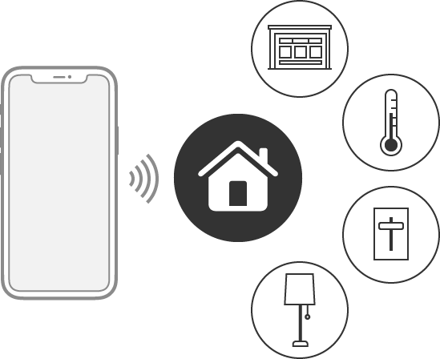

> Navigation: [Technologies](technologies.md)

# HomeKit

Framework

Configure, control, and communicate with home automation accessories.

## Overview

HomeKit enables your app to coordinate and control home automation accessories from multiple vendors to present a coherent, user-focused interface.

The diagram depicts a stylized phone emitting waves to indicate communication with a house pictured as a central icon. Four icons are arranged in a semi-circle to the right of the house icon, depicting connected accessories including a garage door, a thermometer, a sliding light switch, and a lamp.

Using HomeKit, your app can:

- Discover HomeKit-compatible automation accessories and add them to a persistent, cross-device home configuration database.
- Display, edit, and act upon the data in the home configuration database.
- Communicate with configured accessories and services in order to perform actions like turning on the lights in the living room.

## Topics

### Essentials

- [Enabling HomeKit in your app](homekit/enabling-homekit-in-your-app.md) — Declare your app’s intention to use HomeKit, and get permission from the user to access home automation accessories.
- [HomeKit Entitlement](bundleresources/entitlements/com.apple.developer.homekit.md) — A Boolean value that indicates whether users of the app may manage HomeKit-compatible accessories.
- [NSHomeKitUsageDescription](bundleresources/information-property-list/nshomekitusagedescription.md) — A message that tells people why the app is requesting access to their HomeKit configuration data.

### Home Manager

- [Configuring a home automation device](homekit/configuring-a-home-automation-device.md) — Give users a familiar experience when they manage HomeKit accessories.
- [Testing your app with the HomeKit Accessory Simulator](homekit/testing-your-app-with-the-homekit-accessory-simulator.md) — Install the HomeKit Accessory Simulator to help you debug your HomeKit-enabled app.
- [HMHomeManager](homekit/hmhomemanager.md) — The manager for a collection of one or more of a user’s homes.

### Accessories

- [HMAccessorySetupManager](homekit/hmaccessorysetupmanager.md) — An object that setups up new accessories.
- [HMAccessorySetupResult](homekit/hmaccessorysetupresult.md) — A result object describing information about a successful accessory setup request.
- [HMAccessorySetupRequest](homekit/hmaccessorysetuprequest.md) — An object that describes how to add and setup up new accessories.
- [Interacting with a home automation network](homekit/interacting-with-a-home-automation-network.md) — Find all the automation accessories in the primary home and control their state.
- [HMAccessory](homekit/hmaccessory.md) — A home automation accessory, like a garage door opener or a thermostat.
- [HMService](homekit/hmservice.md) — A controllable feature of an accessory, like a light attached to a garage door opener.
- [HMCharacteristic](homekit/hmcharacteristic.md) — A specific characteristic of a service, like the brightness of a dimmable light or its color temperature.
- [HMMediaSourceDisplayOrderProfile](homekit/hmmediasourcedisplayorderprofile.md) — An interface from which to read and, if allowed by the accessory, update the ordering of input sources.

### Action Sets

- [HMActionSet](homekit/hmactionset.md) — A collection of actions that you trigger as a group.
- [HMTimerTrigger](homekit/hmtimertrigger.md) — A trigger to activate an action set based on a periodic timer.
- [HMEventTrigger](homekit/hmeventtrigger.md) — A trigger to activate an action set based on a set of events and optional conditions.

### Errors

- [HMError](homekit/hmerror.md) — An error HomeKit returns.
- [HMErrorDomain](homekit/hmerrordomain.md) — A string that identifies the HomeKit error domain.
- [Code](homekit/hmerror/code.md) — Possible error values that can be returned from HomeKit APIs.
- [HMErrorBlock](homekit/hmerrorblock.md) — A completion block that provides an error.

### Classes

- [HMAccessorySetupPayload](homekit/hmaccessorysetuppayload.md) — A payload for authenticating a HomeKit accessory.
