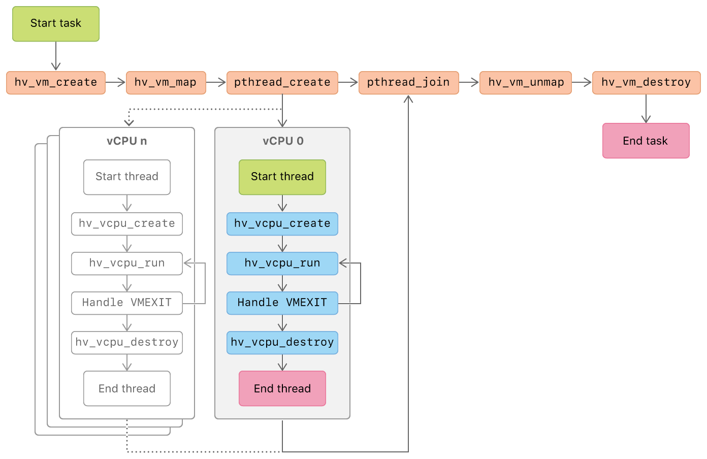

> Navigation: [Technologies](technologies.md)

# Hypervisor

Framework

Build virtualization solutions on top of a lightweight hypervisor, without third-party kernel extensions.

## Overview

Hypervisor provides C APIs so you can interact with virtualization technologies in user space, without writing kernel extensions (KEXTs). As a result, the apps you create using this framework are suitable for distribution on the [Mac App Store](https://www.appstore.com/).

Use this framework to create and control hardware-facilitated virtual machines and virtual processors (VMs and vCPUs) from your entitled, sandboxed, user-space process. Hypervisor abstracts virtual machines as processes, and virtual processors as threads.

### Requirements

The Hypervisor framework has the following requirements:

- **Supported hardware** — The Hypervisor framework requires hardware support to virtualize hardware resources. On Apple silicon, that includes the Virtualization Extensions. On Intel-based Mac computers, the framework supports machines with an Intel VT-x feature set that includes Extended Page Tables (EPT) and Unrestricted Mode.

At runtime, determine whether the Hypervisor APIs are available on a particular machine with the sysctl command, passing `kern.hv_support` as an argument.

- **Entitlements** — All process must have the [com.apple.security.hypervisor](bundleresources/entitlements/com.apple.security.hypervisor.md) entitlement to use Hypervisor API.

### Virtual Resource Mapping

A guest is an operating system that runs on top of the virtual hardware. The operating system and processes that run the virtualized hardware are together called the host. Virtual hardware in the guest maps to specific resources on the host.

Each virtual machine corresponds to a process on the host. There can only be one virtual machine at a time per process; the virtual machine creates it with [hv_vm_create](<hypervisor/hv_vm_create(__).md>).

Virtual CPUs (vCPUs) in a virtual machine map to POSIX threads. Create a new vCPU for the current thread with [hv_vcpu_create](<hypervisor/hv_vcpu_create(______).md>). The vCPU runs when the thread calls [hv_vcpu_run](<hypervisor/hv_vcpu_run(__).md>).

Hypervisor maps the physical memory in the guest to virtual memory of the host process. Create a new memory mapping with [hv_vm_map](<hypervisor/hv_vm_map(________).md>). Access to memory outside the mapped range causes [hv_vcpu_run](<hypervisor/hv_vcpu_run(__).md>) to exit. Emulate memory-mapped hardware by emulating the memory access on exit and re-enter the guest with [hv_vcpu_run](<hypervisor/hv_vcpu_run(__).md>).

### Example VM Life Cycle

The following figure illustrates a simplified life cycle of creating and running a virtual machine with one or more virtual CPUs using the Hypervisor API.

At the start of a task:

- Create a VM with [hv_vm_create](<hypervisor/hv_vm_create(__).md>).
- Map a region in the virtual address space of the current task into the guest physical address space of the VM with [hv_vm_map](<hypervisor/hv_vm_map(________).md>).
- Create one or more POSIX threads with `pthread_create(_:_:_:_:)`.

In each thread:

- Create a virtual CPU with [hv_vcpu_create](<hypervisor/hv_vcpu_create(______).md>).
- Call [hv_vcpu_run](<hypervisor/hv_vcpu_run(__).md>) to run the vCPU.

When a thread receives an exit event:

- Handle the event.
- Re-enter the guest with [hv_vcpu_run](<hypervisor/hv_vcpu_run(__).md>) or destroy the vCPU with [hv_vcpu_destroy](<hypervisor/hv_vcpu_destroy(__).md>).

After all threads finish:

- Unmap the memory region with [hv_vm_unmap](<hypervisor/hv_vm_unmap(____).md>).
- Destroy the VM with [hv_vm_destroy](<hypervisor/hv_vm_destroy().md>).

## Topics

### Platforms

- [Apple Silicon](hypervisor/apple-silicon.md) — Create and run virtual machines on Apple silicon.
- [Intel-based Mac](hypervisor/intel-based-mac.md) — Create and run virtual machines on Intel-based Mac computers.

### Entitlements

- [com.apple.security.hypervisor](bundleresources/entitlements/com.apple.security.hypervisor.md) — A Boolean value that indicates whether the app creates and manages virtual machines.
- [com.apple.vm.hypervisor](bundleresources/entitlements/com.apple.vm.hypervisor.md) — A Boolean value that indicates whether the app creates and manages virtual machines. _(deprecated)_
- [com.apple.vm.networking](bundleresources/entitlements/com.apple.vm.networking.md) — A Boolean that indicates whether the app manages virtual network interfaces without escalating privileges to the root user.
- [com.apple.vm.device-access](bundleresources/entitlements/com.apple.vm.device-access.md) — A Boolean value that indicates whether the app captures USB devices and uses them in the guest-operating system.

### Reference

- [Hypervisor Structures](hypervisor/hypervisor-structures.md)
- [Hypervisor Constants](hypervisor/hypervisor-constants.md)
- [Hypervisor Functions](hypervisor/hypervisor-functions.md)
- [Hypervisor Data Types](hypervisor/hypervisor-data-types.md)

### Structures

- [hv_ipa_granule_t](hypervisor/hv_ipa_granule_t.md)
- [hv_tlbi_op_t](hypervisor/hv_tlbi_op_t.md) _(beta)_

### Variables

- [HV_FEATURE_REG_ID_AA64ISAR2_EL1](hypervisor/hv_feature_reg_id_aa64isar2_el1.md) _(beta)_
- [HV_FEATURE_REG_ID_AA64MMFR3_EL1](hypervisor/hv_feature_reg_id_aa64mmfr3_el1.md) _(beta)_
- [HV_FEATURE_REG_ID_AA64MMFR4_EL1](hypervisor/hv_feature_reg_id_aa64mmfr4_el1.md) _(beta)_
- [HV_FEATURE_REG_ID_AA64PFR2_EL1](hypervisor/hv_feature_reg_id_aa64pfr2_el1.md) _(beta)_
- [HV_IPA_GRANULE_16KB](hypervisor/hv_ipa_granule_16kb.md)
- [HV_IPA_GRANULE_4KB](hypervisor/hv_ipa_granule_4kb.md)
- [HV_SYS_REG_ID_AA64ISAR2_EL1](hypervisor/hv_sys_reg_id_aa64isar2_el1.md) _(beta)_
- [HV_SYS_REG_ID_AA64MMFR3_EL1](hypervisor/hv_sys_reg_id_aa64mmfr3_el1.md) _(beta)_
- [HV_SYS_REG_ID_AA64MMFR4_EL1](hypervisor/hv_sys_reg_id_aa64mmfr4_el1.md) _(beta)_
- [HV_SYS_REG_ID_AA64PFR2_EL1](hypervisor/hv_sys_reg_id_aa64pfr2_el1.md) _(beta)_
- [HV_TLBI_OP_ASIDE1IS](hypervisor/hv_tlbi_op_aside1is.md)
- [HV_TLBI_OP_RVAAE1IS](hypervisor/hv_tlbi_op_rvaae1is.md)
- [HV_TLBI_OP_RVAALE1IS](hypervisor/hv_tlbi_op_rvaale1is.md)
- [HV_TLBI_OP_RVAE1IS](hypervisor/hv_tlbi_op_rvae1is.md)
- [HV_TLBI_OP_RVALE1IS](hypervisor/hv_tlbi_op_rvale1is.md)
- [HV_TLBI_OP_VAAE1IS](hypervisor/hv_tlbi_op_vaae1is.md)
- [HV_TLBI_OP_VAALE1IS](hypervisor/hv_tlbi_op_vaale1is.md)
- [HV_TLBI_OP_VAE1IS](hypervisor/hv_tlbi_op_vae1is.md)
- [HV_TLBI_OP_VALE1IS](hypervisor/hv_tlbi_op_vale1is.md)
- [HV_TLBI_OP_VMALLE1IS](hypervisor/hv_tlbi_op_vmalle1is.md)

### Functions

- [hv_vcpu_get_serror](<hypervisor/hv_vcpu_get_serror(____).md>) _(beta)_
- [hv_vcpu_get_wait_for_interrupt_time](<hypervisor/hv_vcpu_get_wait_for_interrupt_time(____).md>) _(beta)_
- [hv_vcpu_invalidate_tlb](<hypervisor/hv_vcpu_invalidate_tlb(______).md>) _(beta)_
- [hv_vcpu_set_serror](<hypervisor/hv_vcpu_set_serror(____).md>) _(beta)_
- [hv_vm_config_get_default_ipa_granule](<hypervisor/hv_vm_config_get_default_ipa_granule(__).md>)
- [hv_vm_config_get_ipa_granule](<hypervisor/hv_vm_config_get_ipa_granule(____).md>)
- [hv_vm_config_set_ipa_granule](<hypervisor/hv_vm_config_set_ipa_granule(____).md>)
