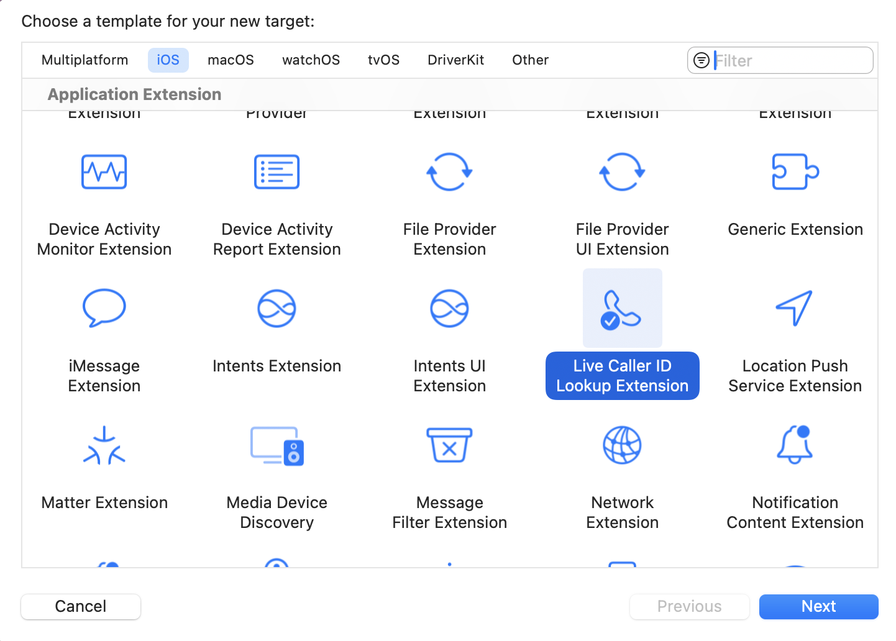

> Navigation: [Technologies](../technologies.md) · [SMS and Call Reporting](../identitylookup.md)

# Getting up-to-date calling and blocking information for your app

<sub>Article</sub>

Implement the Live Caller ID Lookup app extension to provide call-blocking and identity services.

## Overview

With the Live Caller ID Lookup app extension, you can provide caller ID and call-blocking services from a server you maintain. The app extension tells the system how to communicate with your server. When someone’s device receives a phone call, the system communicates with your back-end server to retrieve caller ID and blocking information, and then displays that information on the incoming call screen and in the device’s recent phone calls.

> [!note] Note
> The Live Caller ID Lookup app extension requires you to use Apple relay servers to support making calls to your server endpoints. This requires endpoint validation from Apple. If you’re interested in using the app extension, [submit your request](https://icloud.developer.apple.com/dashboard/identity). For more information on the server side API, see the [Live Caller ID Lookup example](https://github.com/apple/live-caller-id-lookup-example) and the [Swift homomorphic encryption library](https://github.com/apple/swift-homomorphic-encryption).

### Add the app extension to your project

To use the Live Caller ID Lookup app extension, you need to add it to your Xcode project by choosing File \> New \> Target, selecting its template, and clicking Next.



When you add this target to your project, it provides the initial files you need for your app extension.

### Specify your server information

After adding the app extension, the system needs configuration data to connect to your server and authenticate the person using your app. The app extension’s entrypoint is an object that adopts the [LiveCallerIDLookupProtocol](livecalleridlookupprotocol.md). This defines a context parameter where you provide information for the system about your server and access tokens. The [LiveCallerIDLookupExtensionContext](livecalleridlookupextensioncontext.md) takes three parameters:

- [serviceURL](livecalleridlookupextensioncontext/serviceurl.md) — The endpoint for fetching information from your server.
- [tokenIssuerURL](livecalleridlookupextensioncontext/tokenissuerurl.md)— The URL for the Private Access token issuer.
- [userTierToken](livecalleridlookupextensioncontext/usertiertoken.md) — An HTTP bearer token that authenticates the person using your app.

The system uses Private Information Retrieval (PIR) to fetch a database entry without disclosing the query to the server. When an incoming call occurs, the PIR process privately checks the number against your server before revealing relevant caller information to the system.

The system caches the responses for server-side per entry configuration time. This means, if a second phone call comes in from the same number before the cache expires, the system uses the cached values instead of making another PIR request. For more information about setting up your server endpoints, see [Setting up the HTTP endpoints for Live Caller ID Lookup](setting-up-the-http-endpoints-for-live-caller-id-lookup.md).

```swift
import Foundation
import IdentityLookup

@main
struct MyAppExtension: LiveCallerIDLookupProtocol {    
    var context: LiveCallerIDLookupExtensionContext { get {
        return LiveCallerIDLookupExtensionContext(
            // The URL for the server endpoint that the system uses to fetch incoming call information.
            serviceURL: URL(string: "https://app.apple.com")!,
            // The URL of the token issuer.
            tokenIssuerURL: URL(string: "https://app.apple.com")!,
            // The token to authenticate the app. 
            userTierToken: Data(base64Encoded: "BBBB")!
        )
    }}
}
```

### Manage the app extension

After configuring your data and connecting the app extension to the server, you have access to several functions and variables through the [LiveCallerIDLookupManager](livecalleridlookupmanager.md) class. This allows you to manage the state of the app extension.

The app extension needs to be in an enabled state so the system can communicate with your server. To check the status of your app extension, use the [status(forExtensionWithIdentifier:)](<livecalleridlookupmanager/status(forextensionwithidentifier_).md>) function. You can call [openSettings()](<livecalleridlookupmanager/opensettings().md>) to navigate to Settings, where the user can enable the app extension.

```swift
// Check the status of your app extension.
if LiveCallerIDLookupManager.shared.status(forExtensionWithIdentifier: extensionName) == .disabled {
    // Show an alert.
}

// Open Settings.
try await LiveCallerIDLookupManager.shared.openSettings()
```

### Refresh the data

The system fetches data from the parameters in the [LiveCallerIDLookupExtensionContext](livecalleridlookupextensioncontext.md) structure to communicate with the server. If you need to update the extension context, use the [reset(forExtensionWithIdentifier:)](<livecalleridlookupmanager/reset(forextensionwithidentifier_).md>) method. This reregisters your app extension so the system caches the new parameters.

If you communicate to your app through push notifications, or other means, about changes to your server-side parameters, use the [refreshPIRParameters(forExtensionWithIdentifier:)](<livecalleridlookupmanager/refreshpirparameters(forextensionwithidentifier_).md>) to update your dataset immediately. This function asks the system to refresh information about the server dataset, such as its size. The system periodically refreshes these parameters automatically.

## See Also

### Live Caller ID Lookup

- [Understanding how Live Caller ID Lookup preserves privacy](understanding-how-live-caller-id-lookup-preserves-privacy.md) — Use Live Caller ID Lookup to protect user privacy by hiding the client’s IP address, using anonymous authentication, and hiding the incoming phone number.
- [Formatting data for blocking and identity information](formatting-data-for-blocking-and-identity-information.md) — Set up your PIR payload for call blocking and identity information.
- [Setting up the HTTP endpoints for Live Caller ID Lookup](setting-up-the-http-endpoints-for-live-caller-id-lookup.md) — Connect the on-device system to your server.
- [LiveCallerIDLookupProtocol](livecalleridlookupprotocol.md) — Information the system uses to query the app extension for context.
- [LiveCallerIDLookupExtensionConfiguration](livecalleridlookupextensionconfiguration.md) — An object that allows the system to query the app extension.
- [LiveCallerIDLookupExtensionContext](livecalleridlookupextensioncontext.md) — The information the system uses for configuration.
- [CallLookupExtensionStatus](calllookupextensionstatus.md) — Returns a value with the current state of the app extension.
- [LiveCallerIDLookupManager](livecalleridlookupmanager.md) — The entry point that provides access to a collection of functions that help manage the state of the Live Caller ID Lookup app extension.
