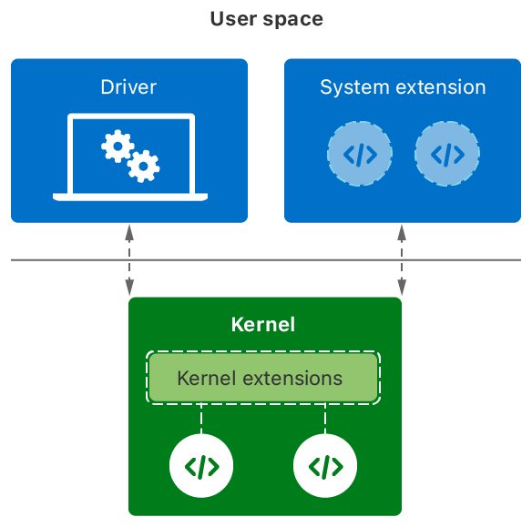

> Navigation: [Technologies](../technologies.md) · [Kernel](../kernel.md)

# Implementing drivers, system extensions, and kexts

Article

Create drivers and system extensions to communicate with hardware and provide low-level services, and only use kernel extensions for a few tasks. 

## Overview

Create drivers, system extensions, and kernel extensions for specific low-level system services.

- A DriverKit extension (dext) manages the communication between your company’s hardware device and the rest of the system.
- A system extension implements features that require kernel-level cooperation, such as custom security and network behaviors.
- A kernel extension (kext) supports any low-level services that cannot be implemented using a dext or system extension.

An illustration of the relationship between drivers, system extensions, kernel extensions, and the kernel. Kernel extensions run inside the kernel. Drivers and system extensions run in user space and communicate with the kernel for critical needs.

Use the DriverKit SDK and [System Extensions](../systemextensions.md) framework to implement low-level services whenever possible. Drivers and system extensions run in user space, instead of inside the kernel’s process space. Running in user space improves system stability and makes it easier to develop, debug, and install your code.

### Implement low-level services using system extensions

The System Extensions framework supports a class of kernel-level features that previously required kexts. System extensions run in user space and interact with the kernel to perform specific tasks. For example, an endpoint-security system extension monitors system events for potential security threats.

> [!note] Note
> In macOS 11 and later, the kernel doesn’t load a kext if an equivalent System Extension solution exists. You may continue to use kexts in macOS 10.15 and earlier.

For more information about the types of system extensions you can create, and how to install them, see [System Extensions](../systemextensions.md).

### Communicate with custom hardware using a DriverKit extension

A dext contains the drivers you need to communicate with your company’s custom hardware. A driver provides a layer of services for accessing the hardware. For example, a driver might configure the device, or it might implement a specific interface for communicating with the device. Because dexts are system extensions, they run in user space and you ship them inside your app bundle.

When the user attaches a new hardware device to the computer, the kernel searches for any dexts that handle the device. From those dexts, the kernel assembles a series of drivers to communicate with the device. Each new driver builds upon the capabilities of the previous driver, offering new services or configuration options.

Apple provides drivers for all standards-based hardware protocols that Mac computers support. Create custom drivers only for the protocols and features unique to your hardware. You can also use a codeless dext to map your hardware to one of Apple’s built-in drivers.

> [!note] Note
> In macOS 11 and later, the kernel doesn’t load a kext if an equivalent DriverKit solution exists. You may continue to use kexts in macOS 10.15 and earlier.

For information about how to create and install custom drivers, see [Creating a Driver Using the DriverKit SDK](../driverkit/creating-a-driver-using-the-driverkit-sdk.md).

### Support custom hardware without writing driver code

Not all drivers require actual code. If your hardware communicates entirely using standards-based protocols, you can ship a driver that matches your hardware to one of the built-in system drivers. Shipping a codeless driver requires less effort, and lets you select which driver the system uses for your hardware.

Ship a codeless driver in one of the following packages:

- A codeless dext, in which your driver class has no implementation.
- A codeless kext, which has no executable file.

Create a codeless dext when the system provides DriverKit support for your hardware. A codeless dext isn’t entirely codeless. It contains a minimal executable file with an empty subclass—that is, a subclass of an existing DriverKit class, where you don’t implement any methods. In the `Info.plist` file of your dext, set the value of the `IOUserClass` key to the name of your custom subclass. At runtime, the system instantiates your class, but all method calls fall through to the implementation of the parent class.

In the few cases where your driver requires a kernel extension, use a codeless kext to match your hardware to the existing system driver. Unlike a DriverKit extension, a codeless kext doesn’t have an executable file. Instead, its `Info.plist` file provides all the information that the system needs to match your hardware to a system driver.

For information about how to create and install a dext, see [Creating a Driver Using the DriverKit SDK](../driverkit/creating-a-driver-using-the-driverkit-sdk.md).

### Build kernel extensions with well-known restrictions

Kexts run inside the kernel and must support the same architecture and restrictions as other kernel code.

- Kexts on Apple silicon must support the `arm64e` architecture. The `arm64e` architecture includes pointer authentication codes (PACs) to detect and guard against malicious or accidental modifications to pointers in memory. The compiler transparently adds and removes PACs to your code at compile time, but the addition of PACs may require you to adjust how you handle pointers in your kexts. For information about supporting PACs, see [Preparing your app to work with pointer authentication](../security/preparing-your-app-to-work-with-pointer-authentication.md).
- Kexts run under Kernel Integrity Protection (KIP). After the system initializes the kernel and kexts, KIP locks down the kernel memory pages to prevent modifications to kernel and driver code. For more information about KIP, see [Kernel Integrity Protection](../https_/support.apple.com/guide/security/kernel-integrity-protection-secb1caeb4bc/1/web/1.md).

### Install kernel extensions as the final step in an installer package

If your custom installer package includes kexts, install them as the final installation step. The system manages kexts differently in macOS 11 and later, requiring a reboot to finish the installation process. As part of the reboot process, users must also explicitly change the security settings of their computer to allow the kext installation.

For information about the kext installation process, see [Installing a custom kernel extension](../apple-silicon/installing-a-custom-kernel-extension.md).

## See Also

### Kernel Extensions

- [Installing a custom kernel extension](../apple-silicon/installing-a-custom-kernel-extension.md) — Install kernel extensions using a custom installer package, and help users understand the installation process.
- [Debugging a custom kernel extension](../apple-silicon/debugging-a-custom-kernel-extension.md) — Configure your system to enable the debugging of custom kernel extensions from a second Mac.
- [Generating a Non-Maskable Interrupt](generating_a_non-maskable_interrupt.md) — Interrupt the kernel on a target Mac and attach a remote debugger to it.
