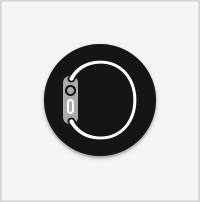

> Navigation: [Technologies](../technologies.md) · [Local Authentication Embedded UI](../localauthenticationembeddedui.md)

# LAAuthenticationView

<sub>Class</sub>

A graphical representation of the state of biometric authentication.

<sub>macOS</sub>

```swift
class LAAuthenticationView
```

## Overview

In the view that you use to manage authentication, add a local authentication view as a subview and provide it with an [LAContext](../localauthentication/lacontext.md) instance. For example, you can do this in the [loadView()](<../appkit/nsviewcontroller/loadview().md>) method of your view controller:

```swift
func loadView() {
    laContext = LAContext()
    laView = LAAuthenticationView(context: laContext)

    view.addSubview(laView)
    laView.translatesAutoresizingMaskIntoConstraints = false

    // Add more subviews and layout constraints...
}
```

When the view appears, call the context’s [evaluatePolicy(_:localizedReason:reply:)](<../localauthentication/lacontext/evaluatepolicy(__localizedreason_reply_).md>) method to initiate the authentication:

```swift
override func viewDidAppear() {
    super.viewDidAppear()

    laContext.evaluatePolicy(
        .deviceOwnerAuthenticationWithBiometricsOrWatch,
        localizedReason: "access your data"
    ) { success, error in
        // Handle the result.
    }
}
```

The local authentication view displays an icon that depends on the type of authentication you request, and the types of authentication that the system supports. For example, for a device that supports Touch ID, if you request the [deviceOwnerAuthenticationWithBiometricsOrWatch](../localauthentication/lapolicy/deviceownerauthenticationwithbiometricsorwatch.md) policy, like in the example above, the view displays the familiar finger print icon:


In the case above, if the user has a connected Apple Watch, that authentication mechanism works as well. If you limit the authentication to the [deviceOwnerAuthenticationWithWatch](../localauthentication/lapolicy/deviceownerauthenticationwithwatch.md) policy, the icon shows an Apple Watch in profile:



You can include other content around this icon that suits your app. The system also displays a message on the Touch Bar or on the user’s Apple Watch, if appropriate. When the evaluation succeeds, the icon transitions into a checkmark:


If you call the evaluation without first attaching it to a local authentication view, the system shows a standard authentication alert instead.

## Relationships

- **Inherits From**: [NSView](../appkit/nsview.md)

- **Conforms To**: [CVarArg](../swift/cvararg.md), [CustomDebugStringConvertible](../swift/customdebugstringconvertible.md), [CustomStringConvertible](../swift/customstringconvertible.md), [Equatable](../swift/equatable.md), [Hashable](../swift/hashable.md), [NSAccessibilityElementProtocol](../appkit/nsaccessibilityelementprotocol.md), [NSAccessibilityProtocol](../appkit/nsaccessibilityprotocol.md), [NSAnimatablePropertyContainer](../appkit/nsanimatablepropertycontainer.md), [NSAppearanceCustomization](../appkit/nsappearancecustomization.md), [NSCoding](../foundation/nscoding.md), [NSDraggingDestination](../appkit/nsdraggingdestination.md), [NSObjectProtocol](../objectivec/nsobjectprotocol.md), [NSStandardKeyBindingResponding](../appkit/nsstandardkeybindingresponding.md), [NSTouchBarProvider](../appkit/nstouchbarprovider.md), [NSUserActivityRestoring](../appkit/nsuseractivityrestoring.md), [NSUserInterfaceItemIdentification](../appkit/nsuserinterfaceitemidentification.md)

## Topics

### Creating a local authentication view

- [- initWithContext:](<laauthenticationview/init(context_).md>) — Creates a new authentication icon that reflects the current authentication state.
- [context](laauthenticationview/context.md) — The local authentication context associated with the authentication view.

### Controlling the size of a local authentication view

- [- initWithContext:controlSize:](<laauthenticationview/init(context_controlsize_).md>) — Creates a new authentication icon that reflects the current authentication state, using a specified size.
- [controlSize](laauthenticationview/controlsize.md) — The size of the local authentication view user interface element.
