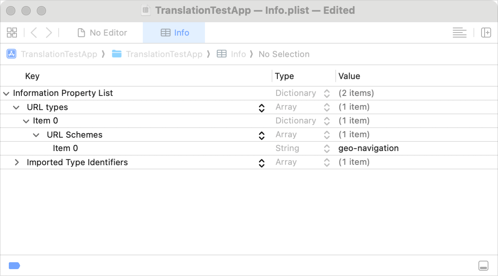

> Navigation: [Technologies](../technologies.md) · [MapKit](../mapkit.md)

# Preparing your app to be the default navigation app

Article

Configure your navigation app so people can set it as the default on their devices.

## Overview

In iOS and iPadOS 18.4 and later in the European Union (EU), and in iOS 26.2 and later in Japan, a person may select an app other than the Maps app to provide navigation instructions. If your app provides navigation services and you want it to optionally become the default navigation app, there are several steps you need to take.

## Add the Default Navigation App entitlement

In Xcode, add the `com.apple.developer.navigation-app` entitlement to the `.entitlements` file for your app’s project. For instructions on how to add this entitlement, see [Default Navigation](../bundleresources/entitlements/com.apple.developer.navigation-app.md).

## Adopt the geonavigation URL scheme

To provide navigation capabilities in your app, you need to adopt the `geo-navigation://` URL scheme. This scheme accepts the following types of navigation queries:

| Action | Parameters | Description | Values |
|---|---|---|---|
| /directions | source | Define the origination point of the navigation route | An address, coordinate, or place-name |
| /directions | destination | Define the final destination of the navigation route | An address, coordinate, or place-name |
| /directions | waypoint | Add places between the source and the destination to use for multistop routing | An address, coordinate, or place-name |
| /place | coordinate | Display a place for a given latitude and longitude at the provided location | A comma-separated pair of floating-point values that represent latitude and longitude |
| /place | address | Display a place at a specified address | An address string, such as  `1 Dr Carlton B Goodlett Pl San Francisco, CA 94102` (San Francisco City Hall) |

You can use several of these parameters in combination to provide a number of action types, including:

- Providing the source and destination for a route.
- Providing the source, the destination, and one or more waypoints between the starting point and the final destination. You can provide these as strings that represent an address, a place-name, or a comma-separated pair of floating-point values for the latitude and longitude of the location as coordinates on the map.

> [!note] Note
> The system doesn’t pass Apple place IDs, transportation modes, or route preferences to default navigation apps.

## Add the geonavigation URL type support and URL scheme

Use the following steps to add the `geo-navigation` support to your app’s `Info.plist` file:

1. In your app’s Xcode project, select the `Info.plist` file in the Project navigator.
2. Expand the information property list by clicking its disclosure triangle to display the resources that the `Info.plist` file contains.
3. Open the URL Types array (or add a URL Types array, if necessary, by creating an entry and selecting URL Types from the pop-up menu).
4. Add a URL Schemes array to the URL Types array.
5. Add a string for the URL Schemes array and set its value to `geo-navigation`.

An Xcode screenshot of the information property list editor showing a URL scheme with a string value of geo-navigation in the URL Types array.

Before your app can open incoming `geo-navigation:`  URLs, it needs to support this scheme as a custom URL scheme. To add this support, see [Defining a custom URL scheme for your app](../xcode/defining-a-custom-url-scheme-for-your-app.md).

## Prepare your app for submission to App Store Connect

To submit your app to App Store Connect, it needs to meet the following criteria:

- The `com.apple.developer.navigation-app` entitlement is in your app’s `.entitlements` file, and has a value of `true`.
- Your app is able to handle the `geo-navigation://` URL schema.
- The `Info.plist` file has the `UIBackgroundModes` property array and contains an entry with the string `location`.
