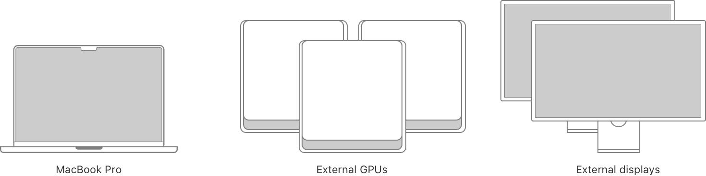
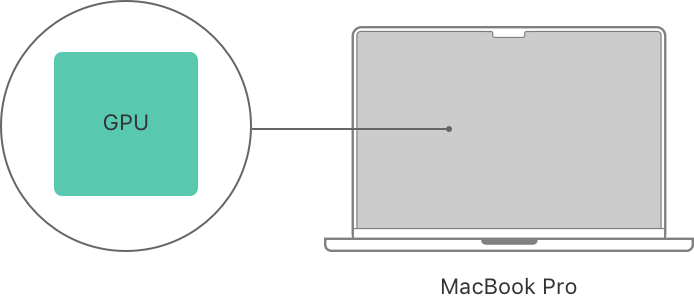
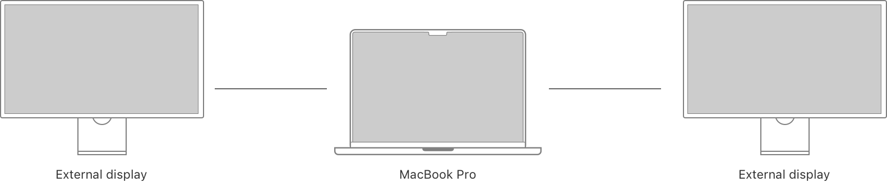
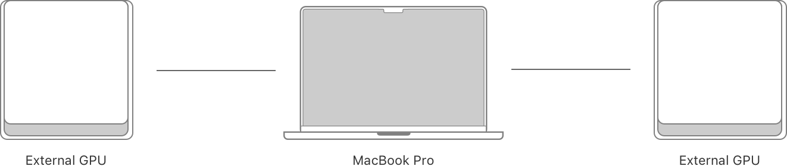

> Navigation: [Technologies](../technologies.md) · [Metal](../metal.md) · [GPU devices and work submission](gpu-devices-and-work-submission.md) · [Multi-GPU systems](multi-gpu-systems.md)

# Assessing multi-GPU and multidisplay setups on an Intel-based Mac

Article

Learn the possible GPU and display configurations for a Mac and their limitations.

## Overview

An Intel-based Mac can have multiple GPUs, and each GPU may connect to zero, one, or multiple displays. Prepare your app for various combinations of GPUs and display configurations by testing as many as possible, starting with the more common ones described below.

In general, each GPU in the system has its advantages and tradeoffs, depending on your app’s needs. It’s important your app chooses an appropriate GPU for each task, especially when it involves presenting the results on a specific display or transferring data between GPUs. For more information about choosing GPUs and transferring data between them, see [Finding multiple GPUs on an Intel-based Mac](finding-multiple-gpus-on-an-intel-based-mac.md) and [Adjusting for GPU memory bandwidth tradeoffs](adjusting-for-gpu-memory-bandwidth-tradeoffs.md).

> [!tip] Tip
> As an alternative to implementing a policy that selects a GPU and a display for a task, your app can suggest configurations to a person and let them decide.

### Consider various GPU and display configurations

For a Mac with one built-in GPU — either integrated or discrete — that GPU always drives the built-in display.

For a Mac with two built-in GPUs — both an integrated GPU and a discrete GPU — either GPU can drive the built-in display.

A Mac can also directly connect to and drive one or more external displays. For a Mac that has a single, built-in GPU (either integrated or discrete), that GPU drives every display that’s directly connected.

However, for a Mac with two built-in GPUs (both integrated and discrete), only the discrete GPU can drive the external displays. The discrete GPU also drives the built-in display when the Mac is driving one or more external displays. On that same Mac, the integrated GPU can drive only the built-in display, and only when the Mac isn’t driving any external displays.

Your app can use external GPUs for compute or rendering tasks, but an external GPU can’t drive the built-in display.

For a display that’s connected to an external GPU, only that GPU can drive the display. A built-in GPU can’t drive a display that’s connected to an external GPU.

A person can configure a Mac with a combination of the scenarios above. For example, someone may connect multiple external GPUs and external displays that directly connect to the Mac and indirectly through an external GPU.

A system diagram that shows an iMac Pro connected to an external display, an external GPU, and another external GPU that’s also connected to two additional external displays.

## See Also

### Selecting GPUs

- [Adjusting for GPU memory bandwidth tradeoffs](adjusting-for-gpu-memory-bandwidth-tradeoffs.md) — Choose a suitable GPU and memory storage mode for tasks based on that GPU’s memory bandwidth on a Mac.
- [Selecting device objects for graphics rendering](selecting-device-objects-for-graphics-rendering.md) — Switch dynamically between multiple GPUs to efficiently render to a display.
- [Selecting device objects for compute processing](selecting-device-objects-for-compute-processing.md) — Switch dynamically between multiple GPUs to efficiently execute a compute-intensive simulation.
