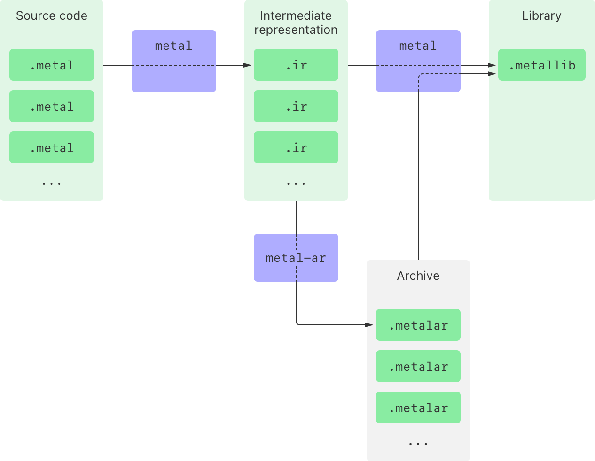

> Navigation: [Technologies](../technologies.md) · [Metal](../metal.md) · [Shader libraries](shader-libraries.md) · [Metal libraries](metal-libraries.md)

# Building a shader library by precompiling source files

<sub>Article</sub>

Create a shader library that you can add to an Xcode project with the Metal compiler tools in a command-line environment.

## Overview

Manually compile your Metal Shading Language (MSL) source files into a Metal shader library outside of an Xcode project with the Metal command-line tools. The `metal` compiler tool converts each shader source file into an intermediate representation file. The `metal` and `metal-ar` tools then compile intermediate representation files into a library and a binary archive, respectively.



<sub>A block flow diagram of the compilation stages for Metal shaders that produce both a shader library and shader archive.  The diagram starts at the Metal source code stage, which contains multiple files that end with a dot-metal suffix. Those files flow through the command line tool named ‘metal’ and into the intermediate representation stage, which contains files that end with a dot IR suffix. The intermediate representation stage flows to both the library stage and the archive stage. The line to the archive stage goes through a command line tool named ‘metal’ dash, AR. The archive stage contains multiple files that end with a dot ‘metal’ AR suffix (without a dash).  Both the archive stage and the intermediate representation stage flow to the library stage through the metal command line tool. The library stage contains one file that ends with a ‘metal’ LIB suffix.</sub>

You can create a library from one or more intermediate representation files, one or more archive files, or a combination of both.

### Compile a shader source file into a library

The simplest way to compile and build a single MSL source file into a library file is with two commands. The first command invokes the `metal` compiler tool, which compiles the source file into an intermediate representation file.

```shell
% xcrun -sdk macosx metal -o Shadow.ir  -c Shadow.metal
% xcrun -sdk macosx metal -o PointLights.ir  -c PointLights.metal
% xcrun -sdk macosx metal -o DirectionalLight.ir  -c DirectionalLight.metal
```

The `-o` option indicates the output file name and the `-c` option tells the tool to preprocess, compile, and assemble the source file.

> [!note] Note
> This example uses the `macosx` SDK, but you can use any SDK your app targets.

Optionally, you can combine several intermediate representation files into a single Metal archive with the `metal-ar` tool.

```shell
% xcrun -sdk macosx metal-ar -q Lights.metalar DirectionalLight.ir PointLights.ir
```

The `-q` option tells the tool to quickly append to its argument, which creates a new archive file if it doesn’t already exist.

Build a Metal library from one or more intermediate representation files, one or more archive files, or a combination of both with the `metal` tool.

```shell
% xcrun -sdk macosx metal -o LightsAndShadow.metallib Lights.metalar Shadow.ir
```

The command produces a Metal library that your app can load at runtime. One way to do this is by adding it to your project’s build targets in Xcode.

> [!note] Note
> The Metal command-line tools for Windows use the same options and arguments as their macOS counterparts.

### Retrieve and load a library

At runtime, you can access a library by creating an [MTLLibrary](mtllibrary.md) instance with the [- newLibraryWithURL:error:](<mtldevice/makelibrary(url_).md>) method.

**Swift**

```swift
func createLibrary(_ device: MTLDevice, libraryName: String) -> MTLLibrary? {
    let libraryURL = Bundle.main.url(forResource: libraryName,
                                     withExtension: "metallib")

    guard let libraryURL else {
        print("Couldn't find library file: \(libraryName)");
        return nil;
    }

    let library: MTLLibrary
    do {
        library = try device.makeLibrary(URL: libraryURL)
    } catch {
        print("Couldn't find library file: \(libraryName)");
        print("Error descriotion: \(error.localizedDescription)")
        return nil
    }

    return library
}
```

**Objective-C**

```objective-c
+ (id<MTLLibrary>) createLibrary:(id<MTLDevice>)device
                        fromName:(NSString*)libraryName
{
    NSURL *libraryURL = [[NSBundle mainBundle] URLForResource:libraryName
                                                withExtension:@"metallib"];

    if (libraryURL == nil) {
        NSLog(@"Couldn't find library file: %@", libraryName);
        return nil;
    }

    NSError *libraryError = nil;
    id <MTLLibrary> library = [device newLibraryWithURL:libraryURL
                                                  error:&libraryError];
    if (library == nil) {
        NSLog(@"Couldn't create library: %@", libraryName);

        if (libraryError != nil) {
            NSLog(@"Error description: %@", libraryError.localizedDescription);
        }
        return nil;
    }

    return library;
}
```

## See Also

### Working with Metal intermediate representation libraries

- [Minimizing the binary size of a shader library](minimizing-the-binary-size-of-a-shader-library.md) — Reduce the storage footprint of your shaders, and potentially reduce their compile time, by selecting the Metal compiler’s size optimization option.
- [Generating and loading a Metal library symbol file](generating-and-loading-a-metal-library-symbol-file.md) — Debug your Metal shaders from your production apps by creating companion symbol files at compile time and loading them at debug time.
