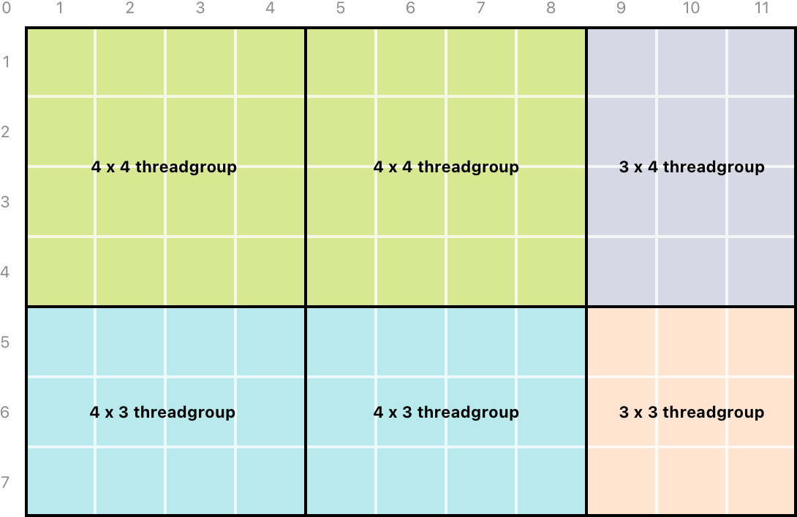
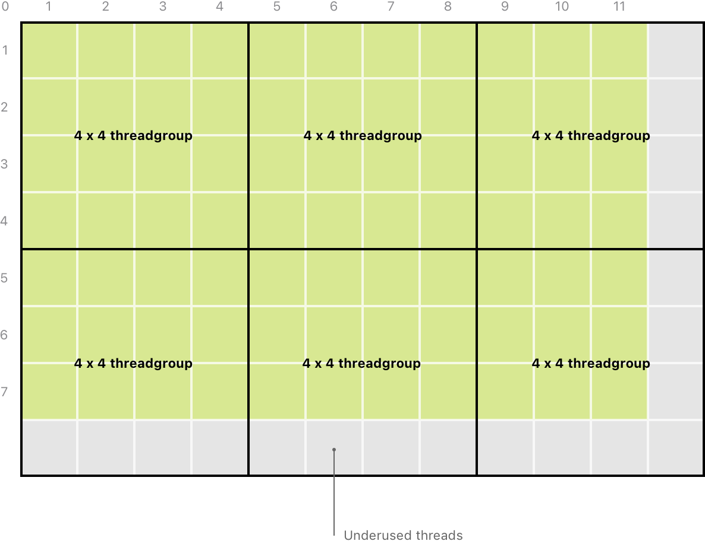

> Navigation: [Technologies](../technologies.md) · [Metal](../metal.md) · [Compute passes](compute-passes.md)

# Calculating threadgroup and grid sizes

<sub>Article</sub>

Calculate the optimum sizes for threadgroups and grids when dispatching compute-processing workloads.

## Overview

You can ensure your app doesn’t underuse threads by specifying the size of the grid and the number of threads per threadgroup. In iOS 11 and macOS 10.13 and later on devices that support nonuniform dispatch sizes, Metal calculates the number of threadgroups and provides nonuniform threadgroups if the grid size isn’t a multiple of the threadgroup size.

In earlier versions of iOS and macOS, you specify the size and number of the threadgroups. Metal composes grids of uniform threadgroups that may not match the size of your data. You can ensure your kernel code doesn’t execute outside the bounds of the data by adding defensive code to it.

### Calculate threads per threadgroup

You calculate the number of threads per threadgroup based on two [MTLComputePipelineState](mtlcomputepipelinestate.md) properties:

- **[maxTotalThreadsPerThreadgroup](mtlcomputepipelinestate/maxtotalthreadsperthreadgroup.md)** — The maximum number of threads that can be in a single threadgroup, which depends on the GPU and on the amount of registers and memory your compute kernel needs.
- **[threadExecutionWidth](mtlcomputepipelinestate/threadexecutionwidth.md)** — The number of threads the GPU schedules to execute in parallel.

> [!note] Note
> After you create a compute pipeline state, its [maxTotalThreadsPerThreadgroup](mtlcomputepipelinestate/maxtotalthreadsperthreadgroup.md) value doesn’t change, but two pipeline states on the same device may return different values.

For example, consider a compute pipeline state with `512` maximum threads per threadgroup and a thread execution width of `16`. For that compute pipeline state, you can launch the largest possible threadgroup by setting the following:

- The second dimension to the maximum threads per thread group divided by the thread execution width
- The third dimension to `1`

**Swift**

```swift
// Calculate the maximum threads per threadgroup based on the thread execution width.
let w = pipelineState.threadExecutionWidth
let h = pipelineState.maxTotalThreadsPerThreadgroup / w
let threadsPerThreadgroup = MTLSizeMake(w, h, 1) 
```

**Objective-C**

```objective-c
// Calculate the maximum threads per threadgroup based on the thread execution width.
NSUInteger w = pipelineState.threadExecutionWidth;
NSUInteger h = pipelineState.maxTotalThreadsPerThreadgroup / w;
MTLSize threadsPerThreadgroup = MTLSizeMake(w, h, 1);
```

On devices that support nonuniform threadgroup sizes, Metal divides a grid into nonuniform, arbitrarily sized threadgroups, such as for an image or texture. The compute command encoder’s [- dispatchThreads:threadsPerThreadgroup:](<mtlcomputecommandencoder/dispatchthreads(__threadsperthreadgroup_).md>) method requires the total number of threads because each thread corresponds to a single pixel.

**Swift**

```swift
let threadsPerGrid = MTLSize(width: texture.width,
                             height: texture.height,
                             depth: 1)
        
computeCommandEncoder.dispatchThreads(threadsPerGrid,
                                      threadsPerThreadgroup: threadsPerThreadgroup)
```

**Objective-C**

```objective-c
MTLSize threadsPerGrid = MTLSizeMake(texture.width, texture.height, 1);
    
[computeCommandEncoder dispatchThreads: threadsPerGrid
                       threadsPerThreadgroup: threadsPerThreadgroup];
```

When Metal performs this calculation, it can generate smaller threadgroups along the edges of your grid. Compared to uniform threadgroups, this technique simplifies kernel code and improves GPU performance.

To determine if a device supports nonuniform threadgroups, see [Metal Feature Set Tables.](https://developer.apple.com/metal/Metal-Feature-Set-Tables.pdf)



<sub>An illustration that shows a grid of squares, which represent threads, divided into 6 threadgroups of varying size that utilize every thread in the grid. The grid is 11 by 7 threads in size. The threadgroups in the grid are 4 by 4, 4 by 3, 3 by 4, and 3 by 3 threads in size.</sub>

### Calculate threadgroups per grid

If you need fine control over the size and number of threadgroups, you can manually calculate how to divide the grid. In your code, ensure that there are sufficient threadgroups to cover the entire image.

**Swift**

```swift
let threadgroupsPerGrid = MTLSize(width: (texture.width + w - 1) / w,
                                  height: (texture.height + h - 1) / h,
                                  depth: 1)
```

**Objective-C**

```objective-c
MTLSize threadgroupsPerGrid = MTLSizeMake((texture.width + w - 1) / w,
                                          (texture.height + h - 1) / h,
                                          1);
```

For a texture that’s 1024 by 768 pixels in size, the code above returns an [MTLSize](mtlsize.md) instance with a width of `32`, a height of `48`, and a depth of `1`. These values divide the texture into 1536 threadgroups, each of which contains 512 threads, for a total of 786,432 threads. In this case, that number of threads matches the number of pixels in the image, and the GPU processes the entire image with no underuse of threads.

However, the code may round up to ensure there are sufficient threads to process the entire image, such as for an image of 1920 by 1080 pixels in size. This approach can result in the threadgroups generating a grid that’s larger than your data.



<sub>An illustration thats  shows how a set of 6 threadgroups, each 4 by 4 threads in size, extend past the bounds of a grid thats 11 by 7 threads in size. The threads outside the grid are highlighted to indicate the code allocates these threads but the kernel can’t utilize them.</sub>

To compensate for the extra threads, you can make your code exit early if the thread position in the grid is outside the bounds of the data.

```metal
kernel void
simpleKernelFunction(texture2d<float, access::write> outputTexture [[texture(0)]],
                     uint2 position [[thread_position_in_grid]]) {
    
    if (position.x >= outputTexture.get_width() || position.y >= outputTexture.get_height()) {
        return;
    }
    
    outputTexture.write(float4(1.0), position);
}
```

> [!note] Note
> You don’t need to check a thread’s position in a grid if you use the [- dispatchThreads:threadsPerThreadgroup:](<mtlcomputecommandencoder/dispatchthreads(__threadsperthreadgroup_).md>) technique.

Encode the command that executes your custom threadgroup size by calling the encoder’s [- dispatchThreadgroups:threadsPerThreadgroup:](<mtlcomputecommandencoder/dispatchthreadgroups(__threadsperthreadgroup_).md>) method.

**Swift**

```swift
computeCommandEncoder.dispatchThreadgroups(threadgroupsPerGrid,
                                           threadsPerThreadgroup: threadsPerThreadgroup)
```

**Objective-C**

```objective-c
[computeCommandEncoder dispatchThreadgroups: threadgroupsPerGrid
                       threadsPerThreadgroup: threadsPerThreadgroup];
```

## See Also

### Encoding a compute pass

- [Creating threads and threadgroups](creating-threads-and-threadgroups.md) — Learn how Metal organizes compute-processing workloads.
- [MTL4ComputeCommandEncoder](mtl4computecommandencoder.md) — Encodes computation dispatches, resource copying commands, and acceleration structure building commands for a single pass into a command buffer.
- [MTLComputeCommandEncoder](mtlcomputecommandencoder.md) — Encodes computation dispatch commands for a single compute pass into a command buffer.
