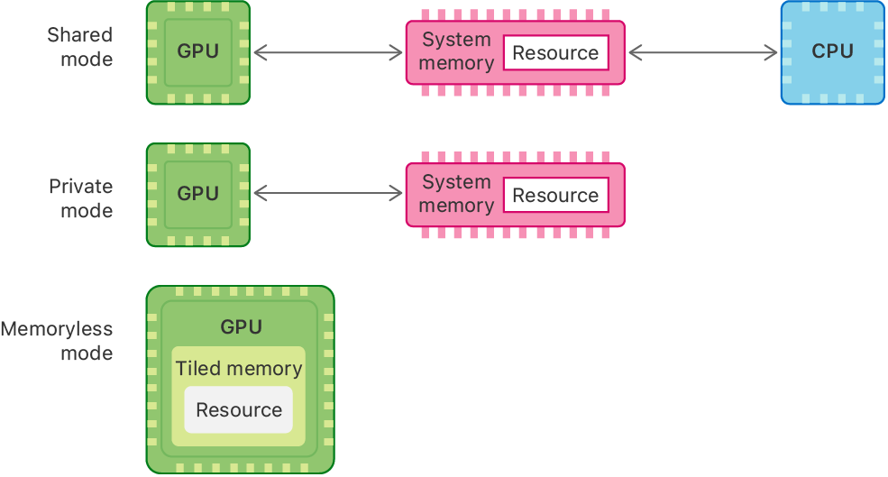

> Navigation: [Technologies](../technologies.md) · [Metal](../metal.md) · [Resource fundamentals](resource-fundamentals.md)

# Choosing a resource storage mode for Apple GPUs

<sub>Article</sub>

Select an appropriate storage mode for your textures and buffers on Apple GPUs.

## Overview

Apple GPUs have a unified memory model in which the CPU and the GPU share system memory. However, CPU and GPU access to that memory depends on the storage mode you choose for your resources. The [MTLStorageModeShared](mtlstoragemode/shared.md) mode defines system memory that both the CPU and the GPU can access. The [MTLStorageModePrivate](mtlstoragemode/private.md) mode defines system memory that only the GPU can access.

The [MTLStorageModeMemoryless](mtlstoragemode/memoryless.md) mode defines tile memory within the GPU that only the GPU can access. Tile memory has higher bandwidth, lower latency, and consumes less power than system memory.



<sub>A diagram that shows the three types of Apple GPU resource storage modes: shared at the top, private in the middle, and memoryless at the bottom. The shared mode resource is in between a GPU and CPU with bidirectional arrows pointing to and from each. The private mode resource is next to a GPU with a bidirectional arrow between them. The memoryless mode resource appears inside a GPU’s tiled memory region.</sub>

### Choose a resource storage mode for buffers or textures

The storage mode you choose depends on how you plan to use Metal resources:

- **Populate and update on the CPU** — Data shared by the CPU and GPU. Use [MTLStorageModeShared](mtlstoragemode/shared.md). The CPU and GPU share data. This is the default for buffer and texture storage.
- **Access exclusively on the GPU** — Data owned by the GPU. Use [MTLStorageModePrivate](mtlstoragemode/private.md). Choose the mode if you populate your resource with the GPU through a compute, render, or blit pass. This case is common for render targets, intermediary resources, or texture streaming. For guidance on how to copy data to a private resource, see [Copying data to a private resource](copying-data-to-a-private-resource.md).
- **Populate on CPU and access frequently on GPU** — Shared integrated memory for the CPU and GPU. Use [MTLStorageModeShared](mtlstoragemode/shared.md).
- **Temporary texture contents for GPU passes** — Memory held by the GPU for textures within or between passes. Use [MTLStorageModeMemoryless](mtlstoragemode/memoryless.md). Memoryless mode only works for textures, and stores temporary resources in tiled memory for high performance. An example is a depth or stencil texture thatʼs used only within a single pass and isnʼt needed in an earlier or later rendering stage.

For information on setting storage modes in your app, see [Setting resource storage modes](setting-resource-storage-modes.md).

### Create a memoryless render target

To create a memoryless render target, set the [storageMode](mtltexturedescriptor/storagemode.md) property of an [MTLTextureDescriptor](mtltexturedescriptor.md) to [MTLStorageModeMemoryless](mtlstoragemode/memoryless.md) and use this descriptor to create a new [MTLTexture](mtltexture.md). Then set this new texture as the [texture](mtlrenderpassattachmentdescriptor/texture.md) property of an [MTLRenderPassAttachmentDescriptor](mtlrenderpassattachmentdescriptor.md).

**Swift**

```swift
let memorylessDescriptor = MTLTextureDescriptor.texture2DDescriptor(pixelFormat: .r16Float,
                                                                    width: 256,
                                                                    height: 256,
                                                                    mipmapped: true)
memorylessDescriptor.storageMode = .memoryless
let memorylessTexture = device.makeTexture(descriptor: memorylessDescriptor)

let renderPassDescriptor = MTLRenderPassDescriptor()
renderPassDescriptor.depthAttachment.texture = memorylessTexture
```

**Objective-C**

```objective-c
MTLTextureDescriptor *memorylessDescriptor = [MTLTextureDescriptor texture2DDescriptorWithPixelFormat:MTLPixelFormatR16Float
                                                                                                width:256
                                                                                               height:256
                                                                                            mipmapped:YES];
memorylessDescriptor.storageMode = MTLStorageModeMemoryless;
id <MTLTexture> memorylessTexture = [_device newTextureWithDescriptor:memorylessDescriptor];
    
MTLRenderPassDescriptor *renderPassDescriptor = [MTLRenderPassDescriptor renderPassDescriptor];
renderPassDescriptor.depthAttachment.texture = memorylessTexture;
```

See [Rendering a scene with deferred lighting in Objective-C](rendering-a-scene-with-deferred-lighting-in-objective-c.md) for an example of an app that uses a memoryless render target.

> [!note] Note
> You can create only textures, not buffers, using [MTLStorageModeMemoryless](mtlstoragemode/memoryless.md) mode. You can’t use buffers as memoryless render targets.

## See Also

### Resource management

- [Setting resource storage modes](setting-resource-storage-modes.md) — Set a storage mode that defines the memory location and access permissions of a resource.
- [Choosing a resource storage mode for Intel and AMD GPUs](choosing-a-resource-storage-mode-for-intel-and-amd-gpus.md) — Select an appropriate storage mode for your textures and buffers on AMD and Intel GPUs.
- [Copying data to a private resource](copying-data-to-a-private-resource.md) — Use a blit command encoder to copy buffer or texture data to a private resource.
- [Synchronizing a managed resource in macOS](synchronizing-a-managed-resource-in-macos.md) — Manually synchronize memory for a Metal resource in apps.
- [Transferring data between connected GPUs](transferring-data-between-connected-gpus.md) — Use high-speed connections between GPUs to transfer data quickly.
- [Reducing the memory footprint of Metal apps](reducing-the-memory-footprint-of-metal-apps.md) — Learn best practices for using memory efficiently in iOS and tvOS.
