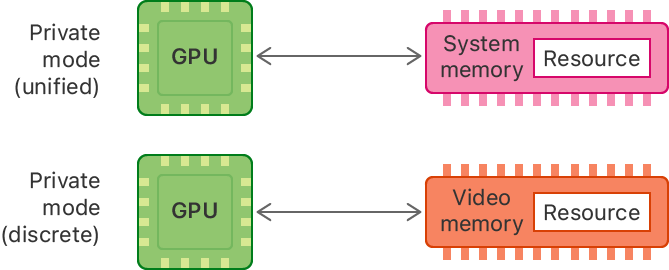
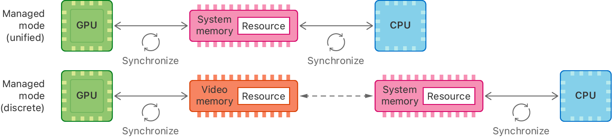

> Navigation: [Technologies](../technologies.md) · [Metal](../metal.md) · [Resource fundamentals](resource-fundamentals.md)

# Choosing a resource storage mode for Intel and AMD GPUs

Article

Select an appropriate storage mode for your textures and buffers on AMD and Intel GPUs.

## Overview

A Mac can have multiple GPUs, each with a unified or discrete memory model. In a _unified memory model_, the CPU and the GPU share system memory. However, CPU and GPU access to that memory depends on the storage mode you choose for your resources. In a _discrete memory model_, system memory is separate from video memory. System memory is accessible to both the CPU and the GPU, but video memory is accessible only to the GPU.

The Metal framework’s resource storage mode API works for both unified and discrete memory models, so you don’t need to write specific code for either.

### Understand the different Metal memory modes

In both memory models, a resource with an [MTLStorageModeShared](mtlstoragemode/shared.md) mode resides in system memory accessible to both the CPU and the GPU. Shared resources are only available on systems with integrated graphics, such as Apple silicon and integrated GPUs on Intel-based Mac computers.

A system diagram that shows the memory location of a shared mode resource in system memory that connects to the GPU and CPU with bidirectional arrows.

A resource with an [MTLStorageModePrivate](mtlstoragemode/private.md) mode is accessible only to the GPU. In a unified memory model, this resource resides in system memory. In a discrete memory model, it resides in video memory. In both memory models, Metal optimizes GPU access to private resources.

Two system diagrams that show the memory location of private resources. The first shows a unified-memory model GPU with with a bidirectional arrow pointing to and from system memory. The second shows a discrete-memory model GPU with with a bidirectional arrow pointing to and from video memory.

In a discrete memory model, Metal always attempts to store private resources in video memory. However, under certain memory constraints, Metal may evict a private resource into system memory. When you use a private resource that Metal previously evicted, Metal attempts to copy it back into video memory before you use it.

In a unified memory model, a resource with an [MTLStorageModeManaged](mtlstoragemode/managed.md) mode resides in system memory accessible to both the CPU and the GPU.

In a discrete memory model, a managed resource exists as a synchronized pair of memory allocations. One copy of the resource resides in system memory accessible only to the CPU; the other resides in video memory accessible only to the GPU. However, you don’t manage the copies separately; Metal creates a single [MTLResource](mtlresource.md) instance to access both.

In both memory models, Metal optimizes CPU and GPU access to managed resources. However, you need to explicitly synchronize a managed resource after modifying its contents with the CPU or the GPU. For information about synchronizing a managed resource, see [Synchronizing a managed resource in macOS](synchronizing-a-managed-resource-in-macos.md).

Two system diagrams that show the memory location of managed resources. The unified-memory model diagram at top shows a managed resource in system memory that connects to the GPU and CPU with bidirectional arrows. The discrete-memory model diagram below it shows a resource in video memory that connects to the GPU connected by a bidirectional arrow that has a synchronize symbol. The video memory connects to the system memory by a dashed bidirectional arrow. The system memory connects to the CPU by a bidirectional arrow that has a synchronize symbol.

### Choose a storage mode for resources

Your storage mode should depend on the resource type and how your application uses storage accessed by Metal. Understanding the underlying memory architecture gives context and helps you investigate where you can optimize storage and synchronization. On Intel-based Mac computers, follow these guidelines:

- Prefer the default storage mode selected by Metal. Metal selects the optimal mode for the resource type and hardware.
- Use the [MTLStorageModePrivate](mtlstoragemode/private.md) mode when creating a resource that’s only accessed by the GPU. This includes temporary targets for render passes.
- To optimize for workloads initialized from CPU and then only processed on GPU, copy from a CPU-populated resource in the default storage mode to a GPU-only [MTLResource](mtlresource.md) with [MTLStorageModePrivate](mtlstoragemode/private.md) storage. See [Copying data to a private resource](copying-data-to-a-private-resource.md) for details.

You’re responsible for signaling synchronization between the CPU and GPU with managed and shared storage. Regardless of your resource size, try and keep your synchronization points as light and infrequent as possible. Batch GPU work together to help reduce frequent synchronization. See [Synchronizing a managed resource in macOS](synchronizing-a-managed-resource-in-macos.md) for details.

To detect the GPU architecture and features at runtime, use the [- supportsFamily:](<mtldevice/supportsfamily(__).md>) method. See [Detecting GPU features and Metal software versions](detecting-gpu-features-and-metal-software-versions.md) for more information, and the [Metal feature set tables (PDF)](https://developer.apple.com/metal/Metal-Feature-Set-Tables.pdf) for full information on hardware support in Apple devices and computers.

## See Also

### Resource management

- [Setting resource storage modes](setting-resource-storage-modes.md) — Set a storage mode that defines the memory location and access permissions of a resource.
- [Choosing a resource storage mode for Apple GPUs](choosing-a-resource-storage-mode-for-apple-gpus.md) — Select an appropriate storage mode for your textures and buffers on Apple GPUs.
- [Copying data to a private resource](copying-data-to-a-private-resource.md) — Use a blit command encoder to copy buffer or texture data to a private resource.
- [Synchronizing a managed resource in macOS](synchronizing-a-managed-resource-in-macos.md) — Manually synchronize memory for a Metal resource in apps.
- [Transferring data between connected GPUs](transferring-data-between-connected-gpus.md) — Use high-speed connections between GPUs to transfer data quickly.
- [Reducing the memory footprint of Metal apps](reducing-the-memory-footprint-of-metal-apps.md) — Learn best practices for using memory efficiently in iOS and tvOS.
