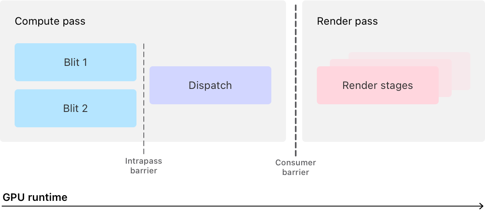

> Navigation: [Technologies](../technologies.md) · [Metal](../metal.md) · [Compute passes](compute-passes.md)

# Combining blit and compute operations in a single pass

<sub>Sample Code</sub>

Run concurrent blit commands and then a compute dispatch in a single pass with a unified compute encoder.

## Overview

This sample demonstrates how to use Metal 4’s unified compute encoder to combine texture data and create a grayscale version of it at the same time. The app runs blit and dispatch operations in a single compute pass, then renders the results with a render pass.

This sample builds on Metal 4 fundamentals in [Drawing a triangle with Metal 4](drawing-a-triangle-with-metal-4.md), including command buffers, allocators, residency sets, and submitting work to the GPU.

Each time the system requests a frame, the app:

1. Creates a composite color texture by copying two color textures with concurrent blit commands.
2. Creates a grayscale texture by converting the composite color texture with a compute kernel.
3. Draws two adjacent rectangles, one for each composite texture.

An [MTL4ComputeCommandEncoder](mtl4computecommandencoder.md) instance combines blit, dispatch, and acceleration structure commands into a single pass, which reduces your app’s overhead from creating multiple encoders and encoding separate passes. The app increases its GPU utilization by running independent blit commands that concurrently write to memory regions that don’t overlap. However, it prevents the blit and dispatch stage memory operations from running at the same time, by synchronizing them with an intrapass barrier.



<sub>A timeline diagram along a GPU runtime axis that shows a compute pass followed by a render pass. The compute pass contains two blit stages that run in parallel, followed by an intrapass barrier, and then a dispatch stage. A consumer barrier separates the compute pass from the render pass, which contains render stages.</sub>

The app also reuses its one argument table by modifying the arguments in the table as necessary. For example, each blit command copies from a different source texture, and the dispatch command needs access to both composite textures. Metal processes bindings at draw and dispatch time, allowing the renderer to reconfigure bindings so that you don’t have to create new argument tables.

### Create long-term resources

The renderer’s initializer creates the fundamental Metal instances it needs: a command queue, a reusable command buffer, and the default library. For more information on how these work, see [Drawing a triangle with Metal 4](drawing-a-triangle-with-metal-4.md).

**Metal4Renderer.m**

```objective-c
device = mtkView.device;

commandQueue = [device newMTL4CommandQueue];
commandBuffer = [device newCommandBuffer];
defaultLibrary = [device newDefaultLibrary];
```

The initializer also creates buffers, textures, an argument table, a shared event, and residency sets by calling helper methods:

**Metal4Renderer.m**

```objective-c
// Create the app's resources.
[self createBuffers];
[self createTextures];

// Create the types that manage the resources.
[self createArgumentTable];
[self createSharedEvent];
[self createResidencySets];
```

The renderer stores and reuses them for every frame.

### Load textures from image files

The `createTextures` helper method starts by loading the contents from the app’s two TGA files into textures:

**Metal4Renderer.m**

```objective-c
NSBundle *mainBundle = [NSBundle mainBundle];
NSString *chyronImageFileName = @"Aloha-chyron";
NSString *backgroundImageFileName = @"Hawaii-coastline";

// Create a texture from the background image file.
NSURL *backgroundImageFile = [mainBundle URLForResource:backgroundImageFileName
                                          withExtension:@"tga"];
backgroundImageTexture = [self loadImageToTexture:backgroundImageFile];
NSAssert(nil != backgroundImageTexture,
         @"The app can't create a texture for the background image: %@",
         backgroundImageFileName);

// Create a texture from the chyron image file.
NSURL *chyronImageFile = [mainBundle URLForResource:chyronImageFileName
                                      withExtension:@"tga"];
chyronTexture = [self loadImageToTexture:chyronImageFile];
```

The `loadImageToTexture:` method creates an instance of [MTLTexture](mtltexture.md) with a pixel format that stores four color channels: blue, green, red, and alpha. Each channel uses an 8-bit unnormalized value, where `0` maps to `0.0` and `255` maps to `1.0`:

**Metal4Renderer.m**

```objective-c
MTLTextureDescriptor *textureDescriptor = [[MTLTextureDescriptor alloc] init];

textureDescriptor.pixelFormat = MTLPixelFormatBGRA8Unorm;
textureDescriptor.textureType = MTLTextureType2D;
textureDescriptor.usage = MTLTextureUsageShaderRead;
textureDescriptor.width = image.width;
textureDescriptor.height = image.height;

// Create the texture instance.
id<MTLTexture> texture;
texture = [device newTextureWithDescriptor:textureDescriptor];
```

After creating the texture, the method copies the image data into it with its [- replaceRegion:mipmapLevel:withBytes:bytesPerRow:](<mtltexture/replace(region_mipmaplevel_withbytes_bytesperrow_).md>) method:

**Metal4Renderer.m**

```objective-c
// Define a region that's the size of the texture, which is the same as the image.
const MTLSize size = {
    textureDescriptor.width,
    textureDescriptor.height,
    1
};
const MTLRegion region = { zeroOrigin, size };

/// The number of bytes in each of the texture's rows.
NSUInteger bytesPerRow = 4 * textureDescriptor.width;

// Copy the bytes from the image into the texture.
[texture replaceRegion:region
           mipmapLevel:0
             withBytes:image.data.bytes
           bytesPerRow:bytesPerRow];
```

### Create textures for the composite images

The app creates two additional textures to store the composite images, by configuring an instance of [MTLTextureDescriptor](mtltexturedescriptor.md) with dimensions that fit both source images. The first texture stores the composite color texture that the compute pass creates from the background and chyron textures. The second texture stores the grayscale equivalent of the composite color texture.

**Metal4Renderer.m**

```objective-c
MTLTextureDescriptor *textureDescriptor = [[MTLTextureDescriptor alloc] init];
textureDescriptor.textureType = MTLTextureType2D;

textureDescriptor.pixelFormat = MTLPixelFormatBGRA8Unorm;
textureDescriptor.width = backgroundImageTexture.width;
textureDescriptor.height = backgroundImageTexture.height + chyronTexture.height;
```

The descriptor configures the composite texture’s height to fit both the background image and the chyron.

The `createTextures` method creates the composite color texture with read-only access, because the `convertToGrayscale` kernel only reads from it:

**Metal4Renderer.m**

```objective-c
textureDescriptor.usage = MTLTextureUsageShaderRead;
compositeColorTexture = [device newTextureWithDescriptor:textureDescriptor];
```

The composite grayscale texture needs both read and write access, because the fragment shader reads from it and the compute kernel writes to it:

**Metal4Renderer.m**

```objective-c
textureDescriptor.usage = MTLTextureUsageShaderWrite | MTLTextureUsageShaderRead;
compositeGrayscaleTexture = [device newTextureWithDescriptor:textureDescriptor];
```

### Create an argument table

The renderer binds resources to shader parameters by creating an argument table that stores buffer and texture bindings:

The `createArgumentTable` method configures an instance of [MTL4ArgumentTableDescriptor](mtl4argumenttabledescriptor.md) with the largest number of buffer and texture bindings the app ever needs at one time:

**Metal4Renderer.m**

```objective-c
MTL4ArgumentTableDescriptor *argumentTableDescriptor;
argumentTableDescriptor = [[MTL4ArgumentTableDescriptor alloc] init];

argumentTableDescriptor.maxTextureBindCount = 2;
argumentTableDescriptor.maxBufferBindCount = 2;

// Create an argument table with the descriptor.
NSError *error = NULL;
argumentTable = [device newArgumentTableWithDescriptor:argumentTableDescriptor
                                                 error:&error];
```

The compute pass binds two textures for the color input and grayscale output. The render pass binds two buffers for vertex data and viewport size, plus one texture that changes between draw calls.

> [!tip] Tip
> Minimize an app’s memory footprint by setting the binding counts to only what the renderer needs.

### Compile a render pipeline

The renderer compiles a render pipeline at launch time by creating an instance of [MTL4Compiler](mtl4compiler.md) with a default configuration:

**Metal4Renderer.m**

```objective-c
MTL4CompilerDescriptor *compilerDescriptor;
compilerDescriptor = [[MTL4CompilerDescriptor alloc] init];

// Create a compiler with the descriptor.
NSError *error = NULL;
compiler = [device newCompilerWithDescriptor:compilerDescriptor
                                       error:&error];
```

The `createRenderPipelineFor:` method compiles a render pipeline with vertex and fragment shaders:

**Metal4Renderer.m**

```objective-c
MTL4LibraryFunctionDescriptor *vertexFunction;
vertexFunction = [MTL4LibraryFunctionDescriptor new];
vertexFunction.library = defaultLibrary;
vertexFunction.name = @"vertexShader";

MTL4LibraryFunctionDescriptor *fragmentFunction;
fragmentFunction = [MTL4LibraryFunctionDescriptor new];
fragmentFunction.library = defaultLibrary;
fragmentFunction.name = @"samplingShader";

MTL4RenderPipelineDescriptor *pipelineDescriptor;
pipelineDescriptor = [MTL4RenderPipelineDescriptor new];
pipelineDescriptor.label = @"Simple Render Pipeline";
pipelineDescriptor.vertexFunctionDescriptor = vertexFunction;
pipelineDescriptor.fragmentFunctionDescriptor = fragmentFunction;
pipelineDescriptor.colorAttachments[0].pixelFormat = pixelFormat;

renderPipelineState = [compiler newRenderPipelineStateWithDescriptor:pipelineDescriptor
                                                 compilerTaskOptions:nil
                                                               error:&error];
```

### Compile a compute pipeline with a grayscale kernel

The renderer compiles a compute pipeline with the `convertToGrayscale` kernel function.

The `createComputePipeline` method creates an [MTL4LibraryFunctionDescriptor](mtl4libraryfunctiondescriptor.md) that refers to the `convertToGrayscale` kernel in the default library:

**Metal4Renderer.m**

```objective-c
MTL4LibraryFunctionDescriptor *kernelFunction;
kernelFunction = [MTL4LibraryFunctionDescriptor new];
kernelFunction.library = defaultLibrary;
kernelFunction.name = @"convertToGrayscale";

// Configure a compute pipeline with the compute function.
MTL4ComputePipelineDescriptor *pipelineDescriptor;
pipelineDescriptor = [MTL4ComputePipelineDescriptor new];
pipelineDescriptor.computeFunctionDescriptor = kernelFunction;

// Create a compute pipeline with the image-processing kernel in the library.
computePipelineState = [compiler newComputePipelineStateWithDescriptor:pipelineDescriptor
                                                   compilerTaskOptions:nil
                                                                 error:&error];
```

The `convertToGrayscale` kernel converts each pixel from color to grayscale. The kernel’s signature declares two texture parameters and a grid position parameter:

**Shaders.metal**

```metal
kernel void
convertToGrayscale(texture2d<half, access::read>  inTexture  [[texture(ComputeTextureBindingIndexForColorImage)]],
                   texture2d<half, access::write> outTexture [[texture(ComputeTextureBindingIndexForGrayscaleImage)]],
                   uint2                          gridId     [[thread_position_in_grid]])
```

The kernel uses the `read` access qualifier for `inTexture` because it only reads from it, and the `write` access qualifier for `outTexture` because it only writes to it.

The `gridId` parameter provides each thread’s position in the 2D grid. The `[[thread_position_in_grid]]` attribute qualifier tells Metal to generate and pass these coordinates to each thread.

The kernel calculates the grayscale value by applying the Rec. 709 luma coefficients to the color pixel’s RGB components:

**Shaders.metal**

```metal
// Check that this part of the grid is within the texture's bounds.
if ((gridId.x >= outTexture.get_width()) ||
    (gridId.y >= outTexture.get_height()))
{
    // Exit early for coordinates outside the bounds of the destination.
    return;
}

/// The input texture's data value at the thread's coordinates.
half4 colorValue = inTexture.read(gridId);

/// A grayscale equivalent of the input texture's color value.
half grayValue = dot(colorValue.rgb, kRec709LumaCoefficients);

// Save the grayscale value to the output texture at the thread's coordinates.
outTexture.write(half4(grayValue, grayValue, grayValue, 1.0), gridId);
```

The kernel first checks whether the thread’s grid coordinates are within the texture’s bounds, then returns early if they aren’t. This check handles the case where the grid size exceeds the texture’s size.

### Calculate the threadgroup count

The renderer calculates how many threadgroups to dispatch based on the composite texture’s dimensions.

The `configureThreadgroupForComputePasses` method sets a 16 × 16 threadgroup size, which runs on any Apple silicon GPU:

**Metal4Renderer.m**

```objective-c
threadgroupSize = MTLSizeMake(16, 16, 1);
```

The method calculates the number of threadgroups in each dimension by dividing the texture’s dimensions by the threadgroup size and rounding up:

**Metal4Renderer.m**

```objective-c
// Find the number of threadgroup widths the app needs to span the texture's full width.
threadgroupCount.width = compositeColorTexture.width + threadgroupSize.width - 1;
threadgroupCount.width /= threadgroupSize.width;

// Find the number of threadgroup heights the app needs to span the texture's full height.
threadgroupCount.height = compositeColorTexture.height + threadgroupSize.height - 1;
threadgroupCount.height /= threadgroupSize.height;

// Set depth to one because the image data is two-dimensional.
threadgroupCount.depth = 1;
```

This calculation ensures the grid covers an area that’s at least as large as the texture, which is why the kernel checks whether each thread’s coordinates are within bounds.

### Combine textures with concurrent blit commands

The renderer encodes a compute pass that combines two operations with a compute encoder:

- Copying texture data with blit commands
- Converting the result to grayscale with a dispatch command

**Metal4Renderer.m**

```objective-c
// Create a compute encoder from the command buffer.
id<MTL4ComputeCommandEncoder> computeEncoder;
computeEncoder = [commandBuffer computeCommandEncoder];
```

The renderer encodes two copy commands that write to different regions of the composite color texture:

**Metal4Renderer.m**

```objective-c
// Copy the chyron texture to the composite color texture.
[self encodeChyronTextureCopy:computeEncoder];

// Copy the background image texture to the composite color texture.
[self encodeBackgroundTextureCopy:computeEncoder];
```

The `encodeChyronTextureCopy:` method copies the chyron texture to the top of the composite texture:

**Metal4Renderer.m**

```objective-c
MTLSize chyronTextureSize;
chyronTextureSize.width = chyronTexture.width;
chyronTextureSize.height = chyronTexture.height;
chyronTextureSize.depth = 1;

MTLOrigin destinationOrigin = zeroOrigin;
destinationOrigin.x = offset;

[computeEncoder copyFromTexture:chyronTexture
                    sourceSlice:0
                    sourceLevel:0
                   sourceOrigin:zeroOrigin
                     sourceSize:chyronTextureSize
                      toTexture:compositeColorTexture
               destinationSlice:0
               destinationLevel:0
              destinationOrigin:destinationOrigin];
```

The `encodeBackgroundTextureCopy:` method copies the background texture below the chyron:

**Metal4Renderer.m**

```objective-c
MTLSize backgroundImageSize;
backgroundImageSize.width = backgroundImageTexture.width;
backgroundImageSize.height = backgroundImageTexture.height;
backgroundImageSize.depth = 1;

MTLOrigin destinationOrigin = zeroOrigin;
destinationOrigin.y = chyronTexture.height;

[computeEncoder copyFromTexture:backgroundImageTexture
                    sourceSlice:0
                    sourceLevel:0
                   sourceOrigin:zeroOrigin
                     sourceSize:backgroundImageSize
                      toTexture:compositeColorTexture
               destinationSlice:0
               destinationLevel:0
              destinationOrigin:destinationOrigin];
```

The unified compute encoder automatically improves the app’s runtime performance when commands write to different destination textures or non-overlapping regions, because it runs those operations concurrently.

> [!note] Note
> Metal runs copy commands sequentially when they write to overlapping regions of a destination texture.

### Synchronize the blit and dispatch stages with a barrier

The renderer resolves an access conflict between the blit and dispatch stages by encoding an intrapass barrier:

**Metal4Renderer.m**

```objective-c
[computeEncoder barrierAfterEncoderStages:MTLStageBlit
                      beforeEncoderStages:MTLStageDispatch
                        visibilityOptions:MTL4VisibilityOptionDevice];
```

An access conflict happens when multiple commands access the same resource at the same time, and at least one of those commands modifies the resource. The copy commands store data to `compositeColorTexture` during the blit stage, and the dispatch command loads from the same texture during the dispatch stage. Without a barrier, the GPU can run these stages concurrently, creating a race condition where the dispatch might read incomplete data.

The barrier forces the GPU to wait until the blit stage completes before starting the dispatch stage, ensuring the dispatch loads the final data values from the composite texture.

For more information about access conflicts and synchronization, see [Resource synchronization](resource-synchronization.md) and [Synchronizing stages within a pass](synchronizing-stages-within-a-pass.md).

### Convert the composite texture to grayscale

The renderer converts the composite color texture to grayscale by dispatching the `convertToGrayscale` kernel:

**Metal4Renderer.m**

```objective-c
[computeEncoder setComputePipelineState:computePipelineState];

[computeEncoder setArgumentTable:argumentTable];

[argumentTable setTexture:compositeColorTexture.gpuResourceID
                  atIndex:ComputeTextureBindingIndexForColorImage];

[argumentTable setTexture:compositeGrayscaleTexture.gpuResourceID
                  atIndex:ComputeTextureBindingIndexForGrayscaleImage];

[computeEncoder dispatchThreadgroups:threadgroupCount
               threadsPerThreadgroup:threadgroupSize];
```

After encoding the dispatch command, the renderer ends the compute pass:

**Metal4Renderer.m**

```objective-c
[computeEncoder endEncoding];
```

### Render the composite textures

The renderer creates a render encoder to draw a rectangle for both the color and grayscale composite textures:

**Metal4Renderer.m**

```objective-c
id<MTL4RenderCommandEncoder> renderEncoder =
[commandBuffer renderCommandEncoderWithDescriptor:renderPassDescriptor];
```

Before the renderer encodes any draw commands, it needs to resolve a potential access conflict between the render pass it’s encoding and the preceding compute pass. The conflict comes from the dispatch command in the compute pass that stores data `compositeColorTexture` and `compositeGrayscaleTexture` and the fragment shader in the render pass because it loads data from the same texture with a sampler.

The renderer resolves this access conflict by encoding a consumer barrier between the [MTLStageDispatch](mtlstages/dispatch.md) and [MTLStageFragment](mtlstages/fragment.md) stages:

**Metal4Renderer.m**

```objective-c
[renderEncoder barrierAfterQueueStages:MTLStageDispatch
                          beforeStages:MTLStageFragment
                     visibilityOptions:MTL4VisibilityOptionDevice];
```

The `afterQueueStages` parameter refers to stages in earlier passes, whereas the `beforeStages` parameter refers to stages in the current and later passes. The app passes [MTLStageFragment](mtlstages/fragment.md) to `beforeStages` because only the fragment stage accesses the texture, which means the GPU can run the vertex stage ([MTLStageVertex](mtlstages/vertex.md)) before the compute pass finishes.

> [!important] Important
> To minimize the runtime performance of a barrier, carefully choose only the stages that need to wait for another stage.

The consumer barrier forces the GPU to wait until the dispatch stage from the earlier compute pass completes before starting the fragment stage of the render pass, without blocking the vertex stage of the render pass. This ensures the fragment shader loads the correct and final data from the textures.

The renderer prepares the render pass for drawing by configuring the viewport, setting the render pipeline state, and binding the argument table to both vertex and fragment stages:

**Metal4Renderer.m**

```objective-c
MTLViewport viewPort;
viewPort.originX = 0.0;
viewPort.originY = 0.0;
viewPort.width = (double)viewportSize.x;
viewPort.height = (double)viewportSize.y;
viewPort.znear = 0.0;
viewPort.zfar = 1.0;

[renderEncoder setViewport:viewPort];

[renderEncoder setRenderPipelineState:renderPipelineState];

[renderEncoder setArgumentTable:argumentTable
                       atStages:MTLRenderStageVertex | MTLRenderStageFragment];
```

The renderer provides input data to the vertex shader by binding the vertex and viewport buffers to the argument table:

**Metal4Renderer.m**

```objective-c
[argumentTable setAddress:vertexDataBuffer.gpuAddress
                  atIndex:BufferBindingIndexForVertexData];

[argumentTable setAddress:viewportSizeBuffer.gpuAddress
                  atIndex:BufferBindingIndexForViewportSize];
```

The renderer draws the first rectangle by binding the composite color texture and calling the encoder’s draw method:

**Metal4Renderer.m**

```objective-c
[argumentTable setTexture:compositeColorTexture.gpuResourceID
                  atIndex:RenderTextureBindingIndex];

const NSUInteger firstRectangleOffset = 0;
const NSUInteger rectangleVertexCount = 6;
[renderEncoder drawPrimitives:MTLPrimitiveTypeTriangle
                  vertexStart:firstRectangleOffset
                  vertexCount:rectangleVertexCount];
```

The renderer draws the second rectangle with the grayscale texture by changing the texture binding in the argument table and issuing another draw command:

**Metal4Renderer.m**

```objective-c
[argumentTable setTexture:compositeGrayscaleTexture.gpuResourceID
                  atIndex:RenderTextureBindingIndex];

const NSUInteger secondRectangleOffset = 6;
[renderEncoder drawPrimitives:MTLPrimitiveTypeTriangle
                  vertexStart:secondRectangleOffset
                  vertexCount:rectangleVertexCount];
```

The app changes the binding entries in the argument table between draw calls because each call needs different arguments.

> [!note] Note
> You can modify the entries in an [MTL4ArgumentTable](mtl4argumenttable.md) instance after passing it to an encoder’s [- setArgumentTable:](<mtl4computecommandencoder/setargumenttable(__).md>) method because Metal evaluates the argument table each time you call a command-encoding method.

After encoding both draw commands, the renderer ends the render pass.

**Metal4Renderer.m**

```objective-c
[renderEncoder endEncoding];
```

### Submit the command buffer to the GPU

After encoding the compute and render passes, the renderer finalizes and submits the command buffer to the Metal device by committing the command buffer to the device’s command queue:

**Metal4Renderer.m**

```objective-c
[commandBuffer endCommandBuffer];

[commandQueue waitForDrawable:drawable];
[commandQueue commit:&commandBuffer count:1];
[commandQueue signalDrawable:drawable];
[drawable present];
```

## See Also

### Essentials

- [Performing calculations on a GPU](performing-calculations-on-a-gpu.md) — Use Metal to find GPUs and perform calculations on them.

## Download

- [CombiningBlitAndComputeOperationsInASinglePass.zip](https://docs-assets.developer.apple.com/published/bd2eacf0a83d/CombiningBlitAndComputeOperationsInASinglePass.zip)
